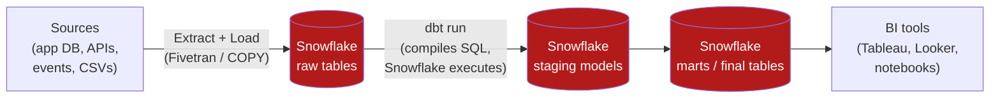

If you spend any time around modern data teams, you'll hear "Snowflake and dbt" said
in the same breath so often it sounds like one product. It isn't — they're two tools
that do **different halves of the same job**, and they fit together so cleanly that the
combination has become a default for analytics work. This post is my attempt to explain
*why* they pair up, and what's actually happening when they do.

## The one-sentence version

> **Snowflake is where your data lives and where computation happens. dbt is how you
> turn raw data into trustworthy, well-tested tables — using SQL that Snowflake runs.**

That's the whole relationship. Snowflake is the **warehouse** (storage + compute);
dbt is the **transformation layer** (the "T" in ELT). dbt doesn't store data and it
doesn't have its own compute engine — it *pushes work down* into Snowflake.

## First, what each one is

### Snowflake — the cloud data warehouse

Snowflake is a fully-managed cloud data platform. The thing that made it famous is the
**separation of storage and compute**:

- **Storage** sits in cheap cloud object storage (S3/GCS/Azure Blob under the hood),
  holding your tables in a compressed columnar format.
- **Compute** runs on "virtual warehouses" — clusters you spin up on demand. You can
  run a huge query on a big warehouse, then shut it off and stop paying for compute
  while your data just sits in storage.

Because the two scale independently, ten analysts can each get their own compute
without copying the data, and an overnight batch job can use a massive warehouse for
20 minutes and nothing the rest of the day.

### dbt — the transformation framework

**dbt** (data build tool) brings software-engineering discipline to SQL. You write
your transformations as plain `SELECT` statements; dbt handles the rest:

- It figures out the **dependency order** between models and builds them in sequence.
- It wraps each `SELECT` in the right `CREATE TABLE` / `CREATE VIEW` boilerplate.
- It runs **tests** on your data (uniqueness, not-null, accepted values, relationships).
- It generates **documentation** and a visual **lineage graph**.
- It version-controls everything in **git**, so transformations get code review, CI,
  and rollbacks like any other codebase.

The key mental model: **dbt is a compiler and orchestrator, not an engine.** It
compiles your models into SQL and sends that SQL to Snowflake to execute.

## How they fit: ELT, not ETL

The old pattern was **ETL** — Extract, Transform, Load — where a separate tool
transformed data *before* loading it into the warehouse. Snowflake + dbt flips that to
**ELT**:

1. **Extract & Load** — a tool like Fivetran/Airbyte (or `COPY INTO`) dumps **raw**
   data into Snowflake, untouched.
2. **Transform** — dbt runs *inside* Snowflake, turning that raw data into clean,
   modeled tables using Snowflake's own compute.

The big idea: **don't transform before loading — load everything raw, then transform
in the warehouse** where you have cheap, scalable compute and a full SQL engine. dbt is
the tool that makes that transform step organized and reliable.

<div class="row justify-content-center">
<div class="col-md-9">



</div>
</div>

Notice that the raw, staging, and final tables **all live in Snowflake**. dbt never
holds the data — it orchestrates transformations that happen *in place*.

## What it looks like in practice

### 1. Connect dbt to Snowflake

dbt's Snowflake connection lives in `profiles.yml`. This is the only place dbt learns
*which* warehouse, database, and role to use:

```yaml
# profiles.yml
my_project:
  target: dev
  outputs:
    dev:
      type: snowflake
      account: ab12345.us-east-1
      user: AUSTIN
      authenticator: externalbrowser   # SSO; or password / key-pair
      role: TRANSFORMER
      warehouse: TRANSFORMING_WH        # the compute dbt will burn
      database: ANALYTICS
      schema: dbt_austin                # your dev sandbox
      threads: 8                        # parallel models = parallel Snowflake queries
```

`threads: 8` is a nice illustration of the relationship — dbt will run up to 8 models
at once, which simply means it fires up to 8 concurrent queries at your Snowflake
warehouse. dbt manages the concurrency; Snowflake does the work.

### 2. Write a model — it's just a SELECT

A dbt "model" is a `.sql` file containing one `SELECT`. Here's a staging model that
cleans up raw orders:

```sql
-- models/staging/stg_orders.sql
with source as (
    select * from {{ source('shop', 'raw_orders') }}
),

cleaned as (
    select
        order_id,
        customer_id,
        lower(status)                       as status,
        cast(created_at as timestamp_ntz)   as ordered_at,
        amount_cents / 100.0                as amount_usd
    from source
    where order_id is not null
)

select * from cleaned
```

That `{{ source(...) }}` is dbt's **`ref`/`source` system** — instead of hardcoding
`ANALYTICS.RAW.RAW_ORDERS`, you reference it symbolically. dbt resolves it to the real
Snowflake table name *and* records the dependency for the lineage graph.

A downstream model just `ref`s the staging model:

```sql
-- models/marts/customer_orders.sql
{{ config(materialized='table') }}

select
    customer_id,
    count(*)            as num_orders,
    sum(amount_usd)     as lifetime_value,
    min(ordered_at)     as first_order_at
from {{ ref('stg_orders') }}
group by 1
```

Because `customer_orders` references `stg_orders`, dbt knows to build staging **first**.
You never write `CREATE TABLE` or manage build order by hand — that's the orchestration
dbt adds on top of Snowflake.

### 3. `materialized` = how dbt writes to Snowflake

That `config(materialized='table')` tells dbt *what kind of Snowflake object* to create.
This is exactly where the two tools meet — the same `SELECT` becomes different Snowflake
DDL depending on the materialization:

| dbt materialization | What dbt runs in Snowflake |
|---|---|
| `view` | `CREATE VIEW … AS (your select)` — no storage, recomputed on read |
| `table` | `CREATE TABLE … AS (your select)` — full rebuild each run |
| `incremental` | First run builds the table; later runs `MERGE`/insert only **new** rows |
| `ephemeral` | No object at all — inlined as a CTE into downstream models |

`incremental` is the one that shows off Snowflake's strengths: on a billion-row events
table, you don't rebuild from scratch every night — dbt generates a `MERGE` that only
processes what's new, and Snowflake executes it efficiently.

### 4. Test your data — in Snowflake

dbt tests are just SQL queries that should return **zero rows** (zero failures). You
declare them in YAML and dbt compiles them into queries it runs against Snowflake:

```yaml
# models/staging/stg_orders.yml
models:
  - name: stg_orders
    columns:
      - name: order_id
        tests:
          - unique
          - not_null
      - name: status
        tests:
          - accepted_values:
              values: ['pending', 'shipped', 'cancelled']
```

Run `dbt test` and dbt asks Snowflake "are there any duplicate `order_id`s? any nulls?
any unexpected statuses?" If a query comes back with rows, the test fails and your
pipeline stops before bad data reaches your dashboards. **This is the part teams fall in
love with** — your data has a test suite, just like your application code.

### 5. Run it

```bash
dbt run        # build all models (Snowflake executes the compiled SQL)
dbt test       # run all data tests
dbt build      # run + test, in dependency order, in one command
dbt docs generate && dbt docs serve   # browse the lineage graph
```

When you type `dbt run`, dbt compiles every model to Snowflake SQL, opens connections
to your warehouse, and streams the `CREATE`/`MERGE` statements over. Watch your
Snowflake query history during a run and you'll see dbt's fingerprints all over it.

## Why the split is so effective

- **Each tool does one thing well.** Snowflake is a world-class SQL engine and storage
  layer; dbt is a world-class way to organize SQL. Neither tries to be the other.
- **All your logic is version-controlled SQL.** Transformations live in git — diffs,
  code review, CI, rollback. No more "what does this dashboard's hidden SQL do?"
- **Tests + docs + lineage come basically free.** The hardest part of data work is
  *trust*; dbt bakes trust-building into the workflow.
- **You only pay Snowflake for compute you use.** dbt runs are bursty — spin up a
  warehouse, build everything, spin down. Storage stays cheap in between.
- **It scales with the team, not against it.** Symbolic `ref`s mean you can refactor a
  table's physical name without breaking 40 downstream models.

## The mental model to walk away with

Think of it like a **kitchen**: Snowflake is the *kitchen itself* — the storage, the
stoves, the counter space. dbt is the *recipe book and the line cook's discipline* —
the ordered steps, the quality checks, the labeled containers. The food is cooked on
Snowflake's stoves, but dbt is what keeps the kitchen from descending into chaos.

You don't choose between them. Snowflake gives you somewhere powerful to do the work;
dbt makes sure the work is organized, tested, and trustworthy. Together they're the
backbone of what most people now just call "the modern data stack."

---

*Next post, I want to take a real dataset all the way through this stack — raw load,
a few staging models, an incremental fact table, and tests — and show the Snowflake
query history at each step.*
