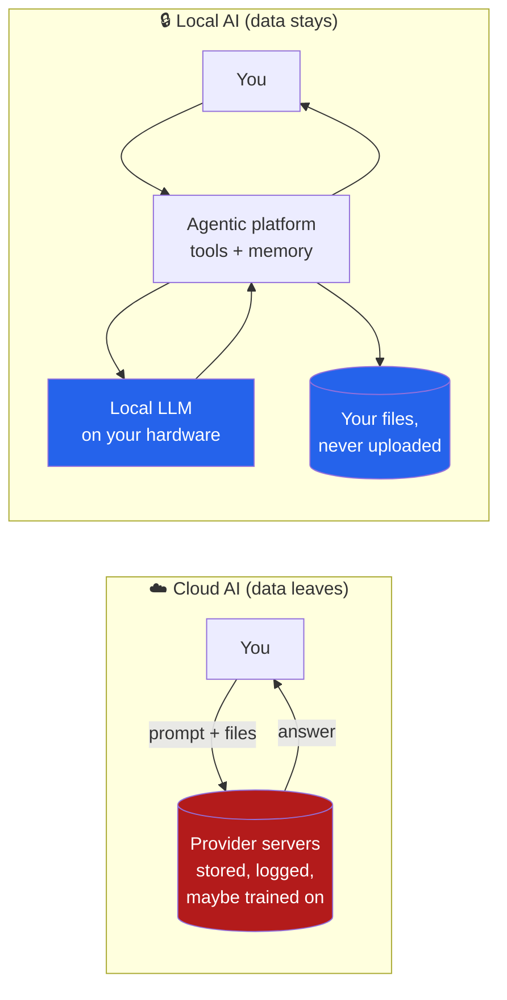

I've been thinking a lot about where my data actually *goes* when I use an AI
assistant. The chat window feels private — it's just me and a text box. But that
text box is a straw, and on the other end is someone else's data center. Everything
I type, every file I drag in, every half-formed idea I think out loud — it all lands
on hardware I don't own, governed by a policy I didn't write and can't see enforced.

The more I sat with that, the more it bothered me. So this is my argument for a
different default: **for anything sensitive, run the model locally and wire it into
your own agentic platform.** Not because the cloud is evil, but because the
convenience has a cost that's easy to ignore until it isn't.

## The convenience trap

Cloud AI is genuinely great. The models are huge, the latency is low, and you don't
need a GPU under your desk. That's exactly why we stop thinking about the trade. You
paste in a contract to "just summarize this real quick," or you ask for help debugging
code that happens to contain an API key, or you talk through something personal — and
none of it feels like a data-handling decision. It feels like typing.

But here's what's actually happening with most cloud services:

- **Your inputs are retained.** Conversations and uploads are stored, often for a
  long time, sometimes to "improve the service" — which can mean human review or
  training data.
- **The data outlives the moment.** You closed the tab; the bytes didn't go anywhere.
  Logs, backups, and caches can persist far past the point where you'd consider the
  conversation "over."
- **You're not the only one who can reach it.** A breach, a rogue insider, a policy
  change, an acquisition, or a subpoena can all turn yesterday's throwaway question
  into something readable by someone you never intended.

That last point is the one that really got me. **A confidential file you uploaded to
"just ask a quick question" can become discoverable evidence years later** — in a
lawsuit, an investigation, or a leak. You didn't keep a copy. The service did.

## The uncomfortable mental model

Think of cloud AI like talking to a brilliant consultant who **records every session,
keeps the tapes forever, and stores them in a building you'll never get to inspect.**
The advice is fantastic. But you'd never hand that consultant your most sensitive
documents without thinking hard about the recording — and yet we do exactly that with
a chat box a dozen times a day.

The asymmetry is the problem: the value is immediate and obvious, the risk is delayed
and invisible. Human brains are terrible at pricing that kind of trade.

## The alternative: local model, your own agent

The good news is that the alternative has gotten real. Open-weight models you can run
on your own machine are now good enough for a huge fraction of everyday work. Pair one
with an **agentic platform** — a framework that lets the model use tools, read your
files, and take actions — and you get most of the magic *without the data ever leaving
your hardware.*

The shift is mostly about where the boundary sits:

In the local setup, the agent orchestrates everything — retrieving from your own
documents, calling tools, chaining steps — but the model doing the thinking runs on a
box you control, and your files are read *in place* instead of being shipped off.

### What that actually looks like

You don't need a research cluster. A practical local stack today is roughly:

- **A local model runtime** — something like Ollama or `llama.cpp` serving an
  open-weight model (Llama, Mistral, Qwen, and friends) on your own CPU/GPU.
- **An agentic layer on top** — a framework that gives the model tools: file access,
  shell commands, web fetch, a code interpreter, retrieval over your own notes.
- **Local retrieval (RAG)** — embed your documents into a local vector store so the
  agent can ground its answers in *your* files without any of them being uploaded.

The whole loop — prompt, retrieval, tool calls, answer — happens between your keyboard
and your disk. Nothing to retain because nothing left.

## I'm not a cloud zealot

I want to be honest about the trade-offs, because pretending local is strictly better
would be its own kind of dishonesty:

- **Local models are smaller and less capable** than the frontier cloud models. For
  the hardest reasoning, the cloud still wins.
- **You own the maintenance.** Updates, hardware, and the occasional "why is this
  slow" are now your problem.
- **Good local inference wants decent hardware** — a capable GPU or a modern machine
  with enough memory.

So I don't think the answer is "never touch the cloud." I think the answer is
**match the tool to the sensitivity of the data:**

- **Public or low-stakes** (brainstorming, public code, general questions) → cloud is
  fine, enjoy the horsepower.
- **Sensitive or irreversible** (contracts, personal data, anything with secrets,
  anything you'd hate to see surface in five years) → keep it local.

## The takeaway

The question I now ask before pasting anything into an AI box is simple: **"Am I okay
with this being stored on someone else's computer, possibly forever?"** If the answer
is no, that's my signal to switch to the local stack.

Building a local LLM behind your own agentic platform isn't about paranoia — it's
about keeping the boundary of your private data where it belongs: with you. The models
are finally good enough that you don't have to trade all of your privacy for all of the
capability. You can keep most of both.

---

*I want to actually build this out in a future post — a fully local agent: an
open-weight model via Ollama, a small tool-use framework, and RAG over my own notes,
with a honest benchmark of where it holds up against the cloud and where it doesn't.*
