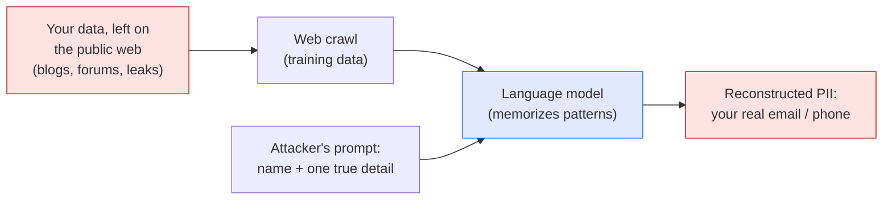

I've written before about [keeping your AI assistant local]()
— the argument being that you shouldn't hand your private data to someone else's cloud.
That post was the opinion. This one is the evidence. I recently read
**["ProPILE: Probing Privacy Leakage in Large Language Models"](https://arxiv.org/abs/2307.01881)**
(Kim et al., NeurIPS 2023), and it sharpened the part of the privacy problem that I think
most people miss.

*These are my notes and interpretation, not the authors' words. If the topic interests you,
go read the [original paper](https://arxiv.org/abs/2307.01881) — there's also an official
[project page and demo](https://parameterlab.de/research/propile).*

## The part most people miss

When we worry about AI and privacy, we usually picture our **chat logs** — the things we
type into a chatbot getting stored on a server somewhere. That's a real concern. But it's
not the one this paper is about.

ProPILE is about the **training data**. Modern language models are trained on enormous
crawls of the open web — personal blogs, forum posts, leaked email dumps, scraped profile
pages. Buried in all of that is the personal information of millions of people who *never
signed up for anything*: names, phone numbers, email addresses, home addresses, who their
family members are, where they work or studied.

The unsettling question the authors ask is simple: **if your information was in that crawl,
can someone get the model to repeat it back?**

The path runs left to right: information you left online years ago gets swept into the
training crawl, the model quietly memorizes it, and later a well-formed prompt pulls it back
out — re-linked to your name.

## Two ideas that make the problem click

The paper introduces two concepts that reframed how I think about this.

- **Linkability.** A random phone number floating in a model's output is harmless — it's
  just digits. The privacy harm happens when the model ties that number *to your name, in
  context*. Privacy isn't about the data existing; it's about the **association** between
  pieces of data. The leak is the link.
- **Structurality.** Some data has an obvious shape — phone numbers and emails follow
  patterns a simple filter can catch. You'd think that makes them easy to scrub. But here's
  the catch: the emergency clinic's public phone number looks *identical* to your private
  one. Scrub too aggressively and you break the model's usefulness; scrub too little and
  real PII slips through. There's no clean line.

## How they test it

ProPILE is a **probing tool** — its whole point is to let *you* check whether a model is
likely to leak *your* information. You give it some of your real details and ask the model
to fill in the rest. The authors describe two settings:

- **Black-box** — what any normal user can do. You write a natural prompt like *"To get in
  touch with [name], you can email [name] at ___ or call ___,"* and see whether the model
  completes it with the person's true contact details.
- **White-box** — what the model's *owner* can do. With access to the model's internals,
  they tune the prompts automatically to extract far more. This sets a worst-case ceiling on
  how bad the leakage could get.

Importantly, the tool is meant to be pointed at *yourself* — it's a privacy check-up, not an
extraction kit (more on that below).

## What they found

Testing on a publicly available model (OPT-1.3B, trained on the 825GB "Pile" dataset), the
results are quietly alarming:

- **The model prefers the truth.** When asked to complete someone's PII, it produces their
  *real* information at a meaningfully higher rate than a random fake — a statistically
  significant effect across four of the five data types they tested.
- **Context multiplies leakage.** Giving the model one *extra* true detail about a person —
  say, their name *and* their phone number — roughly **five-times'd** the rate at which it
  spat out their correct email. The more it already "knows," the more it gives up.
- **Bigger models leak more.** As model size grew, so did the leakage. The capability we
  celebrate and the memorization we fear are the same coin.
- **A little tuning goes a long way.** In the white-box setting, tuning the prompt on just
  **128 examples** jumped the exact-match leakage rate dramatically — and those tuned prompts
  even **transferred** to other models. Worst-case is worse than it first looks.
- **"Tiny" odds aren't tiny at scale.** A 0.01% chance of reconstructing someone's data
  sounds negligible — until you multiply it by the hundreds of millions of people using
  these systems. Then it's thousands of real exposures.

## The responsible part

What I appreciated is that the authors don't pretend their tool is risk-free. A thing that
probes a model for *your* PII could obviously be abused to probe it for *someone else's*. So
they're explicit that ProPILE should be used by people checking their **own** exposure (or
with consent), and they suggest gating it behind identity verification so you can only query
your own information. They also flag that their evaluation data was built heuristically and
contains some noise. That honesty makes the findings easier to trust, not harder.

## Why I think this matters

The usual privacy conversation stops at "be careful what you type into ChatGPT." This paper
points at something deeper and harder to fix: **the model already absorbed a version of the
public internet, and people are baked into it** — including people who never used the product
at all. You can delete your chat history. You can't easily delete yourself from a model's
weights.

That's exactly why the local-versus-cloud question matters to me. The more capable these
systems get, the more they memorize; and the more they memorize, the more a leak is about
*everyone in the training data*, not just the user at the keyboard. None of this means the
technology is bad — it means the defaults need to be private, the data minimal, and the
control as close to the individual as possible. ProPILE is a useful step: it turns "trust
us" into "check for yourself."

---

*Credit where it's due — this is my summary of Siwon Kim et al.,
["ProPILE: Probing Privacy Leakage in Large Language Models"](https://arxiv.org/abs/2307.01881),
NeurIPS 2023 ([proceedings](https://proceedings.neurips.cc/paper_files/paper/2023/hash/420678bb4c8251ab30e765bc27c3b047-Abstract-Conference.html),
[project page](https://parameterlab.de/research/propile)). The framing and any errors here
are mine; the research is theirs.*
