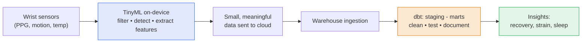

I wear a [WHOOP](https://www.whoop.com/) on my wrist. It's been a genuinely good journey
— the band quietly logs my sleep, recovery, and strain, and over time those numbers have
nudged how I train, when I rest, and how I read my own energy. I don't think about the
hardware much day to day. What I *do* think about, because it's literally my job as a
**Business Analytics Consultant**, is where all that data goes after it leaves my wrist.

So when I came across dbt Labs'
**[WHOOP case study](https://www.getdbt.com/case-studies/whoop)**, it clicked two halves of
my world together: the wearable I use every day, and the data tooling I work with. This is a
post about that case study, my own journey with the product, and a research idea it sparked —
connecting **TinyML** at the edge to a **dbt** project in the warehouse.

## My journey with WHOOP

What I like about WHOOP isn't any single metric — it's the *loop*. Sleep feeds recovery,
recovery sets the day's strain target, the day's effort feeds back into the next night's
sleep. It's a feedback system you can actually see, and seeing it changes behavior. That's
the same reason I like good analytics: a number you can't see can't change anything; a number
you can see, in context, quietly reshapes decisions.

But every one of those daily insights starts as a faint electrical signal on my wrist. Before
WHOOP can tell me my recovery is 64%, an enormous amount of *data work* has to happen — on the
device, and then far downstream in a warehouse. The case study is about that downstream half.

## What dbt did for WHOOP (the analytics half)

Here's the part that resonated with me professionally. According to the case study, when WHOOP
started, it had **no central data orchestration** — just ad-hoc SQL scripts run as needed.
Anyone who's done analytics consulting knows that movie: every question gets its own one-off
query, nothing is reusable, and no two people's numbers quite agree.

Their fix came in two stages:

1. **dbt Core** gave them a single, centralized layer for transformation and orchestration —
   one systematic place to clean and model data, with the visibility and code reuse the
   ad-hoc scripts never had.
2. As the team grew, they migrated to **dbt Cloud** for scale and governance. The problem
   they were solving is painfully familiar: analysts were independently building nearly
   *identical* models for the same data, with no visibility into each other's work.

The outcomes the case study reports are the part I'd put on a slide for a client:

- A shared **"WHOOP Commons"** dbt project holding company-wide data and reusable code.
- **dbt Mesh** so every team can pull those common assets, discoverable through **dbt Explorer**.
- **99% documentation coverage** — almost every model explains itself.
- Only **a single analytics engineer** needed to maintain dbt Cloud.

That last one is the headline for me. The value of dbt isn't "it runs SQL." It's that it turns
data transformation into *software* — tested, documented, reusable, governed — so a small team
can serve a whole company without drowning in duplicate work. That's exactly the kind of
"clean the data, then build trustworthy insight on top of it" story I help clients write.

## The other half: TinyML on the wrist

Here's where my curiosity runs the other direction. The case study is about the warehouse end
of the pipeline. But the band on my wrist is the *other* end — and that end is **TinyML**
territory.

TinyML is machine learning that runs on tiny, battery-powered devices — microcontrollers with
kilobytes of memory, not data-center GPUs. A wearable can't stream raw sensor data to the
cloud every millisecond; it would melt the battery and saturate the network. Instead, a lot of
the first-pass intelligence happens **on the device**: filtering noise, detecting heartbeats
from a raw optical signal, recognizing sleep stages or movement — compact models doing
*feature extraction* right at the sensor, then sending up something small and meaningful.

So the full path looks like this:

Two kinds of "model" live on this one line and almost never get talked about together: a
**TinyML model** doing real-time inference on a chip the size of a fingernail, and a stack of
**dbt models** doing batch transformation in the warehouse. Edge and warehouse, milliseconds
and nightly runs — but it's all one journey from signal to insight.

## The research idea: connect TinyML to a dbt project

This is the thread I want to pull on next. As a Business Analytics Consultant I live in the
**dbt half** — cleaning messy data and building insight on top of it. My side interest in
TinyML lives in the **edge half**. The case study made me want to deliberately connect them in
a single project of my own:

- **At the edge:** take a wearable-style sensor stream and do on-device feature extraction with
  a small TinyML model — the way a band turns a noisy optical signal into a clean heart-rate
  series. (My [wake-word detection project]({{ '/projects/tinyml/' | relative_url }}) is the
  same family of problem: tiny models, real-time, power-constrained.)
- **In the warehouse:** land those compact features and model them with **dbt** — staging,
  marts, tests, and documentation — exactly the WHOOP Commons pattern, just at hobby scale.
- **The point:** treat the edge model and the dbt models as *one governed pipeline*, and ask
  the analytics question end to end — how much does on-device feature quality change what the
  warehouse can conclude? Where is it cheaper to be smart: on the chip, or in the SQL?

I don't have the answer yet — that's why it's a research direction and not a results post. But
WHOOP is the perfect muse for it, because I get to *be* a data point in the system I'm
studying. Every night I sleep, I'm generating exactly the kind of edge-to-warehouse data this
project is about.

## Why it matters to me

The neat thing about reading the WHOOP case study as a WHOOP wearer is that it collapsed the
distance between "product I use," "work I do," and "research I'm curious about." dbt is how a
company like WHOOP turns a flood of sensor data into something a person can act on. TinyML is
how that flood gets tamed at the source. I want to build the bridge between them — and I happen
to be wearing the starting point.

---

*Credit where it's due — the analytics facts here come from dbt Labs'
[WHOOP case study](https://www.getdbt.com/case-studies/whoop) and their related webinar,
["Peak data performance: WHOOP's move from dbt Core to dbt Cloud"](https://www.getdbt.com/resources/webinars/peak-data-performance-whoop-s-move-from-dbt-core-to-dbt-cloud).
The TinyML framing and the research idea are mine; WHOOP and dbt are their respective owners'
products.*
