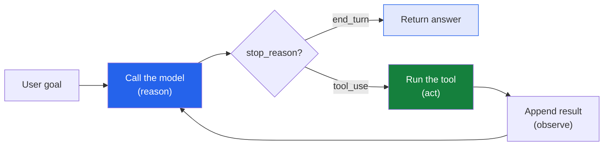

In [Part 1]() I argued that an AI agent is
just an LLM running in a loop — *reason → act → observe → repeat* — until a goal is met.
That's a tidy definition, but definitions are cheap. This post makes it concrete: we're going
to **build the loop by hand**, in about 30 lines of Python, with a tool the model can actually
call. My goal is simple — once you've written the loop yourself, the word "agent" stops being
magic and starts being *code you understand*.

*I'll use Anthropic's [Claude](https://docs.claude.com) and the official `anthropic` Python
SDK, because it's what I reach for. The same shape works with any tool-calling model; only the
field names change.*

## The whole idea, in one picture

Everything below is this loop. Keep it in your head as we go:



The model doesn't run your tools — **you** do. The model just *says which tool it wants and
with what arguments*; your code executes it and hands back the result. That hand-off, repeated,
is the entire mechanism.

## Step 1: give the model a tool

A tool is a JSON description: a name, a plain-English description of *when to use it*, and a
schema for its inputs. Here's one an analytics person like me would actually want — look up a
business metric:

```python
tools = [
    {
        "name": "get_metric",
        "description": "Look up a single business metric by name and quarter. "
                       "Call this whenever the user asks about a number you don't already know.",
        "input_schema": {
            "type": "object",
            "properties": {
                "name":    {"type": "string", "description": "e.g. 'revenue', 'active_users'"},
                "quarter": {"type": "string", "description": "e.g. 'Q1', 'Q2'"},
            },
            "required": ["name", "quarter"],
        },
    }
]
```

The `description` is not decoration — it's how the model decides *when* to reach for the tool.
Be prescriptive ("Call this whenever…"), not vague. Now the actual implementation, which lives
entirely on **my** side:

```python
# A stand-in for a real database / API call.
METRICS = {("revenue", "Q1"): 1_200_000, ("revenue", "Q2"): 1_500_000}

def get_metric(name, quarter):
    value = METRICS.get((name, quarter))
    return f"{name} {quarter} = {value}" if value is not None else "no data"
```

That's the "hands" from Part 1: without it the model can only *talk* about revenue; with it,
the model can *go get* the number.

## Step 2: the loop

Here's the whole agent. This is the part worth reading twice:

```python
import anthropic

client = anthropic.Anthropic()  # reads ANTHROPIC_API_KEY from your environment
messages = [{"role": "user",
             "content": "What was revenue in Q2, and how does it compare to Q1?"}]

while True:
    response = client.messages.create(
        model="claude-opus-4-8",
        max_tokens=1024,
        tools=tools,
        messages=messages,
    )

    # The model is done reasoning and has a final answer.
    if response.stop_reason == "end_turn":
        break

    # The model wants to call one or more tools.
    if response.stop_reason == "tool_use":
        # 1. Record what the model said (including its tool requests).
        messages.append({"role": "assistant", "content": response.content})

        # 2. Run each requested tool and collect the results.
        results = []
        for block in response.content:
            if block.type == "tool_use":
                output = get_metric(**block.input)          # ACT
                results.append({
                    "type": "tool_result",
                    "tool_use_id": block.id,                 # must match the request
                    "content": output,
                })

        # 3. Hand the results back so the model can keep going.
        messages.append({"role": "user", "content": results})  # OBSERVE

print(next(b.text for b in response.content if b.type == "text"))
```

Run it against the question above and the model will, on its own: call `get_metric` for Q2,
call it again for Q1, then do the arithmetic and answer something like *"Q2 revenue was
$1.5M, up 25% from Q1's $1.2M."* **You never told it to make two calls or to compute the
percentage** — it planned that itself. That's the difference between a chatbot and an agent.

## What each piece is really doing

The code is short, but three things in it are the entire game — and they're exactly the
reason→act→observe loop wearing API clothes:

- **`stop_reason` is the model's steering wheel.** Every turn, the model tells you whether it's
  *done* (`end_turn`) or wants to *act* (`tool_use`). Your loop just obeys. There's no hidden
  agent brain — the control flow is a `while` loop reading one field.
- **`tool_use_id` is the thread that stitches request to result.** When you send a result back,
  it must carry the same `id` the model used to ask. That's how the model knows *this answer
  goes with that question* — essential once it fires several tools at once.
- **The `messages` list is the agent's entire memory.** The API is stateless; the model
  remembers nothing between calls. The *only* reason it can "compare Q2 to Q1" is that both tool
  results are sitting in the `messages` list you keep appending to and resending. **The
  conversation history *is* the agent's mind.** Lose it and the agent is amnesiac.

That last point is the one I most wish someone had told me early. There's no magic state — you
are hand-carrying the agent's memory in a Python list.

## Where the danger lives

Notice the line `output = get_metric(**block.input)`. The model chose `block.input`. In this
toy it's a harmless lookup. But swap `get_metric` for `delete_records` or `send_email` and that
same line is now executing a **model-chosen, irreversible action**. This is exactly the
"failure mode that matters" from Part 1 — the moment an agent can *act*, a wrong decision stops
being a bad sentence and becomes a bad *deed*.

That's why real agents put a gate right there:

```python
if block.name in REQUIRES_APPROVAL and not human_says_ok(block.input):
    output = "Action denied by reviewer."
else:
    output = run_tool(block.name, block.input)
```

The loop is trivial to write. Making it *safe* — approvals, validation, logging, limits on how
many times it can loop — is where the real engineering goes. We'll spend a whole post on that
later in the series.

## You don't write this by hand in production

I showed the manual loop because it's the best way to *understand* an agent — you can see every
moving part. In production you'd usually let the SDK's **tool runner** drive the loop for you
(you just supply the tools and it handles the back-and-forth), and reach for the manual version
only when you need fine-grained control — like the approval gate above. But knowing what the
runner is doing under the hood means it's never a black box. You've now seen the engine.

## Coming up next

We have a working agent, but it's a single model calling one tool in a bare `while` loop. Real
systems need branching, retries, state that outlives one question, and multiple tools working
together. That's where orchestration frameworks earn their place — and it's Part 3:
**LangChain and LangGraph — what each is actually for, and when a graph beats a pile of
if-statements.**

In the meantime, I'd love to hear from you in the comments:

- Did writing the loop out like this change how "agent" feels to you — more or less magical?
- What's the **first tool** you'd hand an agent for your own work? (Mine would be a read-only
  query into our analytics warehouse — the safe, high-value place to start.)
- Where would *you* put the approval gate?

If you build a tiny version of this, tell me what your agent did the first time it surprised
you. Mine made a tool call I hadn't anticipated — and that's the moment it stopped being a
script and started being an agent.
