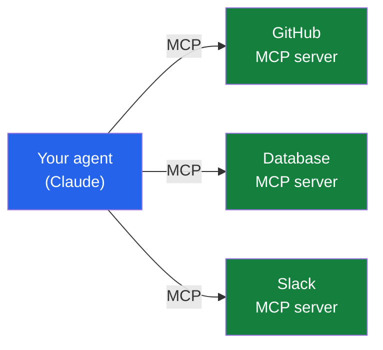

So far this series has built outward: [what an agent is](),
[the loop underneath it](), and
[the frameworks that orchestrate it](). Now I
want to zoom all the way back *in* — to the model at the center — and get specific about building
with **Claude**. Three capabilities turn a chat model into the dependable engine of an agent:
**robust tool use**, **structured outputs**, and the **Model Context Protocol (MCP)**. This is
the post where the agent stops calling toy functions and starts reaching into real systems.

*I'll use Anthropic's `anthropic` Python SDK and `claude-opus-4-8`. I checked these against the
current [Claude docs](https://docs.claude.com) so the code is accurate — but APIs evolve, so
verify signatures before you ship.*

## 1. Tool use, leveled up

In Part 2 we hand-wrote the tool loop: call the model, check `stop_reason`, run the tool, append
the result, repeat. That's the right way to *understand* it. But for production, the SDK gives
you a **tool runner** that drives the whole loop for you — you just decorate your functions:

```python
import anthropic
from anthropic import beta_tool

client = anthropic.Anthropic()

@beta_tool
def get_metric(name: str, quarter: str) -> str:
    """Look up a business metric. Call this whenever the user asks about a number.

    Args:
        name: e.g. 'revenue', 'active_users'.
        quarter: e.g. 'Q1', 'Q2'.
    """
    return f"{name} {quarter} = 1500000"

runner = client.beta.messages.tool_runner(
    model="claude-opus-4-8",
    max_tokens=1024,
    tools=[get_metric],
    messages=[{"role": "user", "content": "Revenue in Q2 vs Q1?"}],
)
for message in runner:      # the runner calls the API, runs tools, loops — until done
    print(message)
```

Notice the schema is **generated from the function signature and docstring** — no hand-written
JSON. That's the same `get_metric` from Part 2, minus the boilerplate. A few things worth knowing
once you're past the basics:

- **Claude can call multiple tools at once.** Ask "compare Q1 and Q2" and it may request *both*
  `get_metric` calls in a single turn, in parallel. (Set `disable_parallel_tool_use: true` if you
  need them serialized.)
- **`tool_choice` controls the model's hand.** `auto` (decide for itself), `any` (must use *some*
  tool), `{"type": "tool", "name": ...}` (must use *this* tool), or `none` (don't). Handy when a
  step *must* go through a specific tool.
- **Write descriptions that say *when*, not just *what*.** "Call this when the user asks about
  current prices" beats "gets prices." The newer Claude models reach for tools more deliberately,
  so a good trigger condition in the description measurably improves whether it calls at the right
  time.

When you need the manual loop back — for a human-approval gate, custom logging, conditional
execution — you drop down to the Part 2 pattern. The runner is the default; the manual loop is
the escape hatch.

## 2. Structured outputs: stop parsing prose

Here's a problem that bites every agent builder. You ask the model to "return the name, email, and
plan," and *usually* you get clean JSON — but every so often it wraps the JSON in a chatty
sentence, or renames a field, and your `json.loads()` throws at 2am. Inside an agent, where one
step's output feeds the next, that fragility compounds.

**Structured outputs** fix it by *constraining* the response to a schema you define. The cleanest
way in the SDK is `messages.parse()` with a Pydantic model — you get back a validated object, not
a string you have to pray over:

```python
from pydantic import BaseModel

class TicketTriage(BaseModel):
    summary: str
    category: str          # "billing" | "technical" | "other"
    urgent: bool

response = client.messages.parse(
    model="claude-opus-4-8",
    max_tokens=1024,
    messages=[{"role": "user", "content": "Charged twice for May and the export button 500s."}],
    output_format=TicketTriage,
)

triage = response.parsed_output       # a real TicketTriage instance
print(triage.category, triage.urgent) # "billing" True
```

No regex, no defensive parsing — the shape is *guaranteed*. (Under the hood this is the
`output_config.format` JSON-schema parameter; `parse()` just wires your Pydantic model to it and
validates the result.) The same idea applies to tools: mark a tool `strict: true` and its
arguments are guaranteed to match the schema, so the model can't hand your function a malformed
input.

Why this matters for agents specifically: **a structured output is a reliable seam between
steps.** It's what lets a LangGraph node (Part 3) confidently route on `triage.urgent` instead of
grepping the model's prose. Reliability at the seams is what separates a demo from a system.

## 3. MCP: plug into real systems without writing every integration

Tools are powerful, but there's a scaling problem hiding in them. Hand-defining `get_metric` is
fine. Now hand-define tools for GitHub, Slack, your database, Google Drive, your ticketing
system… every integration is bespoke code you write, test, and maintain. Multiply that by every
agent you build and it's a lot of duplicated plumbing.

The **Model Context Protocol (MCP)** is the answer to that. It's an **open standard** — introduced
by Anthropic — for how an AI app connects to external tools and data. The analogy I like: MCP is
*USB-C for AI tools*. Instead of a custom cable for every device, a tool exposes itself once as an
**MCP server**, and any MCP-aware client — Claude included — can plug in and use it.



The payoff is **reuse**. There's a growing ecosystem of ready-made MCP servers — GitHub, Slack,
Postgres, filesystems, dozens more — so connecting your agent to them is configuration, not a
fresh integration each time. The Claude API can connect to remote MCP servers directly (you list
the servers, each as roughly `{type, name, url}`), and the SDK has helpers to wire up local MCP
servers into the tool runner from §1. Conceptually:

```python
# Illustrative shape — MCP support is a beta; check the current docs for exact
# field names and the beta header before shipping.
response = client.beta.messages.create(
    model="claude-opus-4-8",
    max_tokens=1024,
    messages=[{"role": "user", "content": "What changed in the repo this week?"}],
    mcp_servers=[{"type": "url", "name": "github", "url": "https://<github-mcp-server>/"}],
)
```

Where authentication is involved, the credentials live *outside* the model — passed by your
harness, never in the prompt — which is exactly the security posture we'll lean on in Part 5. The
point isn't this snippet's exact fields; it's the shift in mindset: **stop thinking "what tools do
I write?" and start thinking "what MCP servers do I connect?"**

## How the three fit together

These aren't three separate topics — they're three layers of the same thing, *making the model a
dependable component*:

- **Tool use** lets the agent *act*.
- **Structured outputs** make what it produces *trustworthy to the next step*.
- **MCP** lets it *reach real systems* without bespoke plumbing for each one.

Stack them and the agent loop from Part 2 — now orchestrated by a graph from Part 3 — is calling
real tools over MCP and emitting machine-checkable output at every seam. That's a real system, not
a demo.

## One more knob: let it think

A quick practical note, because it changes agent quality more than people expect: the recent
Claude models support **adaptive thinking** — the model decides when and how much to reason before
acting — plus an `effort` setting to tune depth vs. cost. For agents doing multi-step planning, I
default to leaving adaptive thinking on; it's the "think before you act" instinct from
[Part 1](), built into the model. The
[image-generation paper I wrote about]()
made the same point in pixels: letting a model reason in stages beats forcing a one-shot answer.

## Coming up next — the finale

We now have a capable agent: it loops, it's orchestrated, it calls real tools, and its output is
trustworthy. The last question is the hardest and the most important: **how do you deploy this
where it actually matters?** Part 5 closes the series with **Agents in the Enterprise —
evaluation, guardrails, cost, security, and the human-in-the-loop decisions that make leadership
comfortable saying *yes*.** It's the part I care about most, because a confident wrong action is
the failure mode that matters.

I'd genuinely like your input in the comments:

- Have you used **MCP** yet? Which server saved you the most integration work — or which one did
  you wish existed?
- For **structured outputs**, where has a guaranteed schema saved you — and where have you still
  been burned?
- What's the most useful tool you've handed Claude? (Still betting mine would be a read-only
  warehouse query.)

This is the layer where I spend most of my building time, so I'm especially keen to compare notes.
Tell me what you've learned.

---

*Further reading: the [Claude tool use](https://docs.claude.com/en/docs/agents-and-tools/tool-use/overview),
[structured outputs](https://docs.claude.com/en/docs/build-with-claude/structured-outputs), and
[MCP](https://modelcontextprotocol.io/) documentation. Verify exact parameters and beta headers
against the current docs — this space moves fast.*
