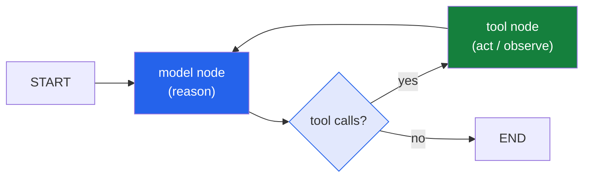

In [Part 2]() we built an agent by hand — a
bare `while` loop that called the model, ran a tool, fed the result back, and repeated. It
worked. But I ended with a warning: the moment you want **branching, retries, state that
outlives one question, and a human approval step**, that little loop grows into a tangle of
`if`-statements that's hard to read and harder to trust.

This post is about the tools that exist to stop that tangle: **LangChain** and **LangGraph**.
They get mentioned in the same breath, but they answer two genuinely different questions. Sorting
that out is the whole point of Part 3.

*Quick note: framework APIs move fast — treat the code here as illustrative of the shape, and
check the current [LangChain](https://python.langchain.com/) /
[LangGraph](https://langchain-ai.github.io/langgraph/) docs for exact signatures.*

## The one-line distinction

Here's the mental model I use:

> **LangChain** composes a **known sequence** of steps. **LangGraph** orchestrates a **looping,
> branching, stateful** process.

If you can draw your flow as a straight line — *do A, then B, then C* — that's LangChain. If
your flow has cycles ("keep using tools until done"), branches ("if the answer's unreliable,
escalate"), or needs to pause and remember, that's LangGraph. Most of Part 2's agent was the
second kind, which is exactly why a `while` loop was already creaking.

## LangChain: glue for a straight line

LangChain is, at heart, a **toolkit of standardized parts** plus a way to pipe them together. It
gives you uniform wrappers around chat models, prompt templates, output parsers, retrievers, and
hundreds of integrations — so swapping one model for another, or one vector store for another,
doesn't rewrite your app. Then it lets you connect them with a `|` pipe, like a Unix pipeline:

```python
from langchain_core.prompts import ChatPromptTemplate
from langchain_core.output_parsers import StrOutputParser

prompt = ChatPromptTemplate.from_template(
    "Summarize this support ticket in one sentence, then tag it as "
    "billing / technical / other:\n\n{ticket}"
)

# prompt -> model -> plain-text parser, composed into one runnable
chain = prompt | model | StrOutputParser()

chain.invoke({"ticket": "I was charged twice for May and the export button 500s."})
```

That's the sweet spot for LangChain: a **fixed pipeline** where data flows one direction —
prompt, model, parse, done. Retrieval-augmented generation (fetch docs → stuff into prompt →
answer) is the classic example. Clean, linear, no loop. For a huge number of real tasks, this is
all you need, and reaching for anything heavier is over-engineering — the same lesson from
[Part 1's "how to use one"](): start simple.

But notice what the pipe *can't* express: "go back to the model." There's no arrow pointing
backward. The moment your agent needs to *loop*, a straight pipeline runs out of road.

## LangGraph: structure for a loop

LangGraph models your application as a **graph**: **nodes** are steps (call the model, run a
tool), **edges** are the transitions between them, and a shared **state** object flows through.
Crucially — unlike a pipe — **edges can point backward and branch**, so you can express exactly
the reason→act→observe cycle we hand-rolled in Part 2:



In code, that's a `StateGraph` with two nodes and a *conditional edge* — the branch — that
either loops back to the model or finishes:

```python
from langgraph.graph import StateGraph, START, END
from langgraph.graph.message import add_messages
from langgraph.prebuilt import ToolNode
from typing import Annotated, TypedDict

class State(TypedDict):
    messages: Annotated[list, add_messages]   # the running conversation = the agent's memory

def call_model(state: State):
    return {"messages": [model.bind_tools(tools).invoke(state["messages"])]}

def route(state: State):
    # the branch: if the model asked for a tool, loop; otherwise stop
    return "tools" if state["messages"][-1].tool_calls else END

graph = StateGraph(State)
graph.add_node("model", call_model)
graph.add_node("tools", ToolNode(tools))     # runs the tools for you
graph.add_edge(START, "model")
graph.add_conditional_edges("model", route)  # model -> tools, or model -> END
graph.add_edge("tools", "model")             # the loop back
agent = graph.compile()
```

Look closely and it's **the exact same loop from Part 2** — `route()` is doing the job our
`if response.stop_reason == "tool_use"` check did. The difference is that the control flow is now
*declared as a graph* instead of buried in procedural code. And that shift is what unlocks the
features that are painful to bolt onto a hand-written loop.

## Why the graph is worth it

If LangGraph were *only* a fancier `while` loop, I'd skip it. The reason it earns its place is
everything you get once the flow is a graph with explicit state:

- **State that persists (checkpointing).** Compile the graph with a *checkpointer* and LangGraph
  saves the state after every node. Now your agent has **memory across turns** for free — close
  the program, reopen it, and the conversation resumes. In Part 2 we hand-carried memory in a
  Python list; here it's a first-class, durable thing.
- **Human-in-the-loop, built in.** Because state is checkpointed, you can **interrupt** the graph
  *before* a risky tool runs, surface it to a person, and resume after approval. Remember the
  approval gate I bolted onto Part 2's loop with an `if`? In LangGraph it's a configured
  interrupt, not custom plumbing — and that's the difference between a demo and something an
  enterprise will deploy.
- **Branching and retries as edges.** "If the tool failed, retry; if it failed twice, escalate
  to a bigger model" is just more nodes and conditional edges — not nested `if`s. This is also
  where the [FrugalGPT-style cascade]() I wrote
  about becomes natural to express: route the easy path to a cheap model, escalate only when a
  check says to.
- **Streaming and observability.** Because every step is a node, you can stream progress and see
  exactly which node ran when — instead of squinting at one opaque `while` loop.

## "But that was a lot of code for the same loop"

Fair. And here's the honest punchline: for the *standard* agent loop, you don't write the graph
by hand at all. LangGraph ships a prebuilt:

```python
from langgraph.prebuilt import create_react_agent

agent = create_react_agent(model, tools)     # the whole reason->act->observe graph
agent.invoke({"messages": [("user", "What was revenue in Q2 vs Q1?")]})
```

That one line builds the same graph we drew above. So why did we walk through the manual
`StateGraph`? Same reason we hand-wrote the loop in Part 2: **so the one-liner isn't a black
box.** When `create_react_agent` does something surprising, you'll know it's nodes, edges, and
state underneath — and you'll know how to drop down and customize it. The prebuilt is the
*default*; the graph is the *escape hatch*, and good engineering is knowing both exist.

## How I decide which to reach for

My rule of thumb, in order of effort:

1. **Just a model call?** Use the SDK directly (Part 2). No framework.
2. **A fixed pipeline** — prompt → model → parse, or RAG? **LangChain** (or just LCEL). Linear,
   readable, done.
3. **A loop, branches, state, or a human step?** **LangGraph.** The moment you catch yourself
   writing the third `if` to manage control flow, that's the signal — a graph beats a pile of
   if-statements.

The mistake I see most is jumping straight to (3) for a problem that (1) or (2) would solve.
Frameworks are leverage, not a starting point. Add structure when the problem demands it, not
before.

## Coming up next

We now have the *orchestration* layer. Next I want to get specific about the **model** at the
center of it — Part 4: **Building with Claude — tool use, structured outputs, and the Model
Context Protocol (MCP) for connecting an agent to real systems.** That's where the agent stops
talking to toy functions and starts reaching into actual tools.

As always, I'd love your take in the comments:

- Are you team **LangGraph**, team **just-write-the-loop**, or something else (a different
  framework, a managed agent platform)? What made you pick?
- What finally pushed you *past* a simple chain into needing a graph — was it state, branching,
  or the human-in-the-loop step?
- If you've shipped a LangGraph agent to production, what bit you that the tutorials didn't warn
  you about?

I find this layer genuinely fun — it's where the "agent" stops being one clever call and becomes
a *system* you can reason about. Tell me where your experience differs from mine.

---

*Sources / further reading: the official [LangChain](https://python.langchain.com/) and
[LangGraph](https://langchain-ai.github.io/langgraph/) docs, and the
[`create_react_agent` reference](https://reference.langchain.com/python/langgraph.prebuilt/chat_agent_executor/create_react_agent).
Framework APIs evolve quickly — verify signatures against the current docs before you ship.*
