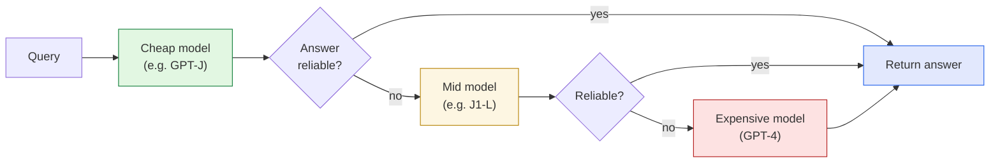

Most of the AI papers I've been reading lately are about *capability* — can the model do the
thing? This one is about something I think about constantly in my day job: **cost.** I finally
sat down with **["FrugalGPT: How to Use Large Language Models While Reducing Cost and Improving
Performance"](https://arxiv.org/abs/2305.05176)** (Chen, Zaharia & Zou, Stanford, 2023), and it
scratched the business-analytics part of my brain in a way most ML papers don't. These are my
notes.

*This is my summary and interpretation, not the authors' words. Go read the
[original paper](https://arxiv.org/abs/2305.05176) — it's clear and refreshingly practical.*

## The problem: the best model is wildly expensive, and you don't always need it

The paper opens with a number that stops you: running a customer-service bot on GPT-4 for a
modest business — 15,000 customers, a few questions a week — works out to roughly **$21,000 a
month.** And the prices across the LLM market differ by *two orders of magnitude*: processing
10M input tokens cost about **$30 on GPT-4** versus **$0.20 on GPT-J** (a much smaller model)
at the time of writing.

Here's the insight that makes the whole paper: **most queries are easy.** You don't need a
flagship model to classify whether a news headline is bullish or bearish — a tiny, cheap model
gets it right most of the time. You only need the expensive model for the genuinely hard ones.
The trouble is the standard setup sends *every* query to the same expensive model, paying
flagship prices for kindergarten questions.

## The core trick: a cascade of models, cheap to expensive

FrugalGPT's main idea is an **LLM cascade.** Line up models from cheapest to priciest. Send the
query to the cheap one first. A small scoring model judges whether that answer is reliable
enough; if it is, you stop and return it. If not, you escalate to the next model up. Most
queries never reach the top.

The "reliable?" gate is just a small, cheap **scoring function** (they use a DistilBERT
regression model) trained to predict whether an answer is correct. A router learns *which*
models to include and *what confidence threshold* to set at each step, all under a budget
constraint. The expensive model becomes the **exception**, not the default.

## The result that surprised me

I expected "cheaper but a bit worse." The headline finding is better than that:

- On **HEADLINES** (a financial-news classification task), FrugalGPT matched GPT-4's accuracy
  at about **one-fifth the budget** — and in their case study actually came out *slightly more
  accurate* (≈0.872 vs 0.857) at **~80% lower cost** (\$6.5 vs \$33.1).
- To *match* the best single model's accuracy, the cost savings were **98.3%** on HEADLINES,
  **73.3%** on OVERRULING (legal), and **59.2%** on COQA (reading comprehension).

**How can cheaper be *more accurate*?** Because of what they call LLM *diversity*: the
expensive model isn't strictly better — it's better *on average*. On ~6% of HEADLINES queries,
GPT-4 was wrong but a cheap model was right (13% on COQA vs GPT-3). The cascade lets the cheap
models cover for the expensive one's blind spots. You're not just saving money; you're
**ensembling** across price tiers.

## The other two strategies (worth keeping in your back pocket)

The cascade is the star, but the paper frames it inside three cost-reduction families I found
useful as a mental checklist:

1. **Prompt adaptation** — make the prompt *cheaper*. Use fewer in-context examples ("prompt
   selection"), or batch several questions into one prompt ("query concatenation") so you don't
   re-send the same instructions every time. (Cost is proportional to tokens, so shorter
   prompts = direct savings.)
2. **LLM approximation** — avoid calling the API at all when you can. A **completion cache**
   reuses a stored answer when a similar question comes in; **fine-tuning** a small model on an
   expensive model's outputs lets the cheap one stand in afterward.
3. **LLM cascade** — the triage approach above: adaptively pick which model handles each query.

## Why this one lands for me

As a business-analytics consultant, this is the paper I'd hand to a finance team nervous about
an AI bill. It reframes "using AI" from a flat per-call cost into an **optimization problem with
a budget constraint** — which is exactly the shape of every problem I work on. A few things I'm
taking away:

- **"Which model?" is the wrong question. "Which model *for this query*?" is the right one.**
  Treating model choice as per-request routing instead of a global default is the whole game.
- **Spend is a distribution, not an average.** Most queries are cheap; a few are expensive.
  Architect for that shape and you capture most of the savings with little quality loss.
- **The cheap option is a hedge, not just a discount.** The diversity result means a portfolio
  of models can beat the single "best" one — the same logic as diversifying anything.

One honest caveat: this is a **2023** paper, and the model lineup (GPT-J, J1-Jumbo, GPT-4-of-
the-day) is dated — prices and quality have shifted a lot since. But the *principle* has only
gotten more relevant as the number of models and the spread in their prices has exploded. The
specific routing table ages; "route by difficulty, escalate only when needed" doesn't.

## Worth discussing

A few questions I'd genuinely like other people's take on, in the comments:

- Where's the line between *frugal* and *false economy*? For a medical or legal answer, is any
  amount of "route to the cheap model first" acceptable, or do some domains demand the flagship
  every time?
- The scoring model decides when an answer is "good enough." **Who audits the auditor?** A
  miscalibrated scorer silently ships wrong answers to save pennies.
- Caching answers is great for cost — but is a cached answer to a *similar* question always the
  right answer? Where does that quietly bite you?

If you've actually deployed something like a model cascade in production, I'd love to hear how
it held up. Comments are open below.

---

*Credit where it's due — this is my summary of Lingjiao Chen, Matei Zaharia & James Zou,
["FrugalGPT: How to Use Large Language Models While Reducing Cost and Improving
Performance"](https://arxiv.org/abs/2305.05176) (Stanford University, 2023). The framing, the
rounded numbers, and any errors here are mine; the research is theirs.*
