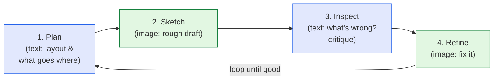

I've been fascinated by diffusion and text-to-image models for a while, so this *Batch* piece
— **["Planning Generated Images in
Stages"](https://www.deeplearning.ai/the-batch/planning-generated-images-in-stages)** — was
right up my alley. The core idea is lovely and almost obvious in hindsight: today's image
models try to paint the *whole picture in one breath*, and humans never do that. We plan,
sketch, step back, and fix. What if we taught the model to work that way too? These are my
notes.

*This is my summary and interpretation, not the authors' words. Go read the originals: the
[article](https://www.deeplearning.ai/the-batch/planning-generated-images-in-stages) and the
paper, **["Think in Strokes, Not Pixels: Process-Driven Image Generation via Interleaved
Reasoning"](https://arxiv.org/abs/2604.04746)** (Zhang et al., 2026).*

## The weakness this is trying to fix

If you've used a text-to-image model much, you know its tells. Ask for *"a red cube on top of a
blue sphere, to the left of a green cup"* and you'll often get the right **objects** but the
wrong **arrangement** — the cube's the wrong color, the spatial relationship is scrambled,
something's missing. Diffusion models are spectacular at texture and style, but they're
famously shaky on **compositional** prompts: spatial relationships, counting, and binding the
right attribute to the right object.

The usual diffusion process is part of why. The model starts from noise and denoises the
*entire canvas at once*, every region in parallel, with no explicit notion of "first I'll
place the sphere, *then* the cube goes on top." There's no plan — just one big simultaneous
guess that has to get everything right together.

## The idea: make the process look like painting

The paper's reframing is to treat image generation as a **process**, not a single shot. Humans
paint incrementally — plan a layout, rough in a sketch, inspect it, refine. So the authors
train the model to loop through four stages, alternating between *thinking in text* and
*drawing in pixels*:

The blue boxes are **textual reasoning** ("the sphere should be lower-left; the cube sits on
it"), the green boxes are **visual creation**. By interleaving them, the model's intermediate
*thoughts* become explicit and — crucially — **supervisable**. Instead of grading only the
final image, you can train on every step: did it plan well? sketch the right layout? catch its
own mistakes? That dense, step-wise supervision is the real contribution; it gives the model
feedback on the *process*, not just the *outcome*.

## How they actually built it

The clever, practical part is how they manufactured training data for a process that doesn't
naturally come with labeled intermediate steps. Starting from a pretrained multimodal model
(**BAGEL-7B**), they:

- **Built the "plan" and "sketch" data** by having GPT-4o turn each text prompt into a *scene
  graph*, then converting that into incremental, step-by-step prompts — using FLUX.1 Kontext to
  render the intermediate drafts. (~32,000 examples with 3–5 intermediate images.)
- **Built the "inspect" data** by having GPT-4o act as a critic — judging consistency and
  writing critiques of the drafts (~15,300 examples). This is how the model learns to *catch
  its own errors*.
- **Built the "refine" data** from existing image-improvement datasets.

In other words: a stronger model (GPT-4o) supervises the *reasoning and inspection*, and
existing generators supply the *intermediate pictures* — bootstrapping a "painting process"
that was never explicitly recorded anywhere.

## Did it work?

Modest but real gains on the compositional benchmarks that test exactly the weakness above:

- **GenEval** (does the image actually match the prompt's objects/relations?): BAGEL-7B went
  from **77% → 83%**.
- **WISE** (world-knowledge / plausibility): average score **0.70 → 0.76**, with noticeably
  better historical-era accuracy and physical/chemical plausibility.

Not a revolution in raw image quality — but a meaningful jump in *doing what you asked*, which
is the part that's been stubbornly hard.

## Why I think this is interesting

A few threads I keep pulling on:

- **It's the same "let it think" lesson, ported to pixels.** We learned that language models
  get dramatically better at hard problems when you let them reason step-by-step instead of
  blurting an answer. This is that idea applied to images: *chain-of-thought for painting.* The
  win comes from making the process explicit, not from a bigger model.
- **Interpretability almost for free.** Because the intermediate plans and critiques are
  written out, you can actually *see why* the model arranged the scene the way it did — and
  intervene. A one-shot diffusion pass is a black box; this is a visible draft history.
- **It's a data-generation story as much as a modeling story.** The method only exists because
  they could synthesize the staged data with other models. That's increasingly how progress
  happens — models supervising models to create training signal that no human labeled.

## A couple of things I'd love to discuss

If image generation interests you too, I'd genuinely like to kick these around in the comments:

- The loop adds latency — you're generating drafts and critiques, not one image. **Is
  "slower but follows the prompt" the right trade?** I suspect it depends entirely on the use
  case (a quick mood-board vs. a precise diagram).
- The inspection step is trained on **GPT-4o's** judgments. Does the model inherit *its* blind
  spots about what a "good" image is? Where does the critic's taste leak in?
- Is "plan → sketch → inspect → refine" fundamental, or just one convenient decomposition?
  What would *your* stages be?

I find the human-process framing genuinely compelling — it's rare to see an AI method get
*better* by becoming *more like how people already work.* Tell me what you think.

---

*Credit where it's due — this is my summary of Lei Zhang, Junjiao Tian, Zhipeng Fan, Kunpeng
Li, Jialiang Wang, Weifeng Chen, Markos Georgopoulos, Felix Juefei-Xu, Yuxiang Bao, Julian
McAuley, Manling Li & Zecheng He, ["Think in Strokes, Not Pixels: Process-Driven Image
Generation via Interleaved Reasoning"](https://arxiv.org/abs/2604.04746) (2026), as covered by
[*The Batch*](https://www.deeplearning.ai/the-batch/planning-generated-images-in-stages). The
framing, the rounded numbers, and any errors here are mine; the research is theirs.*
