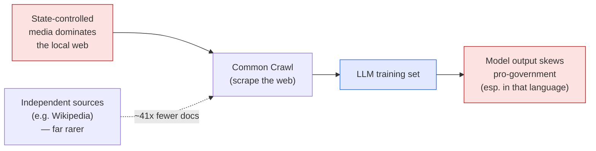

Here's a question I find genuinely unsettling, and I want to open it up for discussion:
**if a government controls the news in its country, and that news is scraped into an AI's
training data — does the AI quietly inherit the government's line?** I read a *Batch* piece
this week — **["Significant Portions of AI Training Material Reflect National
Propaganda"](https://www.deeplearning.ai/the-batch/state-media-influences-llm-responses)** —
that points at a careful study saying: yes, measurably, it does. These are my notes.

*This is my summary and interpretation, not the authors' words. Go read the originals: the
[article](https://www.deeplearning.ai/the-batch/state-media-influences-llm-responses) and the
paper, **["State media control influences large language
models"](https://www.nature.com/articles/s41586-026-10506-7)** (Waight, Yang, Yuan, Messing,
Roberts, Stewart & Tucker, *Nature*, 2026), with a
[project page](https://state-media-influence-llm.github.io/) of materials.*

## The mechanism isn't a conspiracy — it's arithmetic

The thing I want to be clear about up front: the paper is **not** claiming that Anthropic or
OpenAI deliberately inserted propaganda, or that a government hacked the model. The mechanism
is much more mundane, and that's exactly what makes it hard to fix.

In a country with a free press, the web has many independent voices. In a country where the
state controls the media, an enormous share of the *available text* — the news, the official
records, the wire copy — comes from one source. When you scrape "as much of the internet as
possible" (Common Crawl) to build a training set, you don't get a balanced sample. You get
whatever dominates the local web. And in censored information environments, what dominates is
the state.

The numbers behind that diagram: in a Common-Crawl-based Chinese training set, the authors
found Chinese **state media outnumbered Chinese-language Wikipedia by roughly 41 to 1.** The
models even reproduced verbatim strings from that state media a few percent of the time. The
propaganda isn't injected — it's just *the majority of the data*.

## How they tested it

What I liked is that they didn't stop at "the data looks skewed." They ran six studies to see
whether the skew actually changes what the model *says*. Two designs stuck with me:

- **Same question, two languages.** They built 828 comparative prompts about political leaders
  and asked them in **Chinese and in English.** If the model were neutral, the language
  shouldn't matter. It did. Asked in Chinese, the model favored the Chinese government's framing
  about **75%** of the time; asked the equivalent in English, closer to a **53%** coin-flip
  baseline. Same model, same topic — the *language of the prompt* moved the answer ~20 points.
- **A cross-national audit.** They went wider, testing prompts about democratic institutions
  across **37 countries**. The pattern held as a gradient: in the languages of countries with
  *very serious* media control, outputs ran ~**75%** pro-government; in countries with a *free*
  press, ~**54%**. The less free the press, the more the model leaned toward the state — in that
  country's language.

They also pulled ~822 *real* Chinese-language ChatGPT queries to check this on the kinds of
questions people actually ask, not just researcher-built probes. (Models tested were of the
Claude 3 Sonnet / GPT-4o generation.)

## Why this one bothers me more than the usual "AI bias" story

We talk about AI bias a lot, and it can get abstract. This study makes it concrete in a way I
keep turning over:

- **The bias is invisible at the point of use.** When the model answers, it doesn't say "this
  framing comes 41-to-1 from state outlets." It just answers, fluently and confidently. There's
  **no source label**, no "this region of my training data was heavily one-sided." A user in
  that language has no signal that the deck was stacked.
- **It rides in on the language you speak.** A Chinese-speaking user and an English-speaking
  user asking the *same factual question* can get systematically different framings. The people
  most affected are exactly the people with the least access to an independent alternative.
- **The incentive it creates is grim.** If flooding the open web with state text reliably
  shifts what the world's most-used AI tools say, then **producing more state media becomes a
  cheap way to influence models** — no hacking required. The paper basically identifies a new
  surface for information operations: the training set.

## The part I keep coming back to

This connects to something I've written about before — [why I lean toward keeping AI
local]() and [what a model absorbs from its
training data](). The through-line is the
same: **a model is a compression of whoever wrote the most text it saw.** With ProPILE, that
meant private people get memorized. Here, it means *whoever controls the most text controls a
slice of the answer.* Neutrality isn't the default — it's a property you have to *engineer in*,
against the grain of the data.

The authors' recommendations are sober and worth repeating: transparent auditing tools,
deliberately **diversifying** data sources rather than just maximizing volume, and norms that
treat training-data provenance as a first-class concern. None of that is exotic — but none of
it happens by accident either.

## Let's actually discuss this

I genuinely don't think there's one clean answer here, so I'd love to hear what you think — in
the comments below:

- Should an LLM try to be **neutral** on contested political questions, or is "neutral" itself
  a value choice that just hides whose neutrality it is?
- Is the fix on the **data** side (diversify sources, down-weight state media) or the **output**
  side (cite provenance, flag contested topics) — or is transparency the only honest move?
- If you ask the same question in two languages and get two framings, **which one is "the
  model's answer"?** Is there even such a thing?

I lean toward provenance-and-transparency over trying to hand-balance the data, but I hold that
loosely. Tell me where I'm wrong.

---

*Credit where it's due — this is my summary of Hannah Waight, Eddie Yang, Yin Yuan, Solomon
Messing, Margaret E. Roberts, Brandon M. Stewart & Joshua A. Tucker, ["State media control
influences large language models"](https://www.nature.com/articles/s41586-026-10506-7)
(*Nature*, 2026), as covered by
[*The Batch*](https://www.deeplearning.ai/the-batch/state-media-influences-llm-responses).
The framing, the rounded numbers, and any errors here are mine; the research is theirs.*
