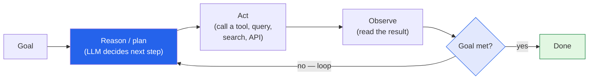

I write here about a lot of things I'm curious about — robotics, tinyML, football analytics.
But this post starts a series on the thing I actually *do*: **building AI agents.** It's the
center of my work as a Business Analytics Consultant and my Master's at the University of
Auckland, and it's where I spend most of my problem-solving energy. So I want to write it up
properly — start from "what is an agent, really," and build toward the part most people
actually need: **how do you get one working inside a real organization.**

This first post is the foundation. Future ones will get hands-on with **LangChain**,
**LangGraph**, **Claude**, and the enterprise-integration questions that decide whether an
agent is a demo or a system you can trust.

## First, let's kill the buzzword

"AI agent" gets thrown around to mean everything and nothing. So here's the definition I
actually use:

> An **AI agent** is an LLM that can *take actions in a loop* to accomplish a goal — deciding
> what to do next based on what happened last — instead of just producing one block of text.

That last clause is the whole thing. A plain chatbot is a function: text in, text out, done. An
agent is a *loop*: it reasons, picks an action (call a tool, run a query, search a document),
looks at the result, and decides what to do next — over and over until the goal is met. The
model stops being the answer and starts being the **decision-maker driving a process.**

That loop — **reason → act → observe → repeat** — is the heartbeat of every agent, whether
it's booking travel, triaging support tickets, or reasoning through an ethics question.

## Chatbot vs. agent: the line that matters

The difference isn't intelligence — it's **agency**. Here's how I keep them straight:

| | Chatbot | Agent |
|---|---|---|
| **Shape** | One question → one answer | A goal → many steps |
| **Tools** | Just talks | Calls tools, APIs, databases |
| **Memory** | Usually just the chat | Tracks state across steps |
| **Failure mode** | Says something wrong | *Does* something wrong |

That last row is the one I never lose sight of. The moment a model can *act* — send the email,
update the record, run the transaction — a confident wrong answer stops being an awkward
sentence and becomes a real-world mistake. Most of the engineering in a good agent is about
that risk, not about making it cleverer.

## What an agent is actually made of

Strip away the hype and an agent is a handful of parts wired together. I learned this building
an **Animal Ethics Advisor** on IBM Cloud during my Master's — an LLM-powered assistant meant
to reason through animal-ethics questions in a structured, defensible way. The model was maybe
20% of the work. The system around it was the rest:

- **The model** — the reasoning engine. The part everyone thinks about, and the part I think
  about least once the system is built.
- **Tools** — the hands. Retrieval over a knowledge base, a database query, an API call.
  Without tools, an LLM can only talk; with them, it can *act*.
- **Orchestration** — the wiring that decides *which* step happens *when*: route the question,
  call the right tool, feed the result back. This is where frameworks like LangChain and
  LangGraph earn their keep, and where a lot of this series will live.
- **Memory / state** — what the agent carries between steps so it doesn't start from zero each
  turn.
- **Evaluation & guardrails** — the part I care about most. Measuring whether the answers are
  actually *good*, and catching the bad ones before they reach a user. For anything touching
  ethics, education, or health, a confident wrong answer is *the* failure mode that matters.

If you've read my [Agentic AI & LLM Systems]({{ '/projects/agentic-ai-systems/' | relative_url }})
project page, this is the same backbone — **retrieve, reason, evaluate, act** — just named
piece by piece.

## How you actually use one

For someone wondering where to even start, here's the honest progression I'd suggest — roughly
the order of effort:

1. **Just prompt well.** Before you build anything, push a single model hard with good
   prompting. A surprising amount of "agent" work is unnecessary if a sharp prompt does the job.
2. **Add one tool.** Give the model a single capability — search your docs, hit one API — and
   let it decide when to use it. That's your first real agent, and it's enough to learn the loop.
3. **Add structure.** Once you have multiple steps and tools, you need orchestration to keep it
   reliable — branching, retries, state. This is the LangGraph chapter of the story.
4. **Wrap it in trust.** Evaluation, guardrails, logging, human-in-the-loop for the risky
   actions. This is what separates a cool demo from something an enterprise will actually deploy.

Most failures I've seen come from skipping straight to step 3 with a problem that step 1 would
have solved. Start simple; add machinery only when the problem demands it.

## Where this connects to the enterprise

This is the part that excites me, because it's where my **Business Analytics Consultant** hat
and my AI work meet. Companies don't want "an AI" — they want a reliable process that turns
their data into a decision a stakeholder can trust. That's *exactly* what a well-built agent is:
not a single clever output, but a dependable system with retrieval, reasoning, and guardrails
around it.

I've prototyped these ideas across **Watsonx.ai**, **Azure AI**, and **IBM Cloud**, which taught
me something useful — the *platform* changes but the *pattern* doesn't. An agent on Watsonx and
an agent built with LangChain and Claude are the same five parts in different clothes. Learn the
pattern and the tools stop being intimidating.

## What's coming in this series

Here's the rough arc I want to write — and I'd love your input on what to prioritize:

- **Anatomy of an agent**, hands-on — building the reason→act→observe loop from scratch so the
  magic stops being magic.
- **LangChain & LangGraph** — what each is actually for, and why graph-based orchestration
  beats a pile of if-statements once your agent gets real.
- **Building with Claude** — tool use, structured outputs, and the Model Context Protocol for
  connecting an agent to real systems.
- **Agents in the enterprise** — evaluation, guardrails, cost (see my
  [FrugalGPT notes]() for the cost angle),
  security, and the human-in-the-loop decisions that make leadership comfortable saying yes.

## Tell me where to start

Since this is a series, I'd genuinely like to write toward what's useful to *you* — in the
comments:

- Are you trying to **understand** agents or **build** one? That changes how deep I go.
- Which platform are you on — **LangChain/LangGraph**, **Claude**, a cloud suite (Azure,
  Watsonx, Bedrock), or undecided?
- What's the **one agent** you wish existed for your work? Concrete problems make the best posts.

I'm genuinely excited to build this part of the blog out. Agents are the most interesting thing
I get to work on, and writing is how I figure out what I actually understand. Hoping you'll
follow along — and that some of it turns out useful. Comments are open below. 👇
