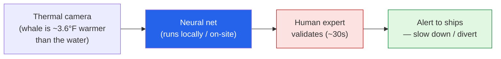

Most of what I write up here is about AI's *capabilities* — agents, image models, cost. This
one is about AI doing something I find genuinely moving: **keeping whales from being killed by
ships.** I read a *Batch* piece —
**["How AI Is Saving Whales"](https://www.deeplearning.ai/the-batch/how-ai-is-saving-whales)** —
and it's the cleanest example I've seen lately of *why* we build this stuff. Not a benchmark, not
a demo. A real problem, a real animal, a measurable outcome. These are my notes.

*This is my summary and interpretation, not the authors' words — go read the
[original article](https://www.deeplearning.ai/the-batch/how-ai-is-saving-whales).*

## The problem: ships can't see whales in time

The scale surprised me. According to **Ocean Wise**, ships strike and kill roughly **20,000
whales a year.** In San Francisco Bay, vessel strikes account for about **40%** of whale deaths —
and it's getting worse, because warming oceans are pushing more gray whales into the bay to
forage, straight into shipping lanes.

The brutal part is that it's not malice or negligence — a loaded container ship simply *cannot*
spot a whale at the surface and stop in time. By the time a lookout sees it, the physics are
already lost. What's missing isn't care; it's **early, reliable detection.**

## The solution: WhaleSpotter

The system, **WhaleSpotter**, pairs a sensor with a model in a way I find elegant:

The pieces:

- **Thermal imaging, not regular cameras.** A whale's body runs about **3.6°F warmer** than the
  surrounding ocean, so it shows up as a heat signature — which works day or night and through
  conditions where a normal camera (or a human eye) would see nothing.
- **A neural net trained on the hard negatives.** It was trained on *hundreds of thousands* of
  thermal images — and crucially, on lots of things that *aren't* whales: birds, breaking waves,
  boats. Teaching it what to ignore is what keeps it from crying wolf.
- **Processing on local hardware.** The model runs on-site rather than shipping every frame to the
  cloud, which cuts the transmission delay — when a whale is in a shipping lane, seconds matter.
- **A human in the loop.** A flagged detection is confirmed by a human expert within about **30
  seconds** before an alert goes out. That last step is what gets the accuracy to **99%.**

## Does it work?

The numbers are the part that got me. The technology came out of **Woods Hole Oceanographic
Institution (WHOI)**, built over a decade-plus of research, and was commercialized as
**WhaleSpotter** (2024), with shipping company **Matson** as an early partner. In deployment:

- A San Francisco Bay installation (cameras on a Coast Guard island tower and a passenger ferry)
  detected **6,600 whales within about a week and a half.**
- Detection-to-alert can be as fast as **one minute.**
- **99% accuracy**, with the human-validation step.
- Over **70 systems** are now deployed across vessels, ports, and offshore operations.

## Why this one stuck with me

A few reasons this is the kind of AI I want to keep pointing at:

- **The "boring" engineering choices are the smart ones.** Thermal instead of RGB. Training on
  negatives, not just whales. Running locally to kill latency. Keeping a human on the trigger.
  None of it is a flashy model — it's *good problem-fit*, and that's what makes it actually work.
- **It rhymes with things I care about.** Running the model on **local hardware** at the edge is
  exactly the instinct behind my [tinyML work]({{ '/projects/tinyml/' | relative_url }}) and
  [why I lean toward keeping AI local]() — put the
  compute where the data is. And the **human-in-the-loop validation** is the same pattern I argued
  is non-negotiable for [agents in the enterprise]():
  let the model do the detection at scale, but keep a person on the high-stakes call. Seeing both
  ideas show up in a whale-saving system was a nice reminder they're not just enterprise niceties —
  they're how you build AI people can trust.
- **It reframes "AI accuracy."** 99% sounds like a benchmark number until you remember what the 1%
  and the 99% *mean here*: a whale alive or not. That's the framing I wish more AI conversations
  started from — not "what's the score," but "what does each error cost in the real world."

## Worth discussing

I'd love to hear what you think in the comments:

- Where else would a **thermal-sensor + small-model + human-confirm** stack work? (I keep thinking
  about wildfire ignition, livestock, search-and-rescue.)
- The human-validation step is the accuracy backbone *and* the scaling bottleneck. As detections
  grow, how much of that 30-second human check can you safely automate — and where must a person
  stay?
- What's the most quietly impactful "AI for good" system you've come across? I want more examples
  like this one.

This is the answer to anyone who thinks AI is all chatbots and hype: point them at a thermal
camera on a ferry quietly keeping whales alive. *That's* why we build it.

---

*Credit where it's due — this is my summary of
["How AI Is Saving Whales"](https://www.deeplearning.ai/the-batch/how-ai-is-saving-whales) from
*The Batch* (DeepLearning.AI), covering the work of
[Woods Hole Oceanographic Institution](https://www.whoi.edu/) and WhaleSpotter, with strike
figures from [Ocean Wise](https://ocean.org/). The framing, the rounded numbers, and any errors
here are mine; the research and reporting are theirs.*
