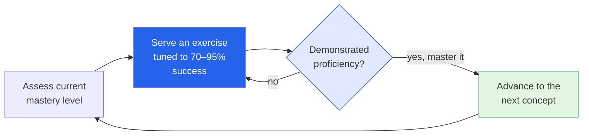

Education is the corner of AI I care about most — it's literally the focus of
[my Master's]({{ '/projects/agentic-ai-systems/' | relative_url }}): ethical, human-centered AI
in learning and health. So when I read a *Batch* piece on
**["Inside Alpha School"](https://www.deeplearning.ai/the-batch/inside-alpha-school-a-texas-based-program-using-algorithms-and-video-monitors-to-teach-children)**
— a school where kids do *two hours* of academics a day on AI software and score in the top 2%
nationally — I was genuinely excited. I'm also trained to ask "where's the evidence?", so these
notes are both: the promise *and* the skepticism, because in education you owe kids both.

*This is my summary and interpretation, not the authors' words — go read the
[original article](https://www.deeplearning.ai/the-batch/inside-alpha-school-a-texas-based-program-using-algorithms-and-video-monitors-to-teach-children).*

## The idea: compress academics, expand everything else

**Alpha School** is a private school in **Austin, Texas** (~250 students, pre-K through high
school), founded in 2014 by **MacKenzie Price** and **Andrew Price**, and rebuilt around
AI-assisted learning in 2022. It's planning to expand to roughly a dozen more cities.

The headline is the **"2-Hour Learning"** model. Instead of a six-hour school day of
whole-class instruction, students spend about **two focused hours** on core academics —
delivered by adaptive software, not a teacher at a whiteboard — and the *rest* of the day on
collaborative projects, life skills, and passions (everything from public speaking to building a
food truck). The pitch: personalized software gets the academics done faster, freeing the day
for the things school usually has no time for.

## How the AI actually works

The academic engine isn't a chatbot — notably, they **avoid chatbots to prevent cheating**.
Instead it's an adaptive, mastery-based system stitched together from apps like **IXL** and
**Khan Academy**, plus their own software. The core loop is the part I find genuinely smart:

The system deliberately keeps each student performing between about **70% and 95%** — hard
enough to stretch, easy enough not to crush — and won't let them advance until they've shown
real proficiency, with a **spaced-repetition** schedule so things stick. One observer's
description stuck with me: a *"turbocharged spreadsheet checklist."* It's less sci-fi than it
sounds, and that's exactly why it might work — it's just **good pedagogy, automated and
personalized.** They also use **video cameras** to flag disengagement (guessing, idling, walking
off), which is the part that makes me a little uneasy — more on that below.

## The claimed results

This is where it gets eye-popping — and where my evidence radar starts pinging:

- Students reportedly rank in the **top 2% nationally** on standardized tests (MAP, AP, SAT).
- The first graduating class — **11 of 12 students** — headed to universities including
  **Stanford, Howard, Northeastern, and Vanderbilt.**
- The founders claim students learn roughly **twice as fast.**

If those numbers hold up the way they're framed, that's a genuinely big deal. The honest word is
*if*.

## The part I can't skip: the evidence is thin

Because this is education — and because I think *caring* about a field means holding it to a
high bar — I have to flag what the article itself raises:

- **No rigorous evidence yet.** Critics point out the effectiveness of "2-Hour Learning" isn't
  backed by independent, controlled studies. Impressive averages aren't the same as proof the
  *method* caused them.
- **Selection bias is the elephant in the room.** This is a **private school** with motivated,
  resourced families. Kids who'd score in the top 2% almost anywhere may simply be *enrolling*
  in the top 2%. Without a comparison group, you can't separate the software from the students.
- **The model has been rejected elsewhere.** Education boards in **California, Pennsylvania, and
  Utah** turned down charter applications from **Unbound Academy** (an Alpha offshoot) for failing
  to meet mandatory standards — a real signal that regulators aren't yet convinced.
- **Minimal transparency.** The proprietary platform's details are largely closed, which makes
  independent evaluation hard.
- **The cameras.** Constant video monitoring of children to detect "wasted time" is effective,
  maybe — but it's exactly the kind of trade-off that my ethics-in-education focus exists to
  scrutinize. Engagement data is still surveillance of kids.

## Why I'm excited *and* cautious

Here's where I land, holding both at once:

- **The core idea is right.** One-to-one, mastery-based, appropriately-difficult tutoring is one
  of the most evidence-backed things in all of education — Bloom's classic "2-sigma" finding is
  that individual tutoring massively outperforms group instruction. The problem has always been
  that human tutors don't scale. **This is the most promising attempt I've seen to scale the one
  thing we *know* works.** That's why it excites me.
- **Freeing the day is the underrated part.** Even if "twice as fast" is generous, *reclaiming
  four hours* for projects, collaboration, and curiosity might matter more than the test scores.
  School optimizing for *more than* test scores is a feature, not a footnote.
- **But "trust me, it works" isn't good enough for kids.** Everything in my training says: show
  me the controlled study, the comparison group, the kids who *weren't* already destined for
  Stanford. Extraordinary claims about children's futures need extraordinary evidence.

So I'm rooting for it *and* I want it audited. Those aren't in tension — that's what
human-centered AI in education actually looks like.

## Worth discussing

I'd really like other perspectives on this one, in the comments:

- Is the right metric **test scores**, or the **four hours of the day school usually crowds
  out**? What *should* we be measuring?
- Where's your line on **monitoring children** to optimize learning — useful signal, or
  surveillance we shouldn't normalize?
- If you could run **one study** to settle whether this works, how would you design it to beat
  the selection-bias problem?

This is the use case I find most hopeful in all of AI — getting every kid something close to a
personal tutor. I just want us to prove it the way we'd want it proven for our own children.

---

*Credit where it's due — this is my summary of
["Inside Alpha School"](https://www.deeplearning.ai/the-batch/inside-alpha-school-a-texas-based-program-using-algorithms-and-video-monitors-to-teach-children)
from *The Batch* (DeepLearning.AI). The framing, the rounded numbers, and any errors here are
mine; the reporting is theirs.*
