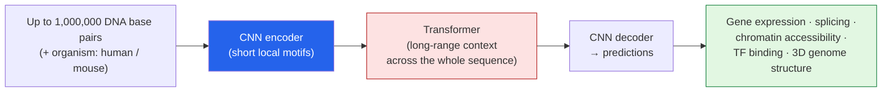

Only about **2% of your DNA codes for proteins.** The other 98% — long dismissed as "junk" — is
where a huge amount of the *regulation* lives: the switches that decide when a gene turns on, how
much RNA it makes, how the genome folds. It's also where a lot of disease-linked mutations hide, and
historically the only way to understand any of it was slow, painstaking lab work. I read a *Batch*
piece —
**["Google's AlphaGenome Interprets DNA That Regulates Genetic Expression"](https://www.deeplearning.ai/the-batch/googles-alphagenome-interprets-dna-that-regulates-genetic-expression)** —
and then went and read the paper, because this sits right on the **digital-health** side of AI that I
care most about. These are my notes.

*This is my summary and interpretation, not the authors' words — go read the
[original article](https://www.deeplearning.ai/the-batch/googles-alphagenome-interprets-dna-that-regulates-genetic-expression)
and DeepMind's [AlphaGenome announcement](https://deepmind.google/blog/alphagenome-ai-for-better-understanding-the-genome/).*

## The problem: the genome's "dark matter"

A mutation in a protein-coding gene is relatively easy to reason about — you can often see how it
breaks the protein. But a mutation in the **non-coding 98%** might do nothing, or it might quietly
turn a gene up or down somewhere else entirely and cause disease. We've known these regulatory
regions matter; what we've lacked is a way to *read* them at scale. AlphaGenome's job is exactly
that: take a stretch of DNA and predict what it *does* regulatorily — computationally, in seconds,
instead of months at the bench.

## The model: one million letters in, thousands of predictions out

**AlphaGenome** (Google DeepMind) ingests up to **1,000,000 DNA base pairs at once**, plus the
organism (human or mouse), and predicts on the order of **~6,000 properties (human)** / **~1,000
(mouse)** — at single-base-pair resolution. It builds on DeepMind's earlier **Enformer** and
complements **AlphaMissense** (which handles the protein-coding side).

- **CNN → transformer → CNN.** Convolutions catch short local patterns (motifs), the transformer
  shares information across *all* million positions for long-range context, and a final decoder turns
  that into per-base predictions.
- **It predicts many modalities at once** — gene start/end, RNA expression levels, splicing patterns,
  chromatin accessibility, transcription-factor binding, and 3D genome structure — not one narrow
  task.
- **Trained on four big public genomics databases:** **ENCODE, GTEx, 4DN Nucleome, and FANTOM5.**
- **A neat training trick:** they pretrained **64 identical models**, then **distilled** their
  combined knowledge into a *single* model using **19 loss terms** — an ensemble's accuracy at one
  model's inference cost.

## Does it work?

DeepMind benchmarked it hard, and the headline is that it's broadly state-of-the-art:

- **Beat nine prior models on 22 of 24** single-sequence gene-property predictions.
- **Matched or exceeded** prior approaches on **24 of 26** human variant-effect predictions.
- In a real-world test, it **correctly recovered the mechanism of T-ALL leukemia** — predicting how a
  specific mutation drives the disease.

It's also **openly available for non-commercial use** — API access, open weights on Hugging Face, and
inference code on GitHub — published in **Nature (Jan 28, 2026).**

## Why this stuck with me

- **It's the digital-health AI I got into the field for.** My focus is ethical, human-centered AI in
  education and [health](/Austin-blog/about/), and this is a clean example: not a chatbot, but a model
  that helps researchers connect a mutation to a mechanism to, eventually, a treatment. The payoff is
  measured in understanding disease, not benchmark points.
- **It's another foundation model on *non-language* data.** I just wrote up
  [Walrus, a physics foundation model](),
  and AlphaGenome is the genomics version of the same story: the transformer recipe — local encoder,
  long-range attention, multi-task decoder — keeps transferring to domains that have nothing to do
  with text. DNA as a 1-million-token "sequence" is a striking reframe.
- **The distillation move is pragmatic.** Train 64 models, distill into one. It's the kind of
  unglamorous engineering decision that makes a research result *usable* — you get ensemble accuracy
  without paying ensemble inference cost every time a scientist runs a query.

## Worth discussing

A few things I'd genuinely like other people's take on in the comments:

- AlphaGenome predicts *correlational* regulatory effects from sequence. How far does that get us
  toward **causal** clinical claims — "this variant causes this disease"? Where does the model need a
  wet-lab in the loop?
- The **ethics** here are real. Powerful non-coding variant interpretation touches genetic privacy,
  insurance, and the temptation to over-read predictions as destiny. What guardrails should ship
  *with* a model like this?
- For anyone in bioinformatics: does a single 1M-bp-context model change your daily workflow, or is
  the bottleneck still the experimental validation it can't replace?

This is the genre of AI I want more of — pointed at the genome's dark matter, helping us understand
why a single letter out of three billion can change a life.

---

*Credit where it's due — this is my summary of
["Google's AlphaGenome Interprets DNA That Regulates Genetic Expression"](https://www.deeplearning.ai/the-batch/googles-alphagenome-interprets-dna-that-regulates-genetic-expression)
from *The Batch* (DeepLearning.AI), covering **AlphaGenome** by
[Google DeepMind](https://deepmind.google/blog/alphagenome-ai-for-better-understanding-the-genome/),
published in *Nature* (28 Jan 2026). The framing, the rounded numbers, and any errors here are mine;
the research is theirs.*
