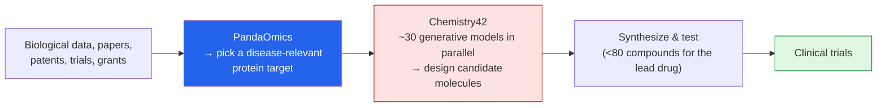

When the **world's most valuable pharmaceutical company** writes a check this size for AI-designed
drugs, it's worth understanding what they're actually buying — and what they're *not*. I read a
*Batch* piece —
**["Pharmaceutical Kingpin Eli Lilly Gave Insilico $2.75 Billion for AI-Driven Drug Development"](https://www.deeplearning.ai/the-batch/pharmaceutical-kingpin-eli-lilly-gave-insilico-2-75-billion-for-ai-driven-drug-development)** —
and it sits at the intersection of two things I care about: **AI in digital health**, and the
*business* of how AI actually gets adopted. These are my notes.

*This is my summary and interpretation, not the authors' words — go read the
[original article](https://www.deeplearning.ai/the-batch/pharmaceutical-kingpin-eli-lilly-gave-insilico-2-75-billion-for-ai-driven-drug-development).*

## The deal: read the structure, not just the headline

The "$2.75 billion" number is real but it's a *ceiling*, and the structure tells you how pharma
actually de-risks an AI bet:

- **$115 million upfront** for exclusive rights to develop and commercialize undisclosed Insilico
  drugs not yet tested in humans.
- **Up to ~$2.75 billion total**, the rest contingent on **developmental, regulatory, and commercial
  milestones**, plus **royalties** on future sales.
- It's Lilly and **Insilico Medicine**'s **third** collaboration — after a 2023 software license and a
  $100M research partnership in late 2025.

So the eye-popping figure is mostly *if-it-works* money. Lilly is paying a modest amount now for
optionality, and the big payments only land if the science clears real clinical and regulatory bars.
That's the sober way to read almost every "$X billion AI deal" headline.

## What Insilico actually does

**Insilico Medicine** (Hong Kong, founded 2014 by **Alex Zhavoronkov**) runs an end-to-end
generative-AI drug pipeline. Two tools do the heavy lifting:

- **PandaOmics** mines biological datasets, literature, patents, trials, and even grant applications to
  identify the **protein target** most relevant to a disease.
- **Chemistry42** runs **~30 generative models in parallel** to design molecular structures optimized
  for binding strength, toxicity, solubility, and other properties.

The numbers behind the lead program are the genuinely impressive part:

- The flagship drug, **rentosertib** (ISM001-055), for **idiopathic pulmonary fibrosis (IPF)**, came
  from identifying a **novel target (the TNIK protein)** and synthesizing **fewer than 80 compounds.**
- Insilico says it compressed **target-ID-to-synthesis from the usual ~5–6 years down to ~18 months.**
- In a **Phase 2a** trial, the highest-dose group **gained ~98.4 mL of forced vital capacity**, while
  the placebo group **declined** — a real, directionally positive clinical signal in a brutal disease.
- Across the platform: **28 generative-AI drug candidates**, roughly **half already in clinical
  trials**; a second program, **garutadustat** (inflammatory bowel disease), entered Phase 2a in
  January 2026.

## The honest caveat (the part I won't skip)

Here's the line that keeps me grounded: **as of mid-2025, ~173 AI-enabled drug programs were in
clinical stages — and not one AI-discovered drug has received regulatory approval yet.** Recent
**Phase 2 failures at BenevolentAI and Recursion** are a reminder that designing a promising molecule
fast is *not* the same as curing anyone. Drug development still takes **10–15 years**, costs **>$2
billion**, and **~86% of candidates fail.** AI is attacking the *front* of that pipeline — finding
targets and designing molecules — which is real and valuable, but the long, expensive, failure-prone
*back half* (the trials) is still the back half.

## Why this stuck with me

- **The structure is the story.** As someone who works in [business analytics](/Austin-blog/about/),
  I find the deal mechanics more instructive than the headline: small upfront, milestone-gated
  billions, royalties. That's how a rational buyer prices a technology that's *promising but
  unproven* — and it's a template for valuing AI bets in any industry, not just pharma.
- **It's the encouraging companion to the cautionary tales.** I just wrote up
  [AlphaGenome reading the regulatory genome](); this
  is the same digital-health thread one step downstream — from *understanding* biology to *designing
  molecules* against it. Seeing the pieces line up is genuinely exciting.
- **"Fewer than 80 compounds" is the metric I'll remember.** Conventional discovery screens thousands.
  If generative models can keep the hit rate that high, the win isn't just speed — it's *less wasted
  chemistry*, which is its own kind of progress.

## Worth discussing

A few things I'd love your take on in the comments:

- If AI compresses *discovery* from years to ~18 months but **trials** are untouched, how much does
  the overall **10–15-year** timeline actually move? Where's the real bottleneck now?
- No AI-discovered drug is approved yet. What would the **first approval** have to look like for you to
  call AI drug discovery "proven" rather than "promising"?
- Lilly's structure — tiny upfront, milestone-gated upside — is how you bet on unproven tech. Where
  else have you seen (or made) that kind of deal for AI?

---

*Credit where it's due — this is my summary of
["Pharmaceutical Kingpin Eli Lilly Gave Insilico $2.75 Billion for AI-Driven Drug Development"](https://www.deeplearning.ai/the-batch/pharmaceutical-kingpin-eli-lilly-gave-insilico-2-75-billion-for-ai-driven-drug-development)
from *The Batch* (DeepLearning.AI), covering the **Eli Lilly–[Insilico Medicine](https://insilico.com/)**
collaboration (announced March 2026) and Insilico's Pharma.AI platform. The framing, the rounded
numbers, and any errors here are mine; the reporting and research are theirs.*
