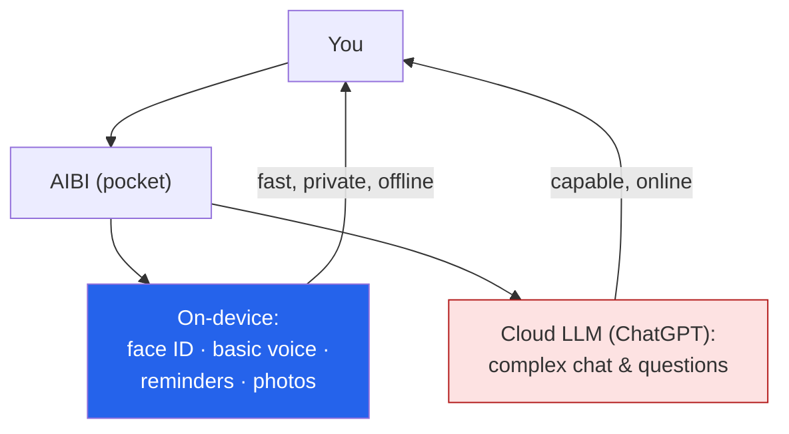

I spent years building **social robots** — Pepper and NAO — at SoftBank, so I have a soft spot for
machines designed to be *companions* rather than tools. That's why **[living.ai](https://living.ai/)**
caught my eye: they make two little companion robots, **EMO** (a desktop pet) and **AIBI** (a
*pocket* pet), and the "pocket robot" framing genuinely excites me. These are my notes — and they
nudged me to write up a [concept project](/Austin-blog/projects/pocket-robot/) on where I think this
idea goes next.

*This is my summary and interpretation from reading the company's site, not their words — go look at
the real thing at [living.ai](https://living.ai/).*

## EMO: a desktop pet with feelings (well, an emotion engine)

EMO is the flagship — a small, stylized desktop robot that's less "voice assistant" and more
*character*. What makes it interesting isn't a single feature, it's how the pieces combine into
something that reads as *alive*:

- **An "Emotion Engine"** driving **1,000+ facial expressions and body movements** — excitement,
  boredom, disappointment, happiness, sadness. Its personality is said to **evolve based on
  surroundings and your interactions**, so two EMOs "grow up" differently.
- **Real sensing:** 10+ internal sensors, an **HD camera with face recognition** (remembers up to 10
  people), a **4-microphone array** for directional sound, a head **touch sensor**, and a neural-net
  processor doing the on-device work.
- **Voice assistant basics** — "Hey EMO!", weather, questions, alarm clock, and **smart-light
  control.**
- **Charming details:** a skateboard charging dock (wireless-charges EMO *and* your phone), celebrates
  birthdays and holidays, and "acts sick" so you respond to it. The newer **EMO GO HOME** can walk to
  its own charger autonomously.

The thing I notice as a robotics person: almost none of that is about raw capability. It's about
**believable personality** — the sensors and the emotion engine exist to make EMO feel like it has an
inner life. That's the hard, interesting part.

## AIBI: the actual pocket robot

AIBI is the one that maps to the "pocket robot" idea: an **ultra-portable, all-day companion** you
carry with you, not one that lives on your desk.

- **Face recognition** — it knows who you are.
- **On-demand photos** — ask and it snaps a shot.
- **Hybrid voice:** **offline** recognition for basic commands, **online** for more.
- **AI chat via ChatGPT** for complex questions, while still working offline for the basics.
- **Animated weather, alarms, and medication reminders** — companion-as-gentle-assistant.

The hybrid offline/online split is the design choice I find smartest: keep the everyday, latency- and
privacy-sensitive stuff **on the device**, and only reach to the cloud LLM when you actually need the
horsepower. (Funny detail: living.ai says AIBI's promo video was shot in 2023 but held until Christmas
2025 because the concepts were ahead of their time.)

## Why this concept grabs me

Three reasons, straight from my own background:

- **I've built this before, at room scale.** [Pepper and NAO]({{ '/projects/pepper-nao-ai/' | relative_url }})
  were companion robots with face/emotion detection and dialogue — the *same* design problem as EMO and
  AIBI, just bigger and pricier. Shrinking that into something pocket-sized and affordable is a real
  shift in who gets to have one.
- **The edge/cloud split is exactly my instinct.** Keeping the fast, private interactions
  [local]() and only escalating to a big model when needed
  is the same architecture I argued for in my tinyML and "keep your AI local" writing. AIBI does it for
  a *companion*, which is a lovely use case for it.
- **Personality is the product.** EMO's whole value is that it feels alive. That's a human-centered
  design problem, not a benchmark — and human-centered AI is the thread through everything I work on.

## A concept project: where the pocket robot goes next

This got me thinking enough that I started a concept write-up —
**[the Pocket Robot Project](/Austin-blog/projects/pocket-robot/)** — sketching what I'd want from a
*next-generation* pocket companion: a tighter on-device/cloud agent loop, genuine memory, and
human-centered guardrails (especially around the camera and the always-on mic). It's a design
exploration, not a product — but EMO and AIBI are proof the category is real, and I want to think out
loud about it.

## Worth discussing

I'd love your take in the comments:

- Would you actually carry a **pocket companion robot**? What would it have to *do* — or refuse to do —
  for it to earn a place in your pocket?
- EMO's pitch is *personality*. How much "inner life" is delightful, and where does it tip into
  manipulative or creepy?
- An always-on camera + mic companion is an obvious **privacy** minefield. What's the right default —
  fully on-device, opt-in cloud, something else?

---

*Credit where it's due — this is my summary from reading [living.ai](https://living.ai/)'s site about
their **EMO** and **AIBI** companion robots. The framing and any errors here are mine; the products are
theirs. I'm not affiliated with living.ai — just a robotics person who finds the pocket-companion idea
genuinely cool.*
