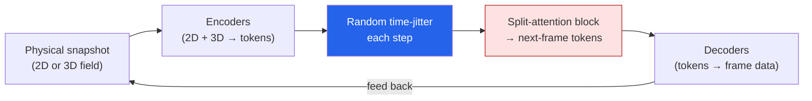

Most foundation models I write about are trained on words. This one is trained on **physics** —
density, pressure, velocity — and it taught me something about why transformers struggle at a task
that looks, on the surface, a lot like next-token prediction. I read a *Batch* piece —
**["A Dynamic Fluids Model Appears to Solve Transformers' Pixelation Problem"](https://www.deeplearning.ai/the-batch/a-dynamic-fluids-model-appears-to-solve-transformers-pixellation-problem)** —
and then went and pulled the paper, because the core trick is too neat to take secondhand. These
are my notes.

*This is my summary and interpretation, not the authors' words — go read the
[original article](https://www.deeplearning.ai/the-batch/a-dynamic-fluids-model-appears-to-solve-transformers-pixellation-problem)
and the [paper](https://arxiv.org/abs/2511.15684).*

## The problem: errors that compound into "pixelation"

Simulating a chaotic physical system — fluid, gas, plasma — is an autoregressive task. You predict
the next frame from the current one, then feed your prediction back in to get the frame after that.
It rhymes with how a language model predicts the next token.

And it has the same Achilles' heel: **errors compound.** But in physics simulation the failure mode
is uglier than a wrong word. The model makes small, *correlated* mistakes at the **same spatial
locations** on every step — a discretization artifact called **aliasing**. Step after step, those
errors stack up in the same places until the simulation is riddled with grid-aligned artifacts that
look exactly like **pixelation** in an image. The physics drifts into garbage, and it drifts in a
structured, predictable-looking way that's hard to ignore.

## The solution: Walrus, and a deceptively simple trick

The model is **Walrus** — a **1.3-billion-parameter** transformer for continuum dynamics, built by
**Michael McCabe and colleagues at the [Polymathic AI](https://polymathic-ai.org/) collaboration**
(a multi-institution effort), released openly under MIT license.

The architecture is sensible but not the headline:

- **Two encoders (2D and 3D)** compress a snapshot of the system into tokens.
- **A split-attention block** generates the next frame's tokens.
- **Two decoders** turn tokens back into frame data, predicting **63 physical fields** (density,
  pressure, velocity, and more).

The actual fix for pixelation is almost embarrassingly simple, and that's why I like it: **randomly
jitter — time-shift — the data on each step before feeding it back in.** If the errors want to pile
up at fixed locations, don't give them a fixed frame of reference. By perturbing *when* the model
sees the data, you **smear the aliasing errors around** instead of letting them accumulate in the
same spots. The paper frames this more formally as a harmonic-analysis-based stabilization method,
but the intuition is that one line: stop the mistakes from finding the same place to hide.

## The data and the numbers

Walrus is trained on **the Well**, a ~15-terabyte dataset the Polymathic team assembled spanning
**19 physical domains** — astrophysics, geoscience, rheology, plasma physics, acoustics, classical
fluids — everything from merging neutron stars to acoustic waves to atmospheric layers.

- **Pretraining:** ~8M 2D and ~4M 3D samples across the 19 domains.
- **Fine-tuning:** ~500K more examples from three fluid-dynamics datasets.

Results, versus competing physics models (MPP-AViT, Poseidon, DPOT):

- **Lowest variance-scaled RMSE in 18 of 19 domains** on single-step prediction — about a **63.6%
  error reduction** against the field.
- **Best in 12 of 19 domains** over longer 20–60-step rollouts (the regime where compounding error
  usually wins).
- The **jittering trick reduced long-term error in 89% of scenarios** — that's the line that earns
  the whole paper.

## Why this stuck with me

I don't simulate plasmas. But three things here generalize:

- **The fix is a training/inference trick, not a bigger model.** The instinct on a problem like
  compounding error is "add parameters / add data." The actual win was *changing how you feed data
  back into the loop.* That's the same lesson I keep relearning with [agents]() —
  the loop structure often matters more than the model size.
- **Autoregressive error compounding is everywhere.** A whale-detection model gets one shot per
  frame, but anything that *feeds its own output back in* — agents taking multi-step actions, long
  rollouts, iterative generation — inherits this exact failure mode. "Errors stack in the same place
  unless you perturb the reference frame" is worth filing away well beyond fluid dynamics.
- **It's openly released.** 1.3B params, MIT license, weights and code public. Foundation models
  trained on *physics instead of language* are a quietly big deal — they're starting to
  [drive actual scientific discovery](https://www.simonsfoundation.org/2025/12/09/these-new-ai-models-are-trained-on-physics-not-words-and-theyre-driving-discovery/),
  and you can go download this one today.

## Worth discussing

A few things I'm chewing on, and I'd love your take in the comments:

- The jitter trick is a way of **breaking a correlation the model didn't know it was exploiting.**
  Where else do our autoregressive systems quietly lock onto a fixed reference frame they shouldn't?
- How far does a *physics* foundation model transfer? 19 domains in one set of weights is a strong
  claim — is this the "GPT moment" for simulation, or domain-specific fine-tuning wearing a
  foundation-model hat?
- If you work in CFD / simulation: what would it take for you to trust a learned surrogate over a
  classical solver for something that matters?

---

*Credit where it's due — this is my summary of
["A Dynamic Fluids Model Appears to Solve Transformers' Pixelation Problem"](https://www.deeplearning.ai/the-batch/a-dynamic-fluids-model-appears-to-solve-transformers-pixellation-problem)
from *The Batch* (DeepLearning.AI), covering **Walrus** by Michael McCabe et al. at
[Polymathic AI](https://polymathic-ai.org/) — paper:
["Walrus: A Cross-Domain Foundation Model for Continuum Dynamics"](https://arxiv.org/abs/2511.15684)
(arXiv:2511.15684), [code](https://github.com/PolymathicAI/walrus). The framing, the rounded
numbers, and any errors here are mine; the research is theirs.*
