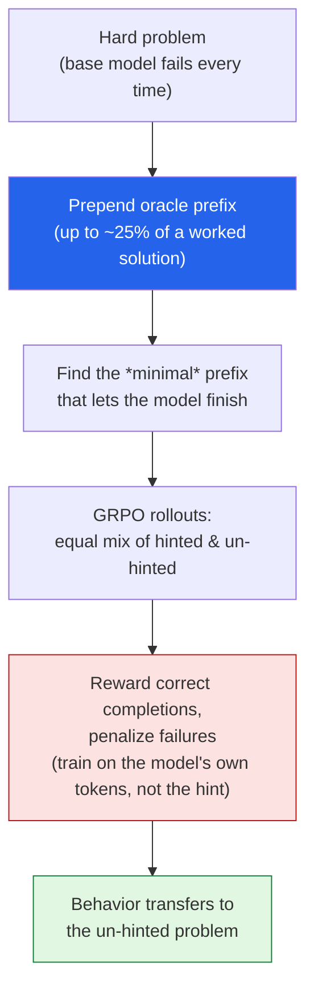

Here's a problem with reinforcement learning that's easy to state and annoying to fix: **if a model
can never stumble onto a correct answer, it never gets a reward, so it never learns.** On genuinely
hard problems that's the norm, not the exception — every rollout fails, the gradient is zero, and
the model just sits there. I read a *Batch* piece —
**["Reinforcement Learning With Hints"](https://www.deeplearning.ai/the-batch/reinforcement-learning-with-hints)** —
about a clever fix called **POPE**, then pulled the paper because the core move is genuinely elegant.
These are my notes.

*This is my summary and interpretation, not the authors' words — go read the
[original article](https://www.deeplearning.ai/the-batch/reinforcement-learning-with-hints)
and the [paper](https://arxiv.org/abs/2601.18779).*

## The problem: zero reward, zero signal

When you train a reasoning model with RL, you let it attempt a problem many times and reward the
attempts that land on the right answer. That works great *as long as the model gets it right
sometimes.* On hard problems — competition math, say — it might get it right **never.** Every rollout
is wrong, every reward is zero, and there's nothing for the optimizer to push toward. The model
can't learn what it can't occasionally do.

The naive fix — "just mix in some hard problems with the easy ones" — actually backfires. The paper
names the culprit: **ray interference.** Optimization gravitates toward the problems it can already
solve, and that progress *actively inhibits* improvement on the hard ones. So you can't just dilute
the hard problems away. You need a way to get a **non-zero learning signal on a problem the model
currently fails.**

## The idea: hint the exploration, don't train on the hint

POPE — **Privileged On-Policy Exploration**, from **Yuxiao Qu, Amrith Setlur, Virginia Smith,
Ruslan Salakhutdinov, and Aviral Kumar at Carnegie Mellon** — does something I find really clean:

> Give the model the **first slice of a worked ("oracle") solution** as a prefix, let it finish from
> there, and use *that* to generate rollouts that actually succeed — but **never train on the oracle
> text as a target.** The hint shapes *exploration*, not the *objective*.

That distinction is the whole trick. The model isn't being taught to imitate the human solution
(that would be plain supervised fine-tuning, and it tends not to transfer). It's being given just
enough of a running start to *discover a correct path on its own*, and then it's rewarded for the
part it did itself. The good behavior then transfers back to the *un-hinted* version of the problem
— a synergy between instruction-following and reasoning.

The mechanics:

1. **Find the problems the base model can't solve** — those are the ones with no learning signal.
2. **Extract a solution prefix** — the beginning of a worked solution, up to about **25%** of the
   full thing.
3. **Use the *minimal* prefix** that's enough to let the model complete it — less hint, more learning.
4. **Train with GRPO** (Group Relative Policy Optimization), giving the model **equal exposure to
   hinted and un-hinted versions**, rewarding correct completions and penalizing failures.

## Does it work?

Base model **Qwen3-4B-Instruct-2507**, trained on three math datasets (including **DAPO-Math-17k**),
evaluated on competition benchmarks:

| Benchmark | Metric | Standard GRPO | **POPE** |
| --- | --- | --- | --- |
| AIME 2025 | pass@1 | 49.6% | **53.1%** |
| AIME 2025 | pass@16 | 81.4% | **82.6%** |
| HMMT 2025 | pass@1 | 31.0% | **37.8%** |
| HMMT 2025 | pass@16 | 63.8% | **67.5%** |

The HMMT pass@1 jump (31.0 → 37.8) is the one that matters most to me — that's the *harder* benchmark,
exactly where standard RL has the least to grab onto, and the hints buy the biggest gain. POPE
genuinely **expands the set of problems the model can solve**, rather than just sharpening ones it
already could.

## Why this stuck with me

- **The "don't train on the hint" rule is the insight.** The obvious move is to show the model good
  solutions and have it copy them. POPE's bet is the opposite: hints are *scaffolding for discovery*,
  removed before they can become a crutch. It's the difference between giving someone the answer and
  giving them the first step so they can find the rest. That generalizes way past math.
- **It rhymes with how I think about [agents]().** A lot
  of agent failure is exploration failure — the model never finds the one action sequence that works,
  so it never learns the loop. "Seed the first move, reward what it builds on top" is a pattern I'd
  love to see applied to multi-step tool use, not just provable math answers.
- **Curriculum is subtle.** "Just add hard problems" *hurting* via ray interference is a great
  reminder that more data isn't a free lunch — *how* you stage difficulty changes whether the model
  learns at all.

## Worth discussing

A few open questions I'd put to the comments:

- POPE needs an **oracle solution** to extract a prefix from. Where do you get those for domains with
  no clean ground truth (open-ended reasoning, code with many valid solutions, agentic tasks)?
- The "minimal prefix" idea is essentially a **difficulty dial.** Could you anneal it — start with
  long hints and shrink them as the model improves, like fading scaffolding in human teaching?
- Is "guide exploration, don't supervise the target" a general recipe? What's the agent-task version
  of a solution prefix?

---

*Credit where it's due — this is my summary of
["Reinforcement Learning With Hints"](https://www.deeplearning.ai/the-batch/reinforcement-learning-with-hints)
from *The Batch* (DeepLearning.AI), covering **POPE** by Yuxiao Qu, Amrith Setlur, Virginia Smith,
Ruslan Salakhutdinov, and Aviral Kumar (Carnegie Mellon) — paper:
["POPE: Learning to Reason on Hard Problems via Privileged On-Policy Exploration"](https://arxiv.org/abs/2601.18779)
(arXiv:2601.18779), [code](https://github.com/CMU-AIRe/POPE). GRPO is from
[arXiv:2402.03300](https://arxiv.org/abs/2402.03300). The framing, the rounded numbers, and any
errors here are mine; the research is theirs.*
