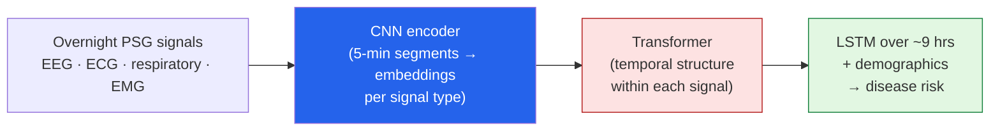

The premise stopped me cold: **a single night in a sleep lab contains a machine-readable fingerprint
of your long-term disease risk — across your whole body.** Not just sleep apnea. Dementia, heart
failure, stroke, atrial fibrillation, even some cancers. I read a *Batch* piece —
**["SleepFM Detects Signs of Neurological Disorders Years Before Symptoms Manifest"](https://www.deeplearning.ai/the-batch/sleepfm-detects-signs-of-neurological-disorders-years-before-symptoms-manifest)** —
and went straight to the paper, because this is squarely the **digital-health AI** I got into the
field for. These are my notes.

*This is my summary and interpretation, not the authors' words — go read the
[original article](https://www.deeplearning.ai/the-batch/sleepfm-detects-signs-of-neurological-disorders-years-before-symptoms-manifest)
and the [paper](https://www.nature.com/articles/s41591-025-04133-4).*

## The idea: sleep as a whole-body signal

We already knew sleep disturbances often *precede* serious illness. SleepFM's bet is that the signal
is there long before any human would notice it — buried in the raw, multi-channel data of an overnight
**polysomnography (PSG)** study. Catch it early enough and you can intervene before the disease
clinically shows up. The headline claim: risk flags for **130 conditions**, some as much as **six
years before symptoms.**

## The model: a multimodal foundation model for sleep

**SleepFM** comes from **Rahul Thapa, Magnus Ruud Kjaer, and colleagues in James Zou's group at
Stanford**, with collaborators across the Danish Center for Sleep Medicine, the Technical University of
Denmark, BioSerenity, Harvard Medical School, and the University of Copenhagen. It's a *foundation
model* trained on raw sleep signals, then adapted to predict disease.

It ingests the full PSG montage:

- **Brain activity (EEG)**
- **Cardiac signals (ECG)**
- **Respiratory data** — airflow, snoring, blood-oxygen saturation
- **Leg muscle activity (EMG)**
- **Demographics** — age, sex

The architecture is a three-part hybrid:

The clever part is **how it's pretrained: contrastive learning across signals.** Embeddings from
*simultaneous* recordings (your EEG and your ECG from the same moment) are pulled together; embeddings
from *non-simultaneous* moments are pushed apart. The model learns the natural cross-signal structure
of a sleeping body **without needing disease labels** — and a key trick is that this scheme
accommodates the *different montages* (electrode/sensor setups) across labs, which is usually what
makes pooling sleep data a nightmare.

## The scale and the numbers

The dataset is the foundation-model part: **~585,000 hours of PSG from ~65,000 participants** across
multiple cohorts.

- They screened **1,000+ disease categories** and found **130** predictable from sleep alone at
  **C-Index / AUROC ≥ 0.75.**
- The **strongest** signals — above **C-index 0.8** — were for cancers, pregnancy complications,
  circulatory disease, and mental-health disorders.
- Pretraining clearly helps: **PTSD detection 0.75 AUC with pretraining vs 0.64 without**; **atrial
  fibrillation 0.81 AUC** on the public SHHS dataset.
- It's **openly released** — weights, training and inference code on
  [GitHub](https://github.com/zou-group/sleepfm-clinical), with partial data for noncommercial
  research — published in **Nature Medicine (2026).**

## The honest caveat (I won't skip it)

This predicts **risk**, not **diagnosis**. A C-index of 0.8 is genuinely strong for population-level
risk stratification, but it is *not* a clinical verdict for an individual — and "six years early" cuts
both ways: it's a precious head start *and* a long window to worry someone who may never get sick.
Early detection only helps if there's actually something you can *do* with the lead time, and if the
false positives don't cause more harm (anxiety, over-testing) than the true positives prevent. The
research is exciting; the deployment ethics are the hard part.

## Why this stuck with me

- **It's the digital-health thread I keep pulling.** This lands right next to my notes on
  [AlphaGenome reading the regulatory genome]() and the
  [Lilly–Insilico AI-drug deal]() — understand
  biology, design the drug, *and now* catch the risk early. The pieces of an AI-assisted preventive-care
  loop are visibly assembling.
- **Another foundation model on non-text signals.** Same story as
  [Walrus (physics)](): the
  encoder → attention → decoder recipe transfers to a domain that has nothing to do with language. A
  night of sleep as a "sequence" is a beautiful reframe.
- **Contrastive pretraining without labels is the unlock.** Labeled disease outcomes are scarce and
  expensive; raw sleep recordings are comparatively abundant. Learning structure from the *unlabeled*
  signal first, then fine-tuning, is exactly how you get leverage in medicine — and it's a pattern
  worth stealing far beyond sleep.

## Worth discussing

A few things I'd genuinely like your take on in the comments:

- A six-year-early **risk** flag is only useful if you can act on it. For which of these conditions does
  the lead time actually change outcomes — and for which does it just create worry?
- PSG still means a night in a sleep lab. How much of this survives the jump to a **consumer wearable**
  with far noisier, fewer signals?
- What consent and communication does a model like this *demand* before it tells someone they're at
  elevated risk for dementia years out?

This is the kind of AI I want more of: not flashy, pointed straight at preventive health — turning one
night's data into a head start.

---

*Credit where it's due — this is my summary of
["SleepFM Detects Signs of Neurological Disorders Years Before Symptoms Manifest"](https://www.deeplearning.ai/the-batch/sleepfm-detects-signs-of-neurological-disorders-years-before-symptoms-manifest)
from *The Batch* (DeepLearning.AI), covering **SleepFM** by Rahul Thapa, Magnus Ruud Kjaer, James Zou,
and colleagues (Stanford and collaborators) — paper:
["A multimodal sleep foundation model for disease prediction"](https://www.nature.com/articles/s41591-025-04133-4),
*Nature Medicine* (2026), [code](https://github.com/zou-group/sleepfm-clinical). The framing, the
rounded numbers, and any errors here are mine; the research is theirs.*
