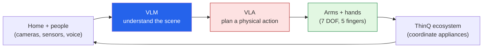

There's a particular moment in science fiction that always lands: the robot **walks into the house**
and just... starts helping. Makes breakfast. Starts the laundry. Folds the clothes. At **CES 2026**,
LG put a real version of that moment on stage — the **LG CLOiD** home robot and a vision they call the
**"Zero Labor Home"** — and as someone who spent years building robots, it made the hair on my arms
stand up a little. I want to use this post as an *introduction*: to the idea, to why I think it's a
genuine threshold, and to the questions I'd love to kick around with you.

*This is my take, sparked by [Dezeen's CES 2026 coverage](https://www.dezeen.com/2026/01/06/lg-ai-powered-robot-ces-2026/)
and [LG's own announcement](https://www.lg.com/global/newsroom/news/home-appliance-solution/lg-electronics-presents-lg-cloid-home-robot-to-demonstrate-zero-labor-home-at-ces-2026/).
The opinions and any errors are mine.*

## What LG actually showed

**CLOiD** is a home robot built around two very human-looking arms — **seven degrees of freedom
each**, with **five independently actuated fingers per hand** for fine manipulation. Its head is a
mobile **AI hub** with cameras, sensors, voice AI, and a display, and it plugs into LG's **ThinQ**
smart-home ecosystem so it can coordinate your other appliances rather than work in isolation.

One honest correction to the sci-fi image, though: **CLOiD doesn't walk — it rolls.** LG deliberately
chose a **wheeled base with a low center of gravity** over legs, citing "stability, safety and
cost-effectiveness" and the risk of tipping onto a child or pet. I actually love that choice (more on
why below). The live CES demos were domestic and concrete:

- **Kitchen:** retrieve the milk, put a croissant in the oven, plan meals for a four-person household.
- **Laundry:** start a wash cycle after everyone leaves, then **fold and stack** the garments once
  they're dry.
- **Living room:** wellness monitoring and assistance for active seniors.

Under the hood is the part that makes this a *2026* story and not a 2016 one: it runs on **Vision-
Language Models (VLM)** to understand what it's seeing and **Vision-Language-Action (VLA)** models to
turn that understanding into physical motion — trained on **tens of thousands of hours of household
task data.** That's the same foundation-model wave that ate language and images, now reaching for
**physical action.** LG brands the whole approach "Affectionate Intelligence."

## Why this feels like a threshold to me

I've built robots that *talk* — [Pepper and NAO]({{ '/projects/pepper-nao-ai/' | relative_url }}) at
SoftBank — and let me tell you, the gap between a robot that *converses* and a robot that reliably
*manipulates the physical world* is enormous. Folding a shirt is a punishingly hard robotics problem:
the object is deformable, the lighting changes, the failure modes are endless. Seeing it framed as a
mundane demo, not a research milestone, says the **VLM/VLA approach is closing that gap** in a way the
hand-coded era never could.

Two design choices tell me LG is thinking like operators, not just dreamers:

- **Wheels over legs.** Bipedal robots are the flashy CES bait, but they're expensive, fragile, and
  genuinely dangerous to fall on a toddler. Choosing a stable wheeled base is the *boring, correct*
  engineering call — the same instinct I respect in the [whale-detection system]()
  that picked thermal cameras over fancier sensing. Good problem-fit beats spectacle.
- **It coordinates, it doesn't replace.** CLOiD doesn't hand-wash your clothes; it *operates your
  washing machine* and folds the output. It's an orchestrator of a connected home, which is a far more
  achievable — and more useful — target than a humanoid doing everything from scratch.

It also rhymes with the [Pocket Robot concept]({{ '/projects/pocket-robot/' | relative_url }}) I just
wrote up: the same physical-AI wave, scaled from something in your pocket to something doing your
chores. The companion and the helper are two faces of robots finally entering everyday life.

## The "Zero Labor Home" — promise and unease

LG's pitch is seductive: automate the chores so people can "rest, enjoy themselves, and spend their
time on more valuable activities." I genuinely want that future — *and* I think "zero labor" is a
phrase worth poking at:

- **Whose labor, and who can afford to delete it?** A robot that erases housework is wonderful — and
  if it's a luxury product, it risks widening the gap between who gets their time back and who doesn't.
- **An always-watching robot in the home.** Cameras and sensors roaming your living space, monitoring
  seniors' wellness — that's powerful for care and a real **privacy** question at the same time. The
  same camera-and-mic tension I flagged for the [pocket robot]()
  applies here, at house scale.
- **Is "zero labor" even what we want?** Some chores are drudgery; some are the small rituals that make
  a place feel like home. I don't think the goal is *zero* — it's giving people the *choice* about
  which labor to keep.

## Let's talk about it

This is an introduction, so I'd rather open a conversation than close one. In the comments:

- Would you let a CLOiD-style robot into your home? What's the **first chore** you'd hand it — and the
  one you'd never?
- VLM + VLA trained on household data is the engine here. Is **physical AI** about to have its
  "ChatGPT moment," or is the messy real world going to humble it for another decade?
- "Zero Labor Home" — aspiration or overreach? What would *you* call the goal?

I got into robotics because I wanted machines to help people live better. A robot rolling into the
kitchen to start breakfast is, weirdly, exactly that dream showing up in a press release. I'll be
watching this one closely — and writing more about physical AI as it gets real.

---

*Credit where it's due — sparked by
[Dezeen's coverage](https://www.dezeen.com/2026/01/06/lg-ai-powered-robot-ces-2026/) of **LG CLOiD**
at CES 2026 and [LG's own announcement](https://www.lg.com/global/newsroom/news/home-appliance-solution/lg-electronics-presents-lg-cloid-home-robot-to-demonstrate-zero-labor-home-at-ces-2026/).
No consumer launch date has been announced. The framing and any errors here are mine.*
