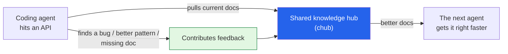

Catching up on a few back issues of [*The Batch*](https://www.deeplearning.ai/the-batch/issue-344) I'd
flagged to read properly. Issue 344's opening letter asks a question I hadn't considered but immediately
liked: **should AI coding agents have their own Stack Overflow?** These are my notes on the letter, plus
a quick lap of the issue.

*This is my summary and interpretation, not the authors' words — go read the
[original issue](https://www.deeplearning.ai/the-batch/issue-344).*

## The letter: a knowledge commons for agents

The setup: coding agents trained on old code keep reaching for **outdated or wrong APIs**, because that's
what was in their training data. Ng's team built a CLI tool, **Context Hub ("chub")**, that feeds agents
*current* API documentation — and it took off fast (thousands of GitHub stars in a week), with the doc
collection growing from under 100 to nearly 1,000 entries through community and agent contributions.

The bigger idea in the letter is the interesting bit: what if agents didn't just *consume* docs but
**contributed back** — flagging a bug, a better API usage pattern, a gap in the documentation — so the
next agent benefits? A Stack Overflow, but where the askers and answerers are increasingly the agents
themselves.

Why it stuck with me: it's the [agentic-coding loop]()
turned into a *collective* one. Right now every agent rediscovers the same API quirks alone. A shared,
continuously-updated commons is exactly the kind of unglamorous infrastructure that quietly makes the
whole ecosystem better — the same instinct behind keeping an agent's context fresh that I keep running
into with [Claude](). The open question is *trust*: if
agents write the knowledge base, how do you keep it from filling up with confident, wrong answers?

## Also in this issue

- **GPT-5.4: higher performance, higher price.** OpenAI shipped GPT-5.4 (Thinking and Pro), with native
  computer use, "tool search," adjustable reasoning, and a context window past a million tokens. It hit
  **state-of-the-art on a stack of hard agentic benchmarks** (GDP-Val-AA, BrowseComp,
  Terminal-Bench-Hard, SWE-Bench-Pro, MCP Atlas). The catch is in the issue's own title — it's
  *expensive*, landing roughly level with Gemini 3.1 Pro on the overall intelligence index while costing
  several times more to run. The frontier keeps climbing, but the [cost-per-unit-intelligence
  question]() isn't going away.
- **Mobile AI skyrockets.** Per Sensor Tower's State of Mobile report, AI app revenue **tripled past
  ~$5B** and downloads **doubled to ~3.8B+**, with ChatGPT, Gemini, DeepSeek, Doubao, and Perplexity
  leading. For the first time, non-game app revenue topped gaming. The takeaway I sit with: for a huge
  number of people, "AI" now *is* a phone app — which makes the on-device and cost story matter even more.
- **Data centers go off-grid.** Meta, OpenAI, and others are building **private power plants** wired
  straight to data centers — gas-fired generators, even modified jet engines — to get power fast,
  bypassing grid queues. It's the literal, physical version of the infrastructure land-grab behind
  [OpenAI's own inference chip](): compute is now
  bottlenecked on *electricity*, and the green commitments are quietly losing to gas in the near term.
- **Lightning-fast diffusion (Apple FAE).** A Feature Auto-Encoder that shrinks vision-encoder embeddings
  so diffusion models train **dramatically faster** (the paper reports matching prior image-quality
  results in a fraction of the epochs). A nice reminder that a lot of progress is *efficiency*, not just
  scale — the same theme as my [process-driven image generation
  notes]().

## Worth discussing

- A knowledge commons written *by* agents needs quality control. Reputation? Verification by other
  agents? Human review? Who curates the curators?
- "SOTA but expensive" is becoming a recurring pattern. When does best-on-benchmarks stop being the thing
  buyers actually optimize for?
- If data centers are now power plants with servers attached, AI's environmental footprint is a
  first-order issue, not a footnote. How honest are the "renewable" pledges when the near-term build is
  gas?

---

*Credit where it's due — this is my summary of
[*The Batch* issue 344](https://www.deeplearning.ai/the-batch/issue-344) (DeepLearning.AI): Andrew Ng's
letter on a Stack Overflow for coding agents (and Context Hub), plus its coverage of GPT-5.4, mobile AI
growth, off-grid data centers, and Apple's FAE. Figures are as reported there; where exact numbers were
unclear I kept the description qualitative. The framing and any errors here are mine.*
