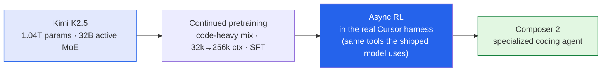

I spend my working days in an AI coding tool, so when the team behind one publishes a full technical
report on how their model was *trained*, I read it. **Composer 2** is Cursor's specialized model for
agentic software engineering, and the [report](https://arxiv.org/abs/2603.24477) (arXiv:2603.24477,
also up on [Cursor's blog](https://cursor.com/blog/composer-2-technical-report)) is unusually candid —
not just "here are our benchmark wins," but the recipe, the infrastructure, and a genuinely good
argument about *why the usual benchmarks lie.* These are my notes.

*This is my summary and interpretation of the paper, not the authors' words. Any errors are mine.*

## The one-paragraph version

Composer 2 starts from **Kimi K2.5** — a **1.04-trillion-parameter Mixture-of-Experts** model with
**32B active parameters** — and specializes it for coding in two stages: **continued pretraining** to
deepen coding knowledge, then **large-scale reinforcement learning** to make it good at the actual
end-to-end job of an agent. The headline results: **61.3 on their internal CursorBench, 73.7 on
SWE-bench Multilingual, and 61.7 on Terminal-Bench** — frontier-competitive, while being cheaper to
serve than the big general-purpose APIs. That last clause — *competitive accuracy at lower cost* — is
the whole thesis: a domain-specialized model can beat generalists on its home turf.

## Stage 1: continued pretraining (and a clever shortcut)

They take Kimi K2.5 and keep training it on a code-dominated mix, staged by sequence length: the bulk
of compute at **32k tokens**, a long-context extension to **256k**, then a short supervised
fine-tuning pass on targeted coding tasks. Training ran in **MXFP8 on NVIDIA B300s**, and the loss
falls **log-linearly** the whole way.

The detail I liked: they wanted to know whether this pretraining actually *helps the RL stage later* —
an expensive question to answer at full scale. So they studied it on a **smaller Qwen3-Coder-30B**
model and found that **cross-entropy loss after pretraining is predictive of RL reward downstream.**
That's a useful, cheap proxy: improve the loss on a small model and you can trust the big run will pay
off. They also train **Multi-Token Prediction** layers (via self-distillation) so the deployed model
can use speculative decoding and serve faster.

## Stage 2: RL inside the real product

This is the part I find most clever, and it lines up with something I believe generally: **train on
the thing you actually ship.** Composer 2's RL doesn't happen in some sanitized toy environment — it
runs inside the **same Cursor harness, with the same tools** (read/edit files, run shell, grep,
semantic search, web search) that the deployed model uses. The problem distribution is drawn from
*real* developer use: iterating on features, debugging, new features, refactors — the messy stuff,
not competitive-programming puzzles. Minimizing train-test mismatch is the core tenet, and it shows up
everywhere in the design.

A few of the engineering choices, because they're instructive:

- **Single-epoch RL** — a prompt is *never trained on twice.* No memorizing the training set.
- **Dr.-GRPO-style debiasing** — they drop GRPO's length-standardization term (it biases toward
  certain lengths) and *don't* normalize advantages by group standard deviation (which would blow up
  tiny differences when every rollout is equally correct). They also pick the **low-variance KL
  estimator** rather than the popular one that explodes when the policies drift apart.
- **A nonlinear length penalty** — concave, so the model is pushed to be *quick on easy tasks but
  think longer on hard ones*, and it learns to batch tool calls in parallel. A reward shaped like how
  a good engineer actually budgets effort.
- **Self-summarization** (carried over from Composer 1.5) lets a single rollout chain many generations
  together through summaries, so the agent can work over long horizons without drowning in context —
  and the final reward flows back through the whole chain, so it *learns to summarize well.*

The result they're proudest of: over training, **both average performance *and* best-of-K go up
together.** That matters because a known failure mode of RL is that it just sharpens the model on
things it could already do — best-of-K stays flat while the average creeps up. Here they see the
opposite: RL is **expanding the set of problems the model can solve at all**, not just reweighting a
fixed pool. That rhymes directly with the [POPE "hints" paper I wrote up
yesterday]() — same prize (broaden the reachable
solution set), different lever.

## The part that stuck with me: CursorBench and the benchmark critique

Here's the argument I think is the most valuable thing in the paper, and it's one I'd make as a
data-analytics person, not just a coding-tool user: **public coding benchmarks increasingly fail to
measure real-world software engineering.** Cursor names four reasons, and they're textbook
measurement-validity problems:

1. **Domain mismatch** — SWE-bench is mostly isolated bug-fixing; Terminal-Bench has abstract puzzles
   (e.g. computing chess moves). Neither spans what developers actually do all day.
2. **Prompt over-specification** — public benchmarks assume a narrow "correct" answer and spell the
   task out cleanly. Real requests are *under*-specified and admit many valid approaches, so clean
   benchmarks either punish good alternatives or hand the model unrealistically explicit prompts.
3. **Data contamination / overfitting** — benchmarks scraped from public repos leak into training
   data. They note **OpenAI suspended reporting SWE-bench Verified** after finding models could
   generate gold patches *from memory*, and that score compression makes **Haiku 4.5 (73.3%) look
   almost level with GPT-5 (74.9%)** on that benchmark — clearly not a real-world ordering.
4. **Narrow scope** — benchmarks measure functional correctness only, ignoring code quality,
   readability, latency, cost, and the interactive feel of a session.

So they built **CursorBench** from *actual* sessions of their own engineering team. The contrast in
the numbers is the punchline: CursorBench tasks have a **median of 181 lines changed** versus **7–10
for SWE-bench**, and a **median prompt of ~390 characters** versus **1,185–3,055** for the public
sets. In plain English: **bigger changes, vaguer instructions** — i.e., real work. And they keep
refreshing it; CursorBench-3 more than doubled the median task size (**+116% lines changed, +167%
files touched**) as developers started handing agents longer-running, more ambiguous jobs.

This is the bit I'll carry into my own work. Any time you optimize against a metric, you inherit that
metric's blind spots — and a benchmark that's clean, static, and public is *almost designed* to drift
away from the real task it was meant to stand in for. "Build your eval from real sessions, and keep
re-cutting it as the work changes" is good advice well beyond coding models.

## The infrastructure, briefly

I won't pretend to do the systems section justice, but the scale is worth registering. Training used
**Context Parallelism** as the main long-context axis (cheaper communication than tensor parallelism),
decoupled expert-parallelism from tensor-parallelism for bigger MoE configs, and ran on **Blackwell
GPUs** with in-house **MXFP8/NVFP4** kernels (some open-sourced into ThunderKittens). The RL stack is
**four decoupled services** — training, environments, inference, evals — with environments running on
**Anyrun**, an internal platform spinning up **hundreds of thousands of Firecracker micro-VMs**
(each a full dev environment with a browser), scheduling **500+ pods per second.** The production run
spanned **3 GPU regions and 4 CPU regions**, with delta-compressed weight sync so geographically
distributed inference could pull updates over commodity cloud storage. It's a reminder that a frontier
model today is as much a *distributed-systems* achievement as a machine-learning one.

## The results, and the honest caveats

| Model | CursorBench | SWE-bench Multilingual | Terminal-Bench |
| --- | --- | --- | --- |
| **Composer 2** | **61.3** | **73.7** | **61.7** |
| Composer 1.5 | 44.2 | 65.9 | 47.9 |
| Composer 1 | 38.0 | 56.9 | 40.0 |

That's a **~37% relative jump on CursorBench over Composer 1.5** (and 61% over Composer 1), with
steady gains on the public benchmarks too — and, per their cost analysis, sitting on a **Pareto-optimal
accuracy-vs-cost frontier**: roughly the inference cost of small/low-effort models at accuracy
competitive with much larger ones.

The caveats I'd keep in mind: **CursorBench is internal and self-reported** — it's a genuinely
thoughtful eval, but it's *their* eval, and it can't be independently reproduced. The headline
cost-efficiency claim depends on it. The team is admirably honest about this and about the model's
ceiling — they say plainly that Composer 2 is "likely smaller than other proprietary models of
comparable ability" and that long-horizon agentic work is where the real work remains.

## Why this matters to me

- **"Train and evaluate on the real thing" is the throughline.** RL in the production harness, evals
  from production sessions — the entire report is an argument against train-test mismatch, which is the
  same discipline I try to bring to any [model I'd put in front of
  stakeholders]().
- **Specialization beats generality on a defined domain.** A 1T-param model tuned hard for coding can
  out-serve bigger generalists on coding *and* cost less. That's a strategic signal for anyone
  deciding whether to reach for a frontier API or a focused model.
- **The benchmark critique is the transferable lesson.** Goodhart's law with citations. I'd put the
  CursorBench section in front of anyone who's ever shipped a dashboard and watched a team optimize the
  number instead of the outcome.

## Worth discussing

- If the most credible eval (CursorBench) is necessarily private, how should the rest of us judge
  these claims? Is there a path to *shared* real-world coding evals that don't immediately leak into
  training data?
- "Best-of-K and average rising together" is the headline RL claim. How much of that is the method vs.
  simply a very strong base model (Kimi K2.5) plus a very clean harness?
- Specialized-vs-generalist feels like the real frontier question. Where's the line where it's worth
  training your own domain model instead of prompting a big general one?

---

*Credit where it's due — this is my summary of the **Composer 2 Technical Report** by the Cursor
Research Team ([arXiv:2603.24477](https://arxiv.org/abs/2603.24477);
[Cursor blog](https://cursor.com/blog/composer-2-technical-report)). All figures (the 61.3 / 73.7 /
61.7 results, the 1.04T/32B architecture, the CursorBench line/character medians, and the
infrastructure numbers) are as reported in the paper. The framing, the rounded numbers, and any errors
here are mine; the research is theirs.*
