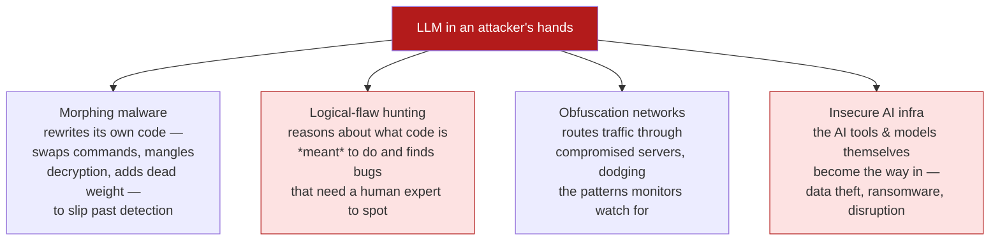

I write a lot here about what AI can *build*. This one is about what it can *break*. I read a *Batch*
roundup —
**["Cybersecurity Alarms Grow Louder"](https://www.deeplearning.ai/the-batch/cybersecurity-alarms-grow-louder)** —
pulling together a cluster of recent warnings about LLMs in the hands of attackers, and it's the kind
of piece I think is worth sitting with rather than skimming. These are my notes.

*This is my summary and interpretation, not the authors' words — go read the
[original article](https://www.deeplearning.ai/the-batch/cybersecurity-alarms-grow-louder).*

## The headline that got my attention

Google's security researchers reported that **hackers used an LLM to discover a previously unknown
vulnerability** in a widely used web-administration tool — and that the people behind it appear to
have been planning to exploit it at scale before it was caught. That's the line that matters: not "an
AI wrote some malware," but **an AI found a real, novel hole** that nobody had documented. Google
frames this as the leading edge of potential **"industrial-scale" cyberattacks**, and it points at a
widening gap between what LLMs can find and what conventional security tooling can catch.

## The four ways LLMs raise the offensive ceiling

The article organizes the threat into four buckets, and laying them out side by side is what made it
click for me:

The one I find genuinely new is **logical-flaw hunting**. Traditional bug-finders (fuzzers, static
analyzers) look for *patterns* — known-bad shapes in code. An LLM can instead **reason about what the
code is trying to do** and notice that the *intent* is broken in a way no pattern would flag. That's
the category that used to require a focused human review, and it's exactly the kind of vulnerability
that's invisible to the usual tools. The Google zero-day above is this category made real.

The fourth bucket — **insecure AI infrastructure** — is the one that closes a loop with my
[gray-market-for-LLM-access notes](): the AI
systems themselves are now targets and entry points, not just tools.

## How capable, concretely?

The number that anchors all of this comes from the **UK's AI Security Institute (AISI)**. They
reported that frontier models — naming **Claude Mythos Preview** and **OpenAI's GPT-5.5** — could
*reliably* execute attacks that would be **expected to take a human about three hours.** The reason
that's striking: AISI's *previous* estimate was roughly **one hour.** The offensive horizon roughly
tripled between assessments.

And there's a scaling wrinkle I want to flag carefully: when the models were allowed **more output
tokens**, they pulled off **more complex** attacks. In other words, the ceiling isn't fixed by the
model alone — give it more room to "think," and the difficulty of what it can attempt goes up. That's
a deeply uncomfortable property for anyone trying to forecast risk, because it means the relevant
number keeps moving.

## Why I'm not reaching for the panic button (but am taking notes)

A few honest reactions:

- **This is dual-use, not pure doom.** Every capability on that list — reason about code intent, find
  logical flaws, generate variants — is *also* what you'd want a defensive tool to do. The same model
  that finds a zero-day for an attacker can find it for the maintainer first. The article's own
  recommendation is exactly this: **prioritize proactive defensive research** — use these tools to
  discover and patch vulnerabilities *before* the other side does. The advantage goes to whoever
  automates the search first, and there's no law that says it has to be the attacker.
- **The asymmetry is the real story.** Attackers only need one hole; defenders need to close all of
  them. AI lowers the cost of *finding* holes, which structurally favors offense unless defenders
  adopt the same tooling at the same pace. That's a tooling-adoption race, and it's winnable — but
  only if defense doesn't sit it out.
- **"Insecure AI infrastructure" is the part I'd watch at work.** As organizations wire LLMs into real
  systems — the [enterprise agents]() I keep writing
  about — the model, its tools, and its data pipeline all become attack surface. Prompt injection,
  poisoned context, leaky tool permissions: these aren't exotic anymore. The
  [trust-and-control instincts]() I apply to *where* AI
  runs apply just as hard to *how safely* it's wired in.

## Worth discussing

- If "more tokens → more complex attacks" holds, capability forecasts have a moving denominator. How
  do you even *govern* a risk whose ceiling rises with inference budget?
- Defensive parity is a tooling-adoption problem as much as a research one. What stops a mid-sized org
  — the kind without a Google-scale security team — from being permanently a step behind?
- Where's the responsible-disclosure line when the *discoverer* is a model an attacker rented? Who's
  accountable, and to whom?

---

*Credit where it's due — this is my summary of
["Cybersecurity Alarms Grow Louder"](https://www.deeplearning.ai/the-batch/cybersecurity-alarms-grow-louder)
from *The Batch* (DeepLearning.AI), which draws on Google's threat-intelligence reporting and the UK
AI Security Institute (AISI). Model names, the three-hour AISI figure, and the four threat categories
are as reported there; the framing, emphasis, and any errors are mine. Where the source summary was
ambiguous, I left details out rather than guess.*
