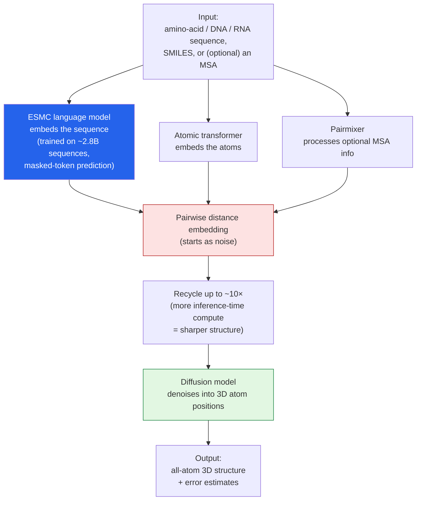

I keep being drawn to the same idea from different angles this month: that a lot of the natural world
turns out to be *readable as a language* once you have a big enough transformer. I wrote it up for
[DNA regulation with AlphaGenome](); here it is again
for protein structure. I read a *Batch* piece —
**["Biological Molecules as Language"](https://www.deeplearning.ai/the-batch/biological-molecules-as-language)** —
about **ESMFold2**, and pulled a few extra threads because the core move is elegant. (I touched on this
in my [issue-359 roundup]() — this is the
proper write-up.) These are my notes.

*This is my summary and interpretation, not the authors' words — go read the
[original article](https://www.deeplearning.ai/the-batch/biological-molecules-as-language).*

## The problem ESMFold2 sidesteps

Predicting a molecule's 3D shape from its sequence is the marquee problem of computational biology, and
AlphaFold cracked the door open. But AlphaFold's lineage leans hard on **multiple-sequence alignments
(MSAs)** — you fold a protein well partly by lining it up against many *related* proteins from across
evolution and reading the patterns in that stack. That works beautifully when relatives exist. It works
badly exactly where biology is most interesting: **novel or synthetic molecules, fast-mutating
pathogens, designed proteins** — anything without a crowd of evolutionary cousins to compare against.

**ESMFold2**, from the non-profit **Biohub** and the AI-for-biology lab **EvolutionaryScale**, attacks
that gap by treating a molecule **like a piece of text** — embedding it *directly* with a language
model, so it can fold from the sequence alone. MSAs become *optional* rather than required.

## How it works

The system (a ~**6.2-billion-parameter** "mixed" architecture) stitches together a few pathways and
then refines a shape out of noise — structurally not that different in spirit from how an image
diffusion model works, pointed at atoms instead of pixels:

The engine underneath is **ESMC** ("Evolutionary Scale Modeling Cambrian"), a language model trained on
roughly **2.8 billion sequences** drawn from across the tree of life — including organisms from extreme
environments and 20,000+ human proteins — using the same **masked-token prediction** objective that
trains text LLMs. It just learns the "grammar" of evolution instead of English. ESMFold2 then borrows
AlphaFold3's good ideas where they help — a **diffusion model** to place atoms, explicit **error
estimates** — and recycles through its distance estimates up to ~10 times, spending more inference
compute to sharpen the answer.

## Does it work?

On the **FoldBench** benchmark, the article reports it holds its own against the best:

| Task | ESMFold2 | Others |
| --- | --- | --- |
| Protein shape, **no MSA** (lDDT) | **0.85** | Chai-1: 0.81 |
| Protein shape, **with MSA** (lDDT) | **0.89** | AlphaFold3 & Protenix-v1: 0.89 (tied) |
| Protein–DNA binding, no MSA (DockQ pass) | **80%** | Chai-1: 71% |
| Protein–DNA binding, with MSA (DockQ pass) | 79% | AlphaFold3: 82% |

The shape of that table is the story: **without** MSAs, ESMFold2 clearly beats a strong peer (Chai-1);
**with** them, it pulls level with AlphaFold3. So you're not trading much accuracy for the convenience
of dropping the alignment requirement — and the team notes that from ESMC's representations *alone*, it
can even beat AlphaFold3 at predicting antibody–antigen binding poses. The honest caveat: AlphaFold3
still edges it on protein–DNA docking when MSAs are available (82% vs 79%).

And the scale this unlocks is the part that made me sit up: because folding straight from a sequence is
*fast*, the team used it to predict **over a billion structures** for an "ESM Atlas" spanning billions
of proteins. MSA-dependence wasn't just an accuracy quirk — it was a throughput ceiling, and removing it
changes what's even attemptable.

## Why this stuck with me

- **"Biology is a language" keeps paying off.** Same masked-token-prediction trick that powers text
  models, aimed at amino acids — and it learns enough evolutionary structure to fold proteins. Stack
  this next to [AlphaGenome reading regulatory DNA]() and
  the [Walrus fluid-dynamics model]() and
  there's a clear throughline: **the transformer is becoming a general instrument for natural science,**
  not just for chat.
- **The MSA-free angle is a values point, not just a metrics point.** Needing a pile of evolutionary
  relatives quietly favors the well-studied and penalizes the novel — new pathogens, designed
  molecules, under-sampled organisms. Folding from the sequence alone is most useful precisely at the
  frontier, which is the right place to lower the cost.
- **Open + free is the multiplier.** Weights on HuggingFace, a web tool, an API — no institutional
  gatekeeping. The [drug-discovery economics]()
  I wrote about get very different when accurate structure prediction is a free commodity any lab can
  run. That's the [human-centered, access-first]() version
  of this technology I want to see more of.

## Worth discussing

- "More inference compute → better structure" (the ~10× recycling) is the same scaling instinct showing
  up in reasoning models. How far does spend-more-at-inference go in science before it plateaus?
- If MSA-free folding is *most* valuable for novel/synthetic molecules, how do we trust it there — the
  exact regime where there's little ground truth to check against?
- A billion predicted structures is a firehose. Does the bottleneck just move downstream to
  *experimental validation* — and does cheap prediction without cheap wet-lab confirmation actually
  speed discovery, or just flood it?

---

*Credit where it's due — this is my summary of
["Biological Molecules as Language"](https://www.deeplearning.ai/the-batch/biological-molecules-as-language)
from *The Batch* (DeepLearning.AI), covering **ESMFold2** from **Biohub** and **EvolutionaryScale**. The
FoldBench figures (lDDT and DockQ) are as reported in the article; the ESMC training scale, the
MSA-optional design, and the billion-plus-structure ESM Atlas are corroborated by Biohub's own
[release materials](https://biohub.org/news/world-model-of-protein-biology/). The framing, the rounded
numbers, and any errors here are mine; the research is theirs.*
