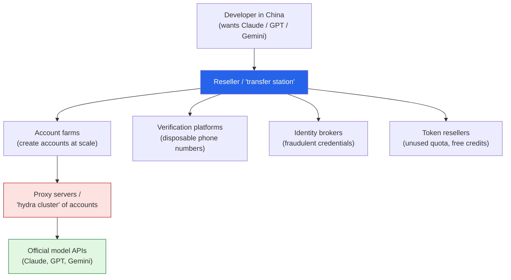

Most of the AI stories I write up here are about a model or a method. This one is about a **market** —
specifically the shadow economy that has grown up to sell access to U.S. frontier models inside
mainland China, where ChatGPT, Claude, Gemini, and Midjourney aren't officially available. I read a
*Batch* piece —
**["Inside the Gray Market for LLM Access"](https://www.deeplearning.ai/the-batch/inside-the-gray-market-for-llm-access)** —
and it stuck with me because it's a clean case study in what happens when demand for a product runs
straight into the wall of who's *allowed* to buy it. These are my notes.

*This is my summary and interpretation, not the authors' words — go read the
[original article](https://www.deeplearning.ai/the-batch/inside-the-gray-market-for-llm-access).*

## The headline number

Developers in China can buy **Anthropic Claude tokens for as little as 10% of the standard price** —
a 90% discount on a product they're not supposed to be able to buy at all. That gap is the whole
story. When a thing is in high demand and officially unavailable, a market appears to bridge the
distance, and it doesn't much care which side of the law it's standing on.

## How the network is wired

The thing that struck me is that this isn't one shady reseller — it's a whole **supply chain**, with
specialized roles that look unsettlingly like a legitimate cloud business:

Account farms spin up model accounts in bulk; verification platforms supply the throwaway phone
numbers to register them; identity brokers manufacture credentials; token resellers traffic in unused
quota; and proxy servers relay the actual API calls through nominally legitimate accounts. The article
calls the front-ends **"transfer stations,"** and the backend a **"hydra cluster"** — a sprawling web
of fake accounts spreading traffic so no single one trips a limit.

## The gray-to-black gradient

What I appreciated about the piece is that it doesn't flatten everything into "fraud." There's a
gradient:

**Genuinely gray (arguably just arbitrage):**

- Aggregating the free API credits providers hand out
- Reselling the unused portion of a legitimate subscription's quota
- Exploiting educational or corporate discounts
- Splitting one subscription plan across many users

**Squarely illicit:**

- Accounts opened with **stolen or fraudulent credit cards**
- Circumventing China's Great Firewall
- **Harvesting users' request logs** and reselling them as training data
- **Model substitution** — billing you for a premium tier while quietly routing your calls to a
  cheaper, weaker model

That last one is the consumer-protection sting, and it's not hypothetical.

## "90% off" can mean "getting a worse model"

The detail that I'll remember: researchers at the **CISPA Helmholtz Center** tested proxy access
advertised as "Gemini-2.5" and measured it on **MedQA**, a medical question benchmark. The proxy
scored **37% accuracy. Google's official API scored 83.82%.** Same advertised model, less than half
the performance — because behind the discount, requests were being silently downgraded to something
cheaper.

That reframes the whole "discount" for me. You're not necessarily buying the same thing at a lower
price. You may be buying a *different, worse thing* wearing the brand's name — with the added bonus
that your prompts and outputs might get logged and resold. In a domain like medicine, a 37%-vs-84%
gap isn't a rounding error; it's the difference between a useful tool and a dangerous one. It's a
sharp argument for *provenance* — knowing the request actually reached the model you think it did —
which is part of why I keep coming back to [keeping AI you control close to
home]().

## Where it shades into model theft

The gray market isn't just a retail story; it's an on-ramp for something bigger. The same proxy
infrastructure that resells access at scale is, per Anthropic, also used to **distill** frontier
models — systematically pumping prompts through Claude and harvesting its outputs to train competing
models.

The numbers Anthropic reported: **over 16 million exchanges from roughly 24,000 fraudulent accounts**,
which it attributed to an **"industrial-scale distillation"** effort and named three Chinese labs —
**DeepSeek, Moonshot, and MiniMax**. By April 2026 the White House had reportedly characterized this
as an **"adversarial threat."** I'd flag the obvious caveat: these are *allegations*, the named labs
dispute them, and distillation's real contribution to any given model is genuinely hard to measure
from the outside. But the mechanism is plausible precisely *because* the access market already exists.

## Why this stuck with me

- **Scarcity manufactures infrastructure.** Block official access to something people badly want and
  you don't kill the demand — you grow a parallel system to serve it, complete with specialized roles,
  pricing, and fraud. The export-control intent is real; so is the workaround economy it spawned.
- **"Cheaper" hides a quality and privacy tax.** The CISPA result is the thing I'd want every
  developer reaching for a discounted API key to internalize: a brand name on the label doesn't
  guarantee the model behind it, and the savings can come straight out of accuracy — or out of your
  data.
- **Access and theft run on the same rails.** The retail gray market and the distillation accusations
  aren't separate stories. The fake-account, proxy-cluster plumbing that lets a developer buy cheap
  tokens is the same plumbing that lets a lab harvest millions of outputs. This is the messy flip side
  of the clean developer experience I wrote about in
  [building with Claude]().

## Worth discussing

- If demand is this strong, is access restriction *containment* or just *displacement* into a market
  no one can audit? What would a legitimate, compliant path even look like?
- Model substitution feels like the under-covered consumer harm here. How would you even *prove* the
  model behind an endpoint is the one you paid for — cryptographic attestation, watermarking,
  benchmark canaries?
- Where's the honest line between "arbitraging free credits" and "fraud"? Several of these practices
  are uncomfortably close to things that happen in plain sight everywhere.

---

*Credit where it's due — this is my summary of
["Inside the Gray Market for LLM Access"](https://www.deeplearning.ai/the-batch/inside-the-gray-market-for-llm-access)
from *The Batch* (DeepLearning.AI). The CISPA Helmholtz Center MedQA figures, Anthropic's
[distillation findings](https://www.anthropic.com/news/detecting-and-preventing-distillation-attacks)
(the 16M exchanges / 24,000 accounts and the DeepSeek/Moonshot/MiniMax allegations, also reported by
[CNBC](https://www.cnbc.com/2026/02/24/anthropic-openai-china-firms-distillation-deepseek.html) and
[VentureBeat](https://venturebeat.com/technology/anthropic-says-deepseek-moonshot-and-minimax-used-24-000-fake-accounts-to)),
are as reported in those sources. The framing and any errors here are mine.*
