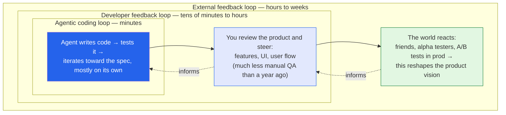

I read [*The Batch*](https://www.deeplearning.ai/the-batch/issue-359) most weeks, but issue 359 is one
I actually wanted to write up — mostly for **Andrew Ng's opening letter on "loop engineering,"** which
named something I'd been feeling but hadn't put words to. The rest of the issue is a tidy snapshot of
where AI is right now, so I'll cover the letter properly and then do a quick lap of the news. These are
my notes.

*This is my summary and interpretation, not the authors' words — go read the
[original issue](https://www.deeplearning.ai/the-batch/issue-359).*

## The letter: building software is three nested loops

Ng's argument is that "writing software" is no longer one activity — it's **three feedback loops
running at very different speeds**, and getting good at building things now means managing all three
rather than just grinding the innermost one.

1. **The agentic coding loop (minutes).** The coding agent writes code, tests it, and iterates toward
   the spec largely without you. Ng mentions an agent that worked on a typing app for *around an hour*
   with no intervention. This is the loop everyone's been obsessing over.
2. **The developer feedback loop (tens of minutes to hours).** You look at what the agent built and
   steer it at a higher level — features, UI, the user flow. His key observation: a year ago developers
   spent this loop acting as manual QA, hunting bugs. Now that agents test their own code, *that part
   has shrunk dramatically*, which frees the human to operate at the level of "is this the right thing
   to build?"
3. **The external feedback loop (hours to weeks).** Real reactions from the real world — asking
   friends, launching to alpha testers, A/B testing in production. This one is irreducibly slow, and
   it's where product vision actually gets corrected.

The line I keep turning over: the human's enduring edge isn't speed, it's a **context advantage** about
what users actually need. As the inner loop gets automated, the job drifts outward — engineers
increasingly do **partial product management**, shaping vision rather than typing implementations.

## Why this framing landed for me

I more or less *live* in the inner loop now — it's exactly the experience I described in my
[Composer 2 notes]() and in
[building with Claude](). What "loop engineering" gave me
is a way to see why that can feel simultaneously amazing and *hollow*: making the inner loop faster
does nothing for the outer loops, and the outer loops are where the value is decided. You can generate
a working app in an hour and still be building the wrong thing.

A few takeaways I'm keeping:

- **The bottleneck moved.** When the cost of *producing* code collapses, the scarce skill becomes
  *deciding what's worth producing* and *reading whether it's working.* That's a taste-and-judgment
  problem, not a typing-speed problem.
- **It reframes the "will AI take my job" anxiety.** The work doesn't vanish; it moves up a loop. The
  uncomfortable part is that the new work — product sense, user empathy, knowing what to build — is
  *harder to fake* than churning out boilerplate.
- **As a [data/analytics person](), the outer loop is
  home turf.** "Ship, measure real behavior, correct the vision" is just the experiment-and-feedback
  discipline analytics has always run on, now wrapped around code generation. The people who'll thrive
  are the ones comfortable closing that outermost loop — not just the innermost one.

## Also in this issue (the quick lap)

The same issue is a good cross-section of the current moment, so briefly:

- **GLM-5.2 — open weights closing on the frontier.** Z.ai (Zhipu) released **GLM-5.2**, a large
  open-weights Mixture-of-Experts model built for long-running, agentic coding, with a roughly
  **million-token** context. It reportedly tops the open-weights field on Artificial Analysis's index —
  landing *third overall, behind only Claude Opus 4.8 and GPT-5.5* — at a fraction of the price. The
  open-vs-closed gap keeps narrowing, and cost is becoming the real story (which is the same thread I
  pulled in [FrugalGPT]()).
- **AI degrees are exploding.** Per Northeastern's Center for Inclusive Computing, there are now
  **1,000+ AI programs across 584 U.S. colleges** — up from a literal handful of AI majors in 2021.
  Carnegie Mellon launched the first U.S. AI bachelor's back in 2018. As someone doing a master's in
  AI, I have mixed feelings — formalizing the field is good, but the open worry (specializing students
  before they have CS fundamentals) is real. It rhymes with the schooling questions in my
  [Alpha School notes]().
- **Apple's on-device recipe.** Apple refreshed its **Apple Foundation Models** for on-device and
  server use and shipped a Foundation Models API for developers. The interesting wrinkle: the on-device
  approach leans on **distillation** (Apple's framing was distillation-based, *not* wholesale adoption
  of a partner's model) and clever memory tricks to run a capable model on a phone. Squarely the
  [keep-AI-local]() direction I care about.
- **Proteins as language: ESMFold2.** Biohub and EvolutionaryScale released **ESMFold2**, which treats
  biological molecules — proteins, DNA, RNA, and the things that bind them — *like text* and predicts
  their shapes. The headline trick: unlike AlphaFold3, it can embed an individual molecule directly
  **without needing multiple-sequence alignments**, while matching or beating prior models on the
  FoldBench benchmark. That lowers the barrier for novel/synthetic molecules with no known relatives —
  a nice complement to the DNA-regulation work in my
  [AlphaGenome notes]().

## Worth discussing

- If the human job is moving "up a loop," what does *training* for that look like? The inner-loop
  skills are what schools teach; the outer-loop skills (taste, user empathy, knowing what to build) are
  the ones AI degrees may *under*-teach.
- Loop engineering assumes you can get fast, honest signal from the outer loops. For lots of real
  products that signal is slow, noisy, or political. Does the framing hold when the external loop takes
  *months*?
- Open-weights models like GLM-5.2 are getting genuinely close at a fraction of the cost. At what point
  does "use the frontier API" stop being the default reflex?

---

*Credit where it's due — this is my summary of
[*The Batch* issue 359](https://www.deeplearning.ai/the-batch/issue-359) (DeepLearning.AI), including
Andrew Ng's letter on loop engineering and the issue's coverage of GLM-5.2, the growth of AI degrees,
Apple's on-device foundation models, and ESMFold2. Where exact figures varied across sources (e.g.
GLM-5.2's parameter count) I kept the description qualitative rather than guess. The framing and any
errors here are mine; the reporting is theirs.*
