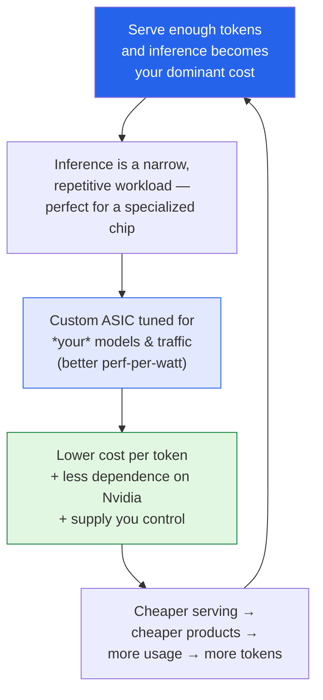

Most of what I write up here is about models and methods. This one is about the **metal underneath**.
OpenAI just unveiled **Jalapeño**, its first custom chip — built specifically for running large language
models, not training them — and I read the *Batch* writeup —
**["Inside Jalapeño, OpenAI's First Inference Chip"](https://www.deeplearning.ai/the-batch/inside-jalapeno-openais-first-inference-chip)** —
because the *why* here is more interesting than the *what*. These are my notes.

*This is my summary and interpretation, not the authors' words — go read the
[original article](https://www.deeplearning.ai/the-batch/inside-jalapeno-openais-first-inference-chip).*

## What it is

Jalapeño is an **inference** accelerator — OpenAI is branding it an "Intelligence Processor" — co-developed
with **Broadcom** and manufactured by **TSMC on its 3nm node**. A few concrete facts that are public:

- It's purpose-built for **inference** (serving models), not training. That focus is the whole design
  philosophy: it's tuned around the specific traffic pattern of running a deployed LLM rather than being
  a general-purpose GPU.
- It went from **initial design to tape-out in about nine months** — which OpenAI claims is the fastest
  ASIC development cycle ever for high-performance advanced semiconductors. Notably, they say they used
  **their own models to speed up the chip design** itself.
- **Engineering samples are already running in the lab** at production target frequency and power —
  including serving **GPT-5.3-Codex-Spark**.
- Early testing reportedly shows **performance-per-watt substantially better than current
  state-of-the-art** accelerators, by cutting data-movement overhead and balancing compute, memory, and
  networking around inference specifically.
- **Deployment starts by the end of 2026**, in gigawatt-scale data centers with **Microsoft** and other
  partners.

Worth being honest about the gaps: the detailed specs that hardware people actually argue over — memory
configuration, raw FLOPS, head-to-head benchmarks against Nvidia — **weren't disclosed.** "Better
perf-per-watt" is a vendor claim until someone runs independent numbers, and I'm reading it as one.

## Why a model company builds a chip

This is the part I find genuinely interesting as a [business/analytics
person](): the logic that makes a *software* company
go spend a fortune designing *silicon.* It comes down to scale changing the math.

Three forces, basically:

1. **Inference is now the bill.** Training a model is a big one-time spend; *serving* it to hundreds of
   millions of users is a forever-cost that scales with usage. Once you're at OpenAI's volume, a few
   percent better performance-per-watt is real money, every single day. This is the
   [FrugalGPT instinct]() — stop overpaying to run models —
   pushed all the way down to the transistors.
2. **A narrow workload rewards a specialized tool.** GPUs are general-purpose; they're built to do many
   things well. Inference for *your own* models is a narrow, repetitive job, and narrow jobs are exactly
   what custom ASICs crush. You can throw out everything you don't need and spend the silicon budget on
   the one traffic pattern you actually run.
3. **Supply and leverage.** Building your own chip means **less dependence on Nvidia** — both on price
   and on getting allocation at all. It's vertical integration as insurance, not just savings. (Google's
   TPUs and Amazon's Trainium/Inferentia have been running this playbook for years; OpenAI joining it is
   the notable part.)

## Why this stuck with me

- **The cost center moved, so the strategy moved.** A couple of years ago the story was "who can train
  the biggest model." Increasingly it's "who can *serve* intelligence cheapest," and that's a hardware-
  and-economics question as much as a research one. The companies that win may be the ones that treat
  inference like a manufacturing problem — squeeze the unit cost — not just a modeling one.
- **The self-improvement angle is quietly the wildest part.** They used their own models to help design
  the chip that will run their own models. That's a real, shipping instance of AI compounding its own
  infrastructure — a much more grounded version of the [recursive-improvement
  hype]() I'm usually skeptical of. Not magic,
  but a genuine flywheel.
- **Vertical integration is a moat *and* a risk.** Owning the stack from chip to product is powerful —
  but it concentrates enormous capability, capital, and dependence (TSMC, Broadcom, Microsoft data
  centers) into very few hands. The same consolidation that lowers OpenAI's costs raises real questions
  about who can even compete, which rhymes with the access-and-control worries in my
  [gray-market notes]().

## Worth discussing

- "Substantially better perf-per-watt" with no public benchmarks — how much weight should anyone put on
  a first-party claim about first-gen silicon until there's independent testing?
- Custom inference chips are great for *your own* models. Does this deepen lock-in — models so tuned to
  proprietary hardware that portability quietly dies?
- If the durable advantage is increasingly *cost-to-serve*, does the competitive frontier shift from
  research labs to whoever has the best chips, fabs, and power contracts? What does that mean for smaller
  players who'll never build silicon?

---

*Credit where it's due — this is my summary of
["Inside Jalapeño, OpenAI's First Inference Chip"](https://www.deeplearning.ai/the-batch/inside-jalapeno-openais-first-inference-chip)
from *The Batch* (DeepLearning.AI). The Broadcom partnership, TSMC 3nm manufacturing, the nine-month
tape-out, GPT-5.3-Codex-Spark testing, and the end-of-2026 Microsoft deployment are corroborated by
[OpenAI's announcement](https://openai.com/index/openai-broadcom-jalapeno-inference-chip/) and reporting
from [TechCrunch](https://techcrunch.com/2026/06/24/openai-unveils-its-first-custom-chip-built-by-broadcom/)
and [VentureBeat](https://venturebeat.com/infrastructure/openai-unveils-first-custom-ai-inference-chip-jalapeno-with-broadcom-and-its-development-was-sped-up-with-openais-own-models).
Undisclosed specs I left undisclosed. The framing and any errors here are mine.*
