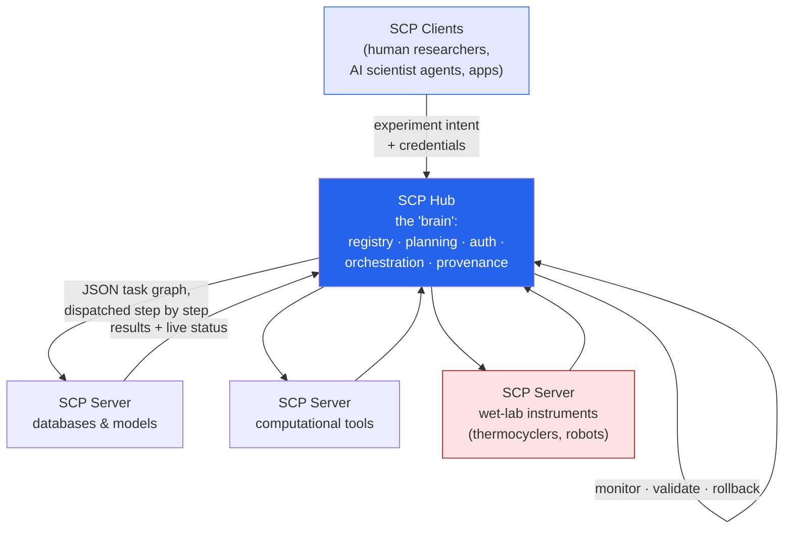

Someone shared the **SCP** paper with me and I fell down a happy rabbit hole. It sits right at the
intersection of two things I care about — [AI agents]() and
real scientific work — so these are my notes on
**"SCP: Accelerating Discovery with a Global Web of Autonomous Scientific Agents"**
([arXiv:2512.24189](https://arxiv.org/abs/2512.24189), Shanghai Artificial Intelligence Laboratory).

*This is my summary and interpretation of the paper, not the authors' words — go read the
[original](https://arxiv.org/abs/2512.24189); the reference implementation is open-source at
[github.com/InternScience/scp](https://github.com/InternScience/scp).*

## The problem: autonomous labs that can't talk to each other

"AI scientists" already exist — systems that reason, plan experiments, run them, and collaborate with
humans. The paper's opening observation is the honest one: almost all of them are **bespoke**. Each is
tightly coupled to one lab's specific tools and workflows, with ad-hoc interfaces to its data, its
simulators, its instruments. There's no shared **protocol layer** that lets an agent in one lab discover
and safely use a model, dataset, or robotic instrument in another — under a common, persistent, secure
scientific context.

If that sounds familiar, it should. It's the same gap [MCP]()
filled for LLM tool use — except MCP was built for generic "call this function" interactions, and science
needs a lot more: whole experiment plans, batches of trials, multi-agent coordination, and *physical*
lab equipment. **SCP (the Science Context Protocol) is the attempt to be that missing standard for
science.** The tagline that stuck with me: turn isolated agents and instruments into an interoperable
*"global web"* of composable discovery services.

## How it works: a hub, edge servers, and clients

SCP is a **hub-and-spoke** architecture built on two pillars — *unified resource integration* (one
universal spec for describing and invoking any scientific resource, be it software, a model, a dataset,
or a physical instrument) and *orchestrated experiment lifecycle management* (a secure service that runs
an experiment from registration through planning, execution, monitoring, and archival).

- **The SCP Hub** is the central orchestrator and protocol authority — a global registry of every tool,
  dataset, agent, and instrument, plus service discovery, task dispatch, OAuth2.1-style authentication,
  and governance. Its clever bit is an *intelligent orchestration* layer: give it a high-level goal
  ("design and run a PCR protocol to verify a gene knockout") and it decomposes that into a multi-step
  plan, ranks the **top-k** candidate plans with rationales (dependencies, expected latency, risk, cost),
  and lets you pick. The chosen plan compiles to a fine-grained **JSON task graph**, then runs through a
  *dispatch → monitor → validate → rollback* loop.
- **SCP Servers** are edge nodes that wrap local resources — instruments, models, databases, pipelines —
  register them as SCP "tools," and enforce local access control.
- **SCP Clients** are the interface for humans and AI scientists; every call carries the user's
  credentials and an experiment ID, so security and provenance stay centralized and auditable.

Concretely, SCP extends the MCP model with four science-specific additions: **richer experiment
metadata** (a first-class experiment context — persistent ID, dry/wet/hybrid type, goals, data URIs),
a **centralized hub** (global registry + experiment memory instead of pure peer-to-peer), **intelligent
workflow orchestration** (an "experiment-flow" API that synthesizes multi-step protocols), and — the one
I find most striking — **wet-lab device integration**, standardized drivers so a thermocycler or robotic
arm is addressable *the same way* as an in-silico model.

## The part I didn't expect: it already spans dry and wet

The reference platform (**Intern-Discovery**) ships **1,600+ interoperable tools** — one of the larger
tool ecosystems reported for scientific agents. The disciplinary split is telling: **~46% biology**,
~21% physics, ~12% chemistry, with the rest across materials, math, and information science; functionally
it's mostly computational tools and databases (UniProt, InterPro, PDB, NCBI) plus a slice of **wet-lab
operations**.

That last bit is what makes SCP more than a fancy tool registry. The case studies close the loop between
*computation* and *physical experiments*:

- **Reproducing a protocol from a PDF.** You upload a method section or lab SOP, a protocol-understanding
  node parses the free-form document into a structured JSON protocol, and the system executes it on real
  automation hardware — pipetting, incubation, measurement. (I appreciated the irony, since I'm literally
  writing this up *from a PDF* someone handed me.)
- **Molecular screening and docking.** 50 SMILES molecules → drug-likeness (QED) and toxicity (LD50)
  filtering → protein prep against a real PDB structure → docking → two candidate hits under
  −7.0 kcal/mol, each step a composable SCP tool call. It reads like the
  [protein-structure work I noted with ESMFold2](),
  but wired into an end-to-end automated pipeline.
- **Dry–wet fluorescent-protein engineering.** In-silico sequence design and property prediction produce
  ranked variants; the *same* SCP plan then drives wet-lab plasmid construction, cell culture, and
  fluorescence readout on robotic platforms — a genuine closed loop between prediction and pipette.

## Why "SCP vs MCP" is the real story

The discussion section is basically a case for why a general agent protocol isn't enough for science, and
it's a clarifying read even if you never touch a lab:

| Need | MCP alone | What SCP adds |
| --- | --- | --- |
| A whole **experiment** as one object | isolated messages, no protocol concept → fragmentation | structured JSON schema for the full plan |
| **High-throughput** batches | stateless, no experiment queue/memory | first-class experiment ID + persistent context |
| **Multi-agent** coordination | message-centric; needs bolt-ons (e.g. A2A) | the Hub *is* the orchestrator |
| **Wet-lab** hardware | no standard for representing lab devices | standardized device drivers, first-class |

The throughline: MCP gives you the *pipes*; SCP adds the *grammar and the governance* on top —
experiment identity, memory, planning, and physical-world actuation. It rhymes with the
["Stack Overflow for agents" idea]()
I liked recently: the unglamorous, shared **infrastructure** is often what actually unlocks the next
capability jump.

## Why it stuck with me

- **The interesting layer is moving up.** A year ago the story was better *models*; increasingly it's
  better *protocols and orchestration* around them — the connective tissue that lets specialized pieces
  compose. That's an [enterprise-architecture instinct]()
  pointed at the scientific method itself.
- **Dry–wet is the hard, honest frontier.** Plenty of "AI for science" stops at simulation. Standardizing
  the messy handoff to physical instruments — with validation, rollback, and provenance — is where the
  real reproducibility and safety questions live, and it's good to see them treated as first-class rather
  than an afterthought.
- **Centralization is the tension.** A single Hub holding global context, auth, and orchestration is
  exactly what makes cross-institution collaboration tractable — and also a concentration of control and
  a single point of failure. Same double-edged tradeoff I keep running into with
  [keeping capability local vs. central]().

## Worth discussing

- If every experiment becomes a versioned JSON task graph with a full audit trail, reproducibility could
  take a real step forward. But who governs the Hub that sees *everyone's* experiments?
- "Upload a PDF, watch it run on a robot" is thrilling and slightly terrifying. What's the validation bar
  before an agent-planned protocol touches physical reagents?
- MCP → SCP is a clean example of a general protocol spawning a domain-specific one. Where else does that
  pattern go next — medicine, manufacturing, climate?

---

*Credit where it's due — this is my summary of
["SCP: Accelerating Discovery with a Global Web of Autonomous Scientific Agents"](https://arxiv.org/abs/2512.24189)
(arXiv:2512.24189) by Shanghai Artificial Intelligence Laboratory; the reference implementation is
open-source ([InternScience/scp](https://github.com/InternScience/scp), Apache 2.0), and
[DeepLearning.AI's *The Batch*](https://www.deeplearning.ai/the-batch/sails-science-context-protocol-helps-ai-agents-communicate-about-local-and-virtual-experiments)
has a good writeup too. Figures and numbers (the 1,600+ tools, discipline percentages, case-study values)
are as reported in the paper. The framing and any errors here are mine.*
