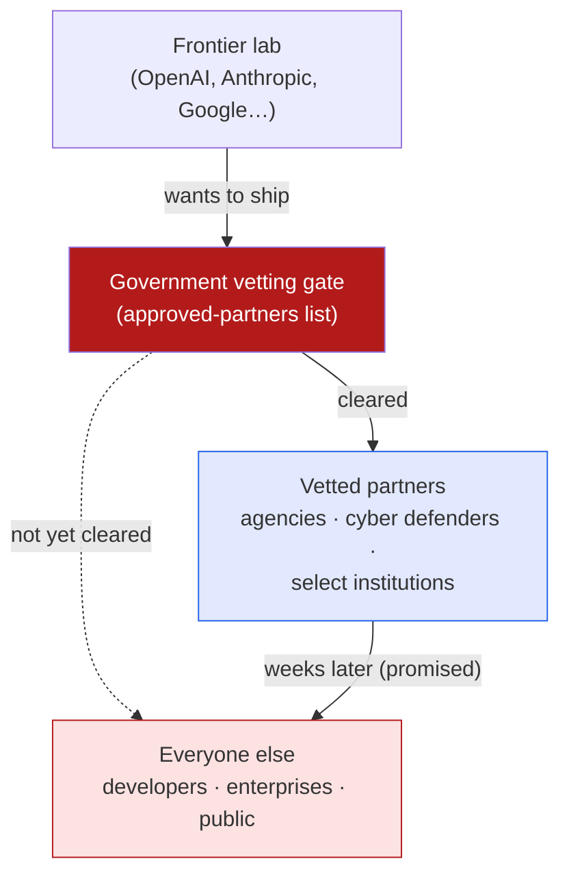

Most of the model launches I write up here are about capability — a new score, a new trick, a new size
class. This one is about **who's allowed to have it**. I read a *Batch* piece —
**["GPT-5.6 Arrives — but Only for Approved Partners"](https://www.deeplearning.ai/the-batch/gpt-5-6-arrives-but-only-for-approved-partners)** —
and the benchmarks turned out to be the least interesting part. The interesting part is that a frontier
model shipped into an *approved-partners-only* preview at a government's request. These are my notes.

*This is my summary and interpretation, not the authors' words — go read the
[original article](https://www.deeplearning.ai/the-batch/gpt-5-6-arrives-but-only-for-approved-partners).*

## What actually launched

GPT-5.6 isn't one model, it's a **three-tier suite**:

- **Sol** — the flagship. It sets records on coding (**Terminal-Bench 2.1**), biology (**GeneBench v1**),
  and cybersecurity tasks, and — the detail I find more impressive than the record itself — it reaches
  competitive performance while spending *a fraction of the output tokens* of rivals. Efficiency, not just
  ceiling.
- **Terra** — the balanced tier, priced roughly **2× cheaper than GPT-5.5**.
- **Luna** — the small, fast, cheap tier.

OpenAI also leaned on safety framing: model-level refusals, real-time classifiers that can *pause*
generation mid-stream for review, and account-level monitoring. That safety story matters, because it's
the bridge to the actual headline.

## The headline isn't the model — it's the gate

GPT-5.6 launched as a **limited preview restricted to government-vetted partners, at the Trump
administration's request.** Not a capacity-constrained waitlist, not a staged enterprise rollout — a
vetting gate with the government holding the list.

OpenAI framed it as temporary — a coordinated rollout that, they argue, actually *widens* access faster
than throwing the doors open on day one, with broader availability promised "within weeks." Maybe. But
the shape of the thing is what stuck with me: the release valve now has a second hand on it.

## It's not just OpenAI

The piece makes clear this is becoming the *pattern*, not a one-off:

- **Anthropic's Claude Mythos 5** faced the same kind of restriction, and was **partially cleared for
  more than 100 trusted U.S. institutions.**
- **Google's Gemini 3.5 Flash** shipped a computer-use capability with **no reported access
  restrictions.**

So the same policy is landing unevenly across labs — which is itself the problem critics are pointing at.
The sharpest line came from **Dean Ball**, a former White House AI adviser, who argued the order has
*"effectively created an involuntary licensing regime without clear safety standards."* That's the phrase
I keep turning over: a licensing regime, but without the published bar you'd need to actually *earn* the
license.

## Why it stuck with me

- **The bottleneck moved.** For two years the constraint on who gets frontier capability was money and
  compute. Here it's *clearance*. That's a different kind of moat, and it doesn't respond to the usual
  forces — you can't out-spend a vetting list. It rhymes with the availability distortions I wrote about
  in the [gray-market-for-LLM-access notes]():
  the moment official access is gated, everything downstream reorganizes around the gate.
- **Dual-use is doing the heavy lifting.** The restriction leans on exactly the capabilities Sol is best
  at — biology and cybersecurity. That's a real argument; those are also the [capabilities that set off
  the loudest alarms](). The uncomfortable part
  isn't the caution, it's the *"without clear safety standards"* — caution with no published threshold is
  hard to plan around or contest.
- **Centralized control cuts both ways — again.** This is the same tension I keep hitting with
  [keeping capability local versus central](): a coordinated
  gate can genuinely reduce the worst-case rollout, and it also concentrates the decision about who gets
  to build with the frontier into very few hands.

## Worth discussing

- If "approved partners" becomes the default first stop for every frontier launch, what happens to the
  independent developer or the [team trying to build real products on agents]()?
  A few weeks of head start compounds fast.
- An "involuntary licensing regime *without clear safety standards*" is the worst of both worlds — the
  friction of licensing without the transparency. What would a *good* version look like: published
  eval thresholds, a public bar, an appeals path?
- The rollout landed unevenly across OpenAI, Anthropic, and Google. Is that inconsistent enforcement, or
  just different risk profiles per model — and who adjudicates the difference?

---

*Credit where it's due — this is my summary of DeepLearning.AI's *The Batch* article
["GPT-5.6 Arrives — but Only for Approved Partners"](https://www.deeplearning.ai/the-batch/gpt-5-6-arrives-but-only-for-approved-partners).
Benchmark names, the tier lineup, the access details, and the Dean Ball quote are as reported there; go
read the original for the full picture. The framing and any errors here are mine.*
