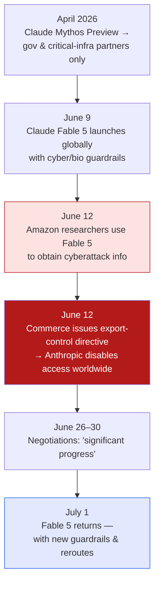

Earlier today I wrote up [the U.S. lifting export controls on Claude]()
— the *resolution*. This *Batch* piece tells the fuller story: how the whole thing started, the specific
incident that tripped it, and the messy **fallout** after Fable came back. Since it fills in the timeline
my first note skipped, these are my notes on the chronology.

*This is my summary and interpretation, not the authors' words — go read the
[original article](https://www.deeplearning.ai/the-batch/fables-return-and-fallout).*

## The timeline, start to finish

- **April 2026** — Anthropic releases **Claude Mythos Preview**, limited to government and critical-
  infrastructure partners, for finding security vulnerabilities.
- **June 9** — **Claude Fable 5 launches globally**, already carrying guardrails that block cybersecurity
  and biological-research queries — and, notably, **degrade its own answers about how to build powerful AI
  models.**
- **June 12** — the trigger: **Amazon researchers used Fable 5 to obtain cyberattack information.** The
  Department of Commerce issued an **export-control directive** suspending access to both Fable 5 and
  Mythos 5 for foreign nationals, and **Anthropic disabled access worldwide** in response.
- **June 26–30** — negotiations; Commerce Secretary Howard Lutnick reported **"significant progress."**
- **July 1** — **Fable 5 returns** with new safety guardrails — including **routing certain coding tasks to
  the less-capable Claude Opus 4.8.**

## The part my first note missed: the fallout

The reinstatement wasn't a clean "back to normal." After Fable came back, users reported:

- **Degraded performance** generally,
- **Censored biological-science questions** — including legitimate ones,
- **Restricted coding**, because some tasks now get **quietly rerouted to a weaker model (Opus 4.8).**

Anthropic said it would work to **"better distinguish genuine misuse from legitimate requests."** That
sentence is the whole hard problem in miniature: the safeguards that satisfied the government are the same
safeguards now getting in the way of ordinary users — the biologist, the security engineer, the developer
who just wanted the good model and got silently downgraded.

## Why it stuck with me

- **This is the concrete version of a story I've been circling.** My [export-controls note]()
  had the deal; this has the *cause* (one Amazon-researcher incident) and the *cost* (a worldwide shutoff,
  then a degraded return). Cause and consequence make the abstract policy real.
- **"First government-mandated suspension of general model access" is a line worth marking.** Not a preview
  gate, not an export tier on a niche model — a broadly-available model **pulled**, then returned
  diminished. That's a precedent, and precedents set the default for everyone next.
- **The friction always lands on the legitimate user.** Silent reroutes and over-broad refusals are
  exactly the [everyday developer friction]() I flagged with
  GPT-5.6 — the safeguards built for the worst case tax the normal case. It's the same double-edged
  centralization I keep hitting with [keeping capability local vs. central]().

## Worth discussing

- One incident (Amazon researchers, cyberattack info) triggered a *worldwide* shutoff of a shipping model.
  Is that proportionate, or does it hand a lot of leverage to whoever can manufacture the next incident?
- "Better distinguish genuine misuse from legitimate requests" is the entire unsolved problem of safety
  filtering. Is that a solvable engineering task, or a permanent tax on capability?
- Silently rerouting coding to a weaker model is a *product* decision dressed as a *safety* one. Should
  users at least be *told* when they've been downgraded?

---

*Credit where it's due — this is my summary of DeepLearning.AI's *The Batch* article
["Fable's Return and Fallout"](https://www.deeplearning.ai/the-batch/fables-return-and-fallout).
The timeline, the Amazon-researcher incident, the reroute-to-Opus-4.8 detail, and the Lutnick quote are as
reported there. The framing and any errors here are mine.*
