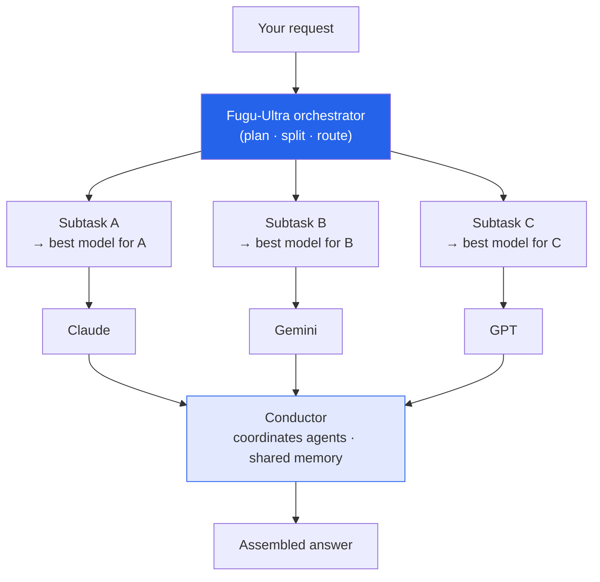

The other three stories I wrote up today are about *who controls access to a model*. This one is the
market's answer to that question: if you can't count on any single provider, **stop betting on one.** I
read a *Batch* piece on **Sakana AI's Fugu and Fugu-Ultra**, and it's the most architecturally
interesting of the bunch. These are my notes.

*This is my summary and interpretation, not the authors' words — go read the
[original article](https://www.deeplearning.ai/the-batch/fugu-blends-models-task-by-task).*

## What Fugu actually is (and isn't)

The name "blends models task by task" made me expect **model merging** or a **mixture-of-experts** — some
weight-level fusion. It's **neither**. Fugu is an **orchestrator**: a model whose job is to *route work*
across other companies' models — Claude, Gemini, GPT — through one unified API, picking the best tool for
each step.

- **Fugu** builds a workflow, deciding **which model to call at each step** until the task is done.
- **Fugu-Ultra** goes further: it **splits the input into subtasks**, designs **parallel** agentic
  workflows, and can **recursively subdivide** a task into smaller ones.

Under the hood, per the article: supervised fine-tuning of an undisclosed base LLM across coding, math,
reasoning, and tool use; an evolutionary algorithm (**sep-CMA-ES**) to *optimize which model gets picked*
for different task components; a **Conductor** (in Fugu-Ultra) that coordinates agents, lets them act
independently within a subtask, and **shares memory** between them; and **GRPO** reinforcement learning to
train on five-step agentic workflows. The clever core is that middle piece — the model-selection policy is
*learned and optimized*, not hand-coded rules.

## The numbers

Fugu-Ultra posts state-of-the-art results, per the article:

- **GPQA-Diamond: 95.5%** — tied for highest with Claude Fable 5.
- **SciCode: 60.1** (Fugu) — best of the models compared.
- **SWE-Bench Pro, Humanity's Last Exam, LiveCodeBench Pro** — Fugu-Ultra beat every model it was
  measured against.

The striking bit: an orchestrator that owns *no frontier model of its own* is topping leaderboards by
being smart about **whom to ask**. Coordination as capability.

**Pricing/availability:** Fugu bills at the underlying model's rate; Fugu-Ultra runs **$5 / $30 / $0.50**
per million input / output / cached tokens, with subscriptions **$20–$200/month**. Available via the
Sakana API, OpenRouter, and Vercel (outside Europe).

## Why the timing is the story

The article is explicit about the geopolitical backdrop, and it ties my whole day of notes together: U.S.
restrictions on [Claude Fable 5]() and
[GPT-5.6]() access have **driven interest in
orchestration**. When any one provider might be gated, throttled, or off-limits tomorrow, a layer that can
**re-route to whoever's available** stops being a nice-to-have and becomes risk management. As the piece
puts it: *"developers can put other companies' models to work and become the API provider themselves."*

## Why it stuck with me

- **The value is migrating to the router.** A year ago the moat was the model. Increasingly it's the
  *orchestration* around models — the same "the interesting layer is moving up" pattern I hit with
  [SCP for science](). Fugu is that thesis pointed at
  general-purpose work.
- **Multi-model is a hedge against policy, not just quality.** We usually justify routing on cost or
  accuracy. Fugu's pitch adds a third axis — *availability under geopolitical uncertainty* — which is a
  genuinely new reason to care about [not tying yourself to one provider]().
- **"Become the API provider yourself" is a real inversion.** The orchestrator resells the frontier labs'
  own capability, wrapped in a control layer they don't own. Whoever controls routing controls the
  customer relationship — a classic move, now aimed at LLMs.

## Worth discussing

- If orchestrators like Fugu sit on top and capture the customer, do the frontier labs quietly become
  wholesale suppliers? Who has pricing power in that stack?
- Learned model-selection (via sep-CMA-ES) is elegant, but it optimizes against *today's* model
  line-up. How brittle is that policy when a provider ships a new model — or gets restricted overnight?
- "Blends models task by task" is doing marketing work — it sounds like merging but it's routing. Does the
  distinction matter to a buyer who just wants the best answer?

---

*Credit where it's due — this is my summary of DeepLearning.AI's *The Batch* article
["Fugu Blends Models Task by Task"](https://www.deeplearning.ai/the-batch/fugu-blends-models-task-by-task).
The architecture (routing, Conductor, sep-CMA-ES, GRPO), benchmark numbers, and pricing are as reported
there. The framing and any errors here are mine.*
