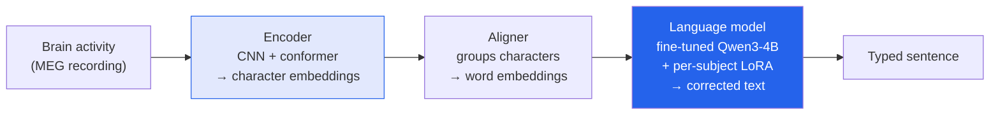

After a week of geopolitics-flavored model news, this one reminded me why I got into this field. I read a
*Batch* piece on **Brain2Qwerty v2** — a system that decodes *typed text straight from brain activity*,
**no surgical implant** — and buried in it is a finding that made me genuinely optimistic. These are my
notes.

*This is my summary and interpretation, not the authors' words — go read the
[original article](https://www.deeplearning.ai/the-batch/text-without-typing).*

## What it is

Brain2Qwerty v2 turns brain waves into written sentences — **no keyboard, no joystick, no eye tracker.**
Crucially it's **non-invasive**: it reads the brain's magnetic activity with **magnetoencephalography
(MEG)** rather than electrodes implanted in tissue. It's an update to the team's earlier Brain2Qwerty,
built by researchers from **Meta, the French CNRS, the Rothschild Foundation Hospital, the Basque Center on
Cognition/Brain and Language, Université Paris Cité, and INRIA.**

## How it works

Three stages, and the shape of it is the interesting part — it's a *very* modern NLP pipeline pointed at
neural signals instead of text:

1. **Encoder** — a CNN followed by a conformer hybrid breaks brain activity into *character-level*
   embeddings.
2. **Aligner** — a small neural net groups those characters into *word* embeddings.
3. **Language-model correction** — a **fine-tuned Qwen3-4B**, with **subject-specific LoRA adapters**,
   cleans up the output.

That last stage is the tell: they're using an off-the-shelf small LLM as an *error corrector* on top of
the neural decoder. The brain-reading part gets you a noisy draft; the language model does what language
models are good at — making it plausible text. Training data was MEG from **9 subjects** typing sentences,
**~90 hours / 22,000 examples.**

## The numbers (honest about how hard this is)

- **Word error rate: 39%** (v2) — down from **43%** (v1).
- **Character error rate:** improved from ~50% at 20 hours of training data to **~25% at 90 hours.**

A 39% word error rate is *not* usable as a daily driver — roughly two in five words wrong. But that's the
wrong frame. The right frame is the slope: more data keeps cutting the error, and v2 beat v1. This is a
research trajectory, not a product yet.

## The finding I got excited about

Here's the one that matters. **Training across many people's brains beats training on one:** a median word
error rate of **47.8% with combined subjects** versus **66.5% trained on a single subject.**

Think about what that implies. If brain-decoding *only* worked per-person, every user would need to
generate their own giant dataset before the thing worked at all — a dead end for scaling. But if pooling
across brains helps, then these systems can **scale like large language models do**: more people, more
data, better for everyone, including new users the model has never seen much of. That's the difference
between a lab curiosity and a technology with a path.

## Why it stuck with me

- **The "boring" LLM is the enabling piece.** Bolting a fine-tuned Qwen3-4B on the end as a corrector is
  the unglamorous move that makes the noisy signal usable — the same "shared infrastructure unlocks the
  capability" pattern I keep noticing, from [SCP for science]()
  to Stack-Overflow-for-agents.
- **Non-invasive is the whole ethical ballgame.** Plenty of impressive BCI results require electrodes *in*
  the brain. Getting *any* signal this good from a scanner you just sit near changes who this could ever
  help — no surgery, far lower stakes. That's the humane version of the "AI for health" work I like
  writing about, like [SleepFM's early detection]().
- **Scaling laws might apply to brains too.** The cross-subject result is the optimistic headline: the
  same "more data, more general" dynamic that powered LLMs may power neural interfaces. That's a genuinely
  hopeful thought for people with paralysis or speech loss.

## Worth discussing

- A 39% word error rate is far from usable — but the curve is bending. What's the honest timeline from
  "research result" to "someone who can't speak uses this daily"?
- MEG scanners are room-sized and expensive. Does the cross-subject scaling finding matter if the *sensor*
  never gets portable — or does portable MEG become the real race?
- Decoding text from brain activity is exactly as sensitive as it sounds. If pooling brain data makes it
  work better, what's the consent-and-privacy framework *before* that data pool exists, not after?

---

*Credit where it's due — this is my summary of DeepLearning.AI's *The Batch* article
["Text Without Typing"](https://www.deeplearning.ai/the-batch/text-without-typing).
The Brain2Qwerty v2 architecture, the institutions involved, the training details, and the error-rate
numbers are as reported there. The framing and any errors here are mine.*
