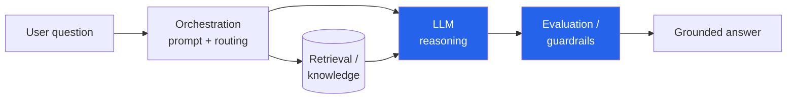

I'm currently pursuing a **Master of Artificial Intelligence at the University of Auckland**,
with a focus on **ethical, human-centered AI** in education and digital health. A good chunk
of that work has been hands-on with the current generation of AI tooling — large language
models, prompt engineering, evaluation, and the agentic patterns that turn a chatbot into
something that can actually *do* things.

## Animal Ethics Advisor

One project I'm proud of is an **Animal Ethics Advisor** built on **IBM Cloud** — an
LLM-powered assistant designed to help reason through animal-ethics questions in a
structured, defensible way. Building it meant getting into the parts of applied AI that
don't show up in a demo:

- **Prompt engineering** — shaping how the model frames a problem so the output is
  consistent and aligned with the intended ethical framework.
- **LLM evaluation** — actually measuring whether the assistant's answers are good, rather
  than trusting a few cherry-picked examples.
- **Agentic system design** — composing the model with tools and steps so it can retrieve,
  reason, and respond rather than answer in a single shot.

I prototyped intelligent assistants using **Watsonx.ai** and **Azure AI**, getting a feel
for how the same agentic ideas map onto different enterprise platforms.

## The shape of an agentic assistant

The recurring pattern across these projects: the model is the reasoning engine, but the
*system* around it is what makes it useful and trustworthy.

That evaluation/guardrail step is the part I care most about — especially for anything
touching ethics, education, or health, where a confident wrong answer is the failure mode
that matters.

## Health data, too

Alongside the LLM work, I've applied **PyTorch** to model physiological data — things like
heart-rate variability (HRV) and REM sleep — to prototype **ML-based health predictions**.
It's the same instinct as the rest of my work: take real, messy signal and turn it into
something a person can act on.

## Why it connects to the rest

This is where my **Business Analytics Consultant** focus and my AI background meet. The
agentic-systems mindset — retrieve, reason, evaluate, act — is exactly how I think about
turning data into decisions: not a single clever output, but a reliable system that a
stakeholder can trust.

*More detailed write-ups of individual projects to come — reach out if you'd like to hear
more about any of them.*
