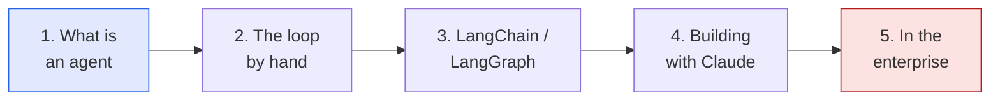

AI agents are the work I'm most invested in right now, so I wrote them up properly — a
**five-part series** that builds from first principles to production. It starts with what an
agent actually *is*, builds the loop by hand, layers on orchestration and the model, and ends
where my day job lives: making one trustworthy enough that an organization will deploy it.

It's written from the practitioner's seat — opinionated, hands-on, with real code — and it ties
back to my [Agentic AI & LLM Systems]({{ '/projects/agentic-ai-systems/' | relative_url }}) work
(the Animal Ethics Advisor, prompt engineering, and LLM evaluation).

## The series

Read it in order, or jump to what you need:

1. **[What Is an AI Agent?]()** — the definition that
   matters: an LLM running in a *reason → act → observe* loop. Chatbot vs. agent, the anatomy, and
   the series roadmap.
2. **[Anatomy of an Agent]()** — building the loop
   by hand in ~30 lines of Python: tool definitions, the `tool_use` cycle, and why the message
   history *is* the agent's memory.
3. **[LangChain vs LangGraph]()** — what each
   framework is actually for: composing a linear pipeline vs. orchestrating a looping, branching,
   stateful agent — and when a graph beats a pile of if-statements.
4. **[Building with Claude]()** — the model layer:
   robust tool use, structured outputs as reliable seams between steps, and the Model Context
   Protocol (MCP) for plugging into real systems.
5. **[Agents in the Enterprise]()** — the hard
   80%: evaluation, guardrails, cost, security, and the human-in-the-loop "reversibility dial" that
   gets leadership to say *yes*.

## The through-line

Every post builds on the last toward one idea: **an agent isn't a single clever output — it's a
dependable system you can trust.** A loop (Part 2), orchestrated as a graph (Part 3), powered by a
capable model with real tools (Part 4), and wrapped in evaluation and guardrails (Part 5). That's
the same *retrieve → reason → evaluate → act* mindset I bring to every analytics engagement.

*The series continues as the field moves — if there's a topic you'd want covered (a hands-on
build, a deeper dive on evaluation, a real case study), the comments on any post are open.*
