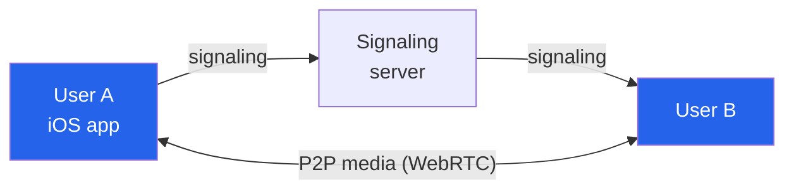

At **Shanghai Huaping Information Technology**, I led the engineering behind **Call Vox** —
a real-time communication app built for **healthcare and remote learning**. This was before
"video call everything" was the default, and the interesting problems were all about making
live audio/video reliable across messy real-world networks.

## What it did

Call Vox brought **real-time voice and video** to use cases where being present remotely
actually mattered — a clinician checking in with a patient, a teacher running a remote
session. It shipped to **iOS** and grew to **10,000+ monthly active users**.

## The tech: WebRTC

The core was **WebRTC**, the open standard for peer-to-peer real-time media. The appeal —
and the challenge — of WebRTC is that it pushes you to handle the hard parts of live media
directly: peer negotiation, NAT traversal, and adapting to whatever bandwidth the network
gives you moment to moment.

The signaling server brokers the initial handshake; once connected, media flows peer-to-peer
for low latency.

## My role

Beyond the real-time media work, I **led the system architecture and the Agile teams** that
delivered it across **mobile and web platforms** — coordinating the work, setting the
technical direction, and keeping releases moving.

## What I took from it

Real-time systems are an unforgiving teacher: there's no "load a spinner and retry" when the
conversation is *live*. Designing for graceful degradation — keep the call alive even when
the network gets bad — is a discipline that's stuck with me across everything I've built
since.
