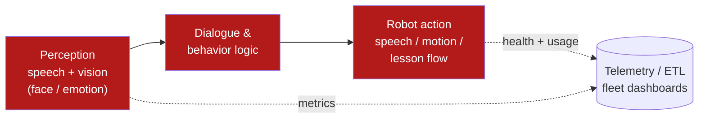

For seven years at **SoftBank Robotics Group**, I worked as a Project & Product Manager
across AI and robotics — sitting between the research, the engineering, and the partners
who actually put these robots in front of students. The work spanned the **Pepper** and
**NAO** humanoid platforms, and the goal was always the same: make a robot that a child or
teacher could simply *talk to* and have it respond like it understood.

> This is a public-level overview of work done at SoftBank Robotics; it deliberately
> avoids internal or proprietary detail.

## What I worked on

**Conversational and perceptual AI.** I helped deliver deployed AI prototypes in
**Python and C++** that combined two streams:

- **Natural language** — speech recognition and dialogue systems so the robot could
  hold a conversation, answer questions, and run guided lessons.
- **Computer vision** — face and emotion detection so the robot could notice who it was
  talking to and adapt its responses.

These features shipped across **3,000+ educational installations**, where reliability and
graceful failure matter far more than benchmark scores — a robot that freezes in front of
a classroom is worse than one that politely says "say that again."

**Platforms and tooling.** I worked on platforms including **RoboBlocks**, the **Robot
Management Console**, and **Choregraphe**, which let educators and partners compose robot
behaviors as modular tasks and watch analytics dashboards rather than write low-level code.

**Fleet health and telemetry.** I engineered **ETL pipelines and telemetry frameworks** to
collect and monitor robot health data, with **Dockerized dashboards on Linux** for remote
device control — so a fleet of robots in the field could be observed and updated centrally.

**Autonomous navigation R&D.** I prototyped navigation using **ROS + SLAM** (e.g.
ORB-SLAM2) together with ML vision models for object detection, scene understanding, and
mapping.

## How the pieces fit

At a high level, an interaction flowed through a perception → reasoning → action loop, with
telemetry observing the whole fleet:

## Beyond the tech: the global part

A lot of this role was *not* code. I collaborated with **global teams across Japan, France,
and China**, synchronizing algorithm roadmaps, SDK releases, and training programs to
support ecosystem growth toward **~17,000 units globally**. I also delivered developer
training on the **Pepper/NAO SDKs, ROS frameworks, and remote deployment** — enabling
**1,000+ global partners** to prototype their own educational and healthcare solutions on
top of the platform.

## What I took from it

The lasting lesson is that **deployed AI is a product problem, not just a model problem.**
The hard parts were reliability at the edge, tooling that non-engineers could use, and
keeping a worldwide partner ecosystem moving in the same direction. That's the lens I bring
to analytics and AI work now.
