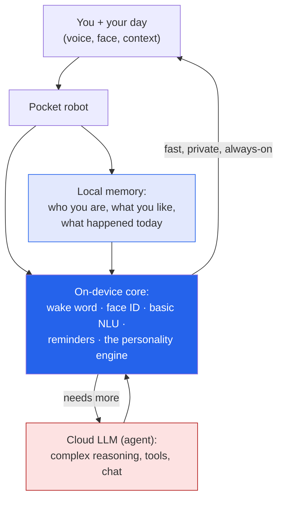

A **pocket companion robot** is the idea I can't stop turning over: a small AI *character* you carry
with you — not a phone app, not a smart speaker, but something with a face, a personality, and a sense
of being *along for the day*. Products like [living.ai](https://living.ai/)'s **EMO** and **AIBI**
(which I wrote up in my [notes post]()) prove
the category is real. This is my **concept exploration** of where it should go next.

It's a design project, not a product — a place to think out loud, grounded in having actually built
companion robots before.

## Why I care about this one

I spent years at SoftBank building [Pepper and NAO]({{ '/projects/pepper-nao-ai/' | relative_url }}) —
social robots with face recognition, emotion detection, and dialogue. The pocket robot is the *same
design problem* shrunk to something you can hold: how do you make a machine feel like a believable,
trustworthy companion? The hard part was never the sensors. It was the **personality and the trust.**

## The concept: a pocket-sized agent loop

The interesting part isn't the hardware — it's treating the device as an
[AI agent]() with a hard constraint: it lives in your
pocket, so it has to be **fast, private, and useful offline**, and only reach for the cloud when it
truly needs the horsepower.

## The three problems worth solving

1. **The edge/cloud split.** Keep latency- and privacy-sensitive interactions
   [on the device]() — wake word, face ID, the personality
   engine, basic commands — and escalate to a cloud model only for genuinely hard requests. This is the
   same instinct behind my [tinyML]({{ '/projects/tinyml/' | relative_url }}) work, applied to a
   companion.
2. **Memory that makes it *yours*.** A companion without memory is a toy. The concept needs persistent,
   on-device memory — who you are, your routines, the small things — so the personality *evolves* with
   you instead of resetting every session.
3. **Human-centered guardrails.** An always-on camera and microphone in your pocket is a privacy
   minefield. The design has to lead with consent and control: on-device by default, explicit opt-in for
   anything cloud, a visible "it's listening" state, and a personality that's *delightful* without being
   manipulative. This is the [enterprise-grade trust thinking]()
   I apply to agents, pointed at something personal.

## Where this connects

This sits at the intersection of everything I work on: **robotics** (Pepper/NAO), **edge AI**
(tinyML, keeping AI local), **agents** (the on-device/cloud loop), and **human-centered design** (the
trust and personality layer). It's a concept for now — but it's the kind of product I'd love to help
build.

*Got thoughts on what a pocket companion should — or shouldn't — do? The comments are open, and on the
[notes post]() too.*
