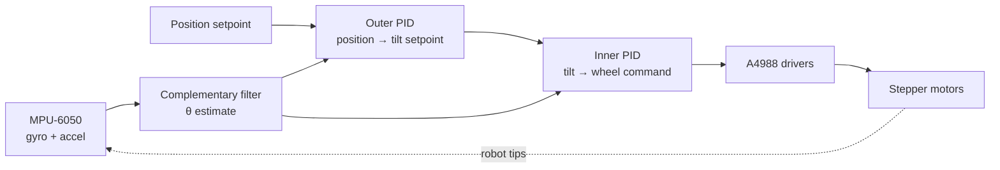

A two-wheel **self-balancing robot** — mechanically an [inverted
pendulum](https://en.wikipedia.org/wiki/Inverted_pendulum) on wheels. Left to
itself it falls over; the job of the controller is to drive the wheels in exactly
the right direction, at exactly the right moment, to keep the body upright. It's a
small project with a lot of control-theory packed into it, which is why I love it.

<div class="row justify-content-sm-center">
    <div class="col-sm-8 mt-3 mt-md-0">
        
    </div>
</div>
<div class="caption">
    The assembled robot balancing in place. <em>(Placeholder image — drop a photo of your build in <code>assets/img/</code> and update the path.)</em>
</div>

## Why build it

I wanted a compact, end-to-end controls project: read a noisy sensor, fuse it into
a clean state estimate, close a feedback loop in real time, and watch the physical
result succeed or fall flat — literally. A balancing robot fails loudly when the
control is wrong, which makes it a fantastic teacher.

## Hardware

| Subsystem      | Part                                  | Notes                                              |
| -------------- | ------------------------------------- | -------------------------------------------------- |
| Compute        | ESP32 (dual-core, 240 MHz)            | Wi-Fi/BLE for telemetry + tuning over the air      |
| IMU            | MPU-6050 (3-axis gyro + accelerometer)| I²C @ 400 kHz, sampled at 200 Hz                   |
| Actuators      | 2× NEMA-17 steppers                   | Microstepped for smooth, slip-free low-speed torque|
| Motor drivers  | 2× A4988                              | 1/16 microstepping, current-limited                |
| Power          | 3S Li-ion (11.1 V) + 5 V buck         | ~45 min runtime                                    |
| Chassis        | 3D-printed (PETG), 3 stacked decks    | Battery mounted high to raise the center of mass*  |

<small>*Counter-intuitively, a higher center of mass makes the pendulum
<em>slower</em> to fall, giving the controller more time to react — the same reason
a long broom is easier to balance on your palm than a pencil.</small>

## How it works

The robot only needs one number to stay alive: its **tilt angle** $$\theta$$ from
vertical. Getting a clean $$\theta$$ is half the battle, because neither sensor is
good enough alone:

- The **accelerometer** measures the gravity vector, so it gives an absolute angle —
  but it's swamped by vibration and the robot's own motion.
- The **gyroscope** measures angular *rate*, which is smooth and fast — but
  integrating it to get angle accumulates **drift** over time.

I fuse them with a **complementary filter**: trust the gyro on short timescales,
trust the accelerometer on long ones.

$$
\theta_t = \alpha\,\bigl(\theta_{t-1} + \omega_{\text{gyro}}\,\Delta t\bigr) + (1-\alpha)\,\theta_{\text{accel}}
$$

with $$\alpha \approx 0.98$$ at a 200 Hz loop. (A Kalman filter does this more
rigorously, but the complementary filter is one line and good enough to balance.)

That angle feeds a **cascaded PID** controller — an inner loop that fights tilt,
wrapped in an outer loop that keeps the robot from drifting across the room:



The inner loop is the classic PID law, run every 5 ms:

$$
u(t) = K_p\,e(t) + K_i \!\int_0^t \! e(\tau)\,d\tau + K_d\,\frac{de(t)}{dt},
\qquad e(t) = \theta_{\text{target}} - \theta(t)
$$

Here's the core of the control task, running pinned to its own ESP32 core under
FreeRTOS so timing stays deterministic:

```cpp
// 200 Hz control loop — runs on core 1, isolated from Wi-Fi/telemetry on core 0
void controlTask(void *arg) {
  const TickType_t period = pdMS_TO_TICKS(5);   // 5 ms = 200 Hz
  TickType_t last = xTaskGetTickCount();

  for (;;) {
    imu.read();
    // Complementary filter: blend gyro integration with accel angle
    float accAngle = atan2f(imu.ay, imu.az) * RAD_TO_DEG;
    angle = ALPHA * (angle + imu.gx * DT) + (1.0f - ALPHA) * accAngle;

    // Inner loop: hold the body vertical (target adjusted by the outer loop)
    float error = targetAngle - angle;
    integral = constrain(integral + error * DT, -I_LIMIT, I_LIMIT);  // anti-windup
    float derivative = (error - prevError) / DT;
    float output = KP * error + KI * integral + KD * derivative;
    prevError = error;

    if (fabsf(angle) > FALL_LIMIT) output = 0;   // gave up — we've tipped over
    driveMotors(output);

    vTaskDelayUntil(&last, period);              // exact, jitter-free cadence
  }
}
```

## What was hard

- **Motor deadband.** Steppers don't respond below a minimum command, so small
  corrections did nothing and the robot wobbled around vertical. Adding a feed-forward
  offset to push past the deadband smoothed it out.
- **Integral windup.** When the robot was caught falling, the integral term saturated
  and overshot wildly on recovery. Clamping the integral (the `anti-windup` line above)
  fixed it.
- **Tuning.** I tuned the inner loop first with the outer loop disabled — raise $$K_p$$
  until it oscillates, add $$K_d$$ to damp it, then a little $$K_i$$ to kill steady-state
  lean. Live BLE telemetry plotting $$\theta$$ vs. time made this enormously faster than
  guessing.

## Results

- Balances indefinitely on a flat surface and shrugs off a finger-flick nudge,
  recovering in well under a second.
- Holds position to within a few centimeters instead of slowly creeping (the outer
  loop earning its keep).
- ~45 minutes of runtime on a charge.

<div class="row">
    <div class="col-sm mt-3 mt-md-0">
        
    </div>
    <div class="col-sm mt-3 mt-md-0">
        
    </div>
</div>
<div class="caption">
    Left: tilt angle holding near 0° under disturbances. Right: the electronics deck.
    <em>(Both placeholders — swap in real telemetry plots and build photos.)</em>
</div>

## What's next

- Replace the hand-tuned PID with an **LQR** controller derived from the linearized
  pendulum dynamics, for a more principled trade-off between responsiveness and effort.
- **BLE teleoperation** — drive it around by feeding velocity commands into the outer loop.
- Swap the complementary filter for a proper **Kalman filter** and compare angle estimates.

> _This is an example write-up — accurate to how these robots actually work, but not
> a specific build of mine. Replace the photos, numbers, and any details with your own,
> or delete this note._
