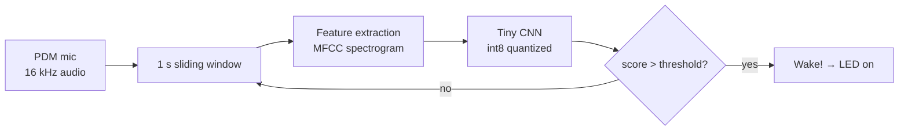

A **keyword-spotting** model — the "Hey Siri" trick — running entirely on a
microcontroller. The device listens continuously for a single wake word and lights
up an LED when it hears it. No Wi-Fi, no cloud, no audio ever leaving the board:
inference happens in **~20 KB of RAM** on a chip that sips power.

This is the essence of **TinyML** — taking a model that would normally need a GPU and
shrinking it until it fits on hardware with less memory than a single web page.

<div class="row justify-content-sm-center">
    <div class="col-sm-8 mt-3 mt-md-0">
        
    </div>
</div>
<div class="caption">
    The board listening for its wake word. <em>(Placeholder image — swap in a photo of your hardware.)</em>
</div>

## Why build it

Wake-word detection is the canonical TinyML problem: the model has to be **tiny**
(it lives alongside everything else in a few hundred KB of flash), **fast** (it runs
many times a second, forever), and **frugal** (it's the only thing awake while the
rest of the system sleeps). Hitting all three at once is a genuinely different
engineering discipline from training models on a workstation, and that's what drew
me in.

## Hardware

| Subsystem   | Part                                   | Notes                                        |
| ----------- | -------------------------------------- | -------------------------------------------- |
| Compute     | Arduino Nano 33 BLE Sense (nRF52840)   | Cortex-M4F @ 64 MHz, 256 KB RAM, 1 MB flash  |
| Microphone  | Onboard MP34DT05 PDM mic               | 16 kHz mono audio                            |
| Output      | Onboard RGB LED                        | Lights when the wake word fires              |
| Power       | 1× 18650 Li-ion + LDO                  | Idle current dominated by the mic + MCU      |
| Runtime     | TensorFlow Lite for Microcontrollers   | No OS, no dynamic allocation                 |

## The pipeline

Raw audio is too high-dimensional to feed a tiny model directly, so each ~1-second
window is turned into a compact **spectrogram** (MFCC-style features) before it ever
reaches the network:



The model itself is a deliberately small convolutional net — a few conv layers and a
dense head, a few thousand parameters. The interesting work isn't the architecture;
it's making it **fit and run on the metal**.

## Training and shrinking the model

I trained in TensorFlow on the [Speech Commands
dataset](https://www.tensorflow.org/datasets/catalog/speech_commands), then did the
two things that make it deployable: **quantize** to 8-bit integers and **convert** to
a TFLite Micro flatbuffer.

Quantization is where most of the size and speed win comes from. Every float weight
and activation is mapped to an `int8` using a scale $$S$$ and zero-point $$Z$$:

$$
r \approx S\,(q - Z), \qquad q = \operatorname{round}\!\left(\frac{r}{S}\right) + Z
$$

That's a **4× size reduction** and far faster integer math on a CPU with no FPU to
spare — at the cost of a little accuracy, which a *representative dataset* during
conversion keeps small by calibrating $$S$$ and $$Z$$ from real samples:

```python
import tensorflow as tf

def representative_data():
    # feed ~100 real feature samples so the converter calibrates int8 ranges
    for sample in calibration_set.take(100):
        yield [tf.cast(sample, tf.float32)]

converter = tf.lite.TFLiteConverter.from_keras_model(model)
converter.optimizations = [tf.lite.Optimize.DEFAULT]
converter.representative_dataset = representative_data
converter.target_spec.supported_ops = [tf.lite.OpsSet.TFLITE_BUILTINS_INT8]
converter.inference_input_type = tf.int8     # so the MCU feeds int8 features directly
converter.inference_output_type = tf.int8

tflite_model = converter.convert()
open("kws_int8.tflite", "wb").write(tflite_model)   # ~18 KB
```

The `.tflite` file is then dumped to a C array (`xxd -i`) and compiled straight into
the firmware. On-device, inference is a tight loop against a fixed **tensor arena** —
no `malloc`, because there's barely any heap to allocate from:

```cpp
// TFLite Micro inference — all memory is statically reserved up front
constexpr int kArenaSize = 20 * 1024;            // the model's entire RAM budget
alignas(16) uint8_t tensor_arena[kArenaSize];

void classify(const int8_t* features, size_t len) {
  TfLiteTensor* input = interpreter->input(0);
  memcpy(input->data.int8, features, len);

  if (interpreter->Invoke() != kTfLiteOk) return; // run the network

  TfLiteTensor* output = interpreter->output(0);
  int8_t wake_score = output->data.int8[kWakeWordIndex];
  if (wake_score > kThreshold) onWakeWord();      // heard it!
}
```

## What was hard

- **RAM is the real budget.** The model weights live in flash, but the **tensor arena**
  (intermediate activations) lives in RAM, and that's the scarce resource. Trimming a
  conv layer's channel count to drop the arena from 32 KB to 20 KB mattered more than
  any accuracy tweak.
- **Quantization gotchas.** Naïve post-training quantization tanked accuracy until I
  added a representative dataset; an under-calibrated scale clipped exactly the quiet
  features that distinguish the wake word.
- **The real world is noisy.** Lab accuracy meant little against background chatter and
  the device's own fan. Mixing **noise and "unknown word" / silence classes** into
  training cut false triggers dramatically.

## Results

| Metric                  | Value             |
| ----------------------- | ----------------- |
| Model size (int8)       | ~18 KB flash      |
| Tensor arena (RAM)      | ~20 KB            |
| Inference latency       | ~30 ms / window   |
| Accuracy (test set)     | ~94%              |
| False accepts           | < 1 per hour idle |

Small enough to leave plenty of the chip free for the rest of the application, and
fast enough to run several times a second with power to spare.

## What's next

- **Quantization-aware training** to claw back the accuracy lost to int8.
- A second wake word, and a tiny **command** vocabulary after it ("on" / "off").
- Port the same model to an **ESP32-S3** and compare latency with its vector instructions.

> _This is an example write-up — accurate to how TinyML keyword spotting actually
> works, but not a specific build of mine. Replace the numbers, photos, and details
> with your own, or delete this note._
